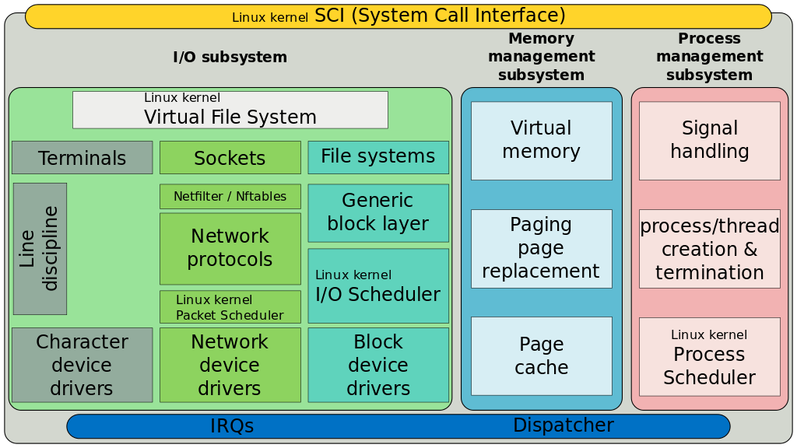

# container-networks

## My notes

- Container Principles and Networks
  - [x] [Linux Network Namespaces](linux-netns.md)：Rosen 带我们过一遍 Linux namespaces 和 cgroups 的原理、应用和实现。
  - [ ] [Linux Control Groups](linux-cgroups.md)
  - [x] [Docker: Lightweight Linux Containers for Consistent Development and Deployment](docker-intro.md)：一篇介绍 Docker 的文章，很经典。
  - [x] [Docker Networks @official-doc](docker-networks.md)：给出了 Docker 网络的全貌。
  - [ ] [~~Container Networks @book~~](container-networks.md)：给出了 Container 网络的全貌。
  - [x] [Docker Networks: Bridge Mode](docker-bridge.md)
  - [x] [Docker Overlay Networks](docker-overlay-networks.md)
  - [x] [Kubernetes Networks](k8s-networks.md)
  - [ ] [CNM vs CNI](cnm-vs-cni.md)

- Virtualization
  - [x] [VirtIO](virtio.md)
  - [x] [VXLAN](vxlan.md)
  - [x] [Open vSwitch](ovs.md)：简单给出 OVS 的动机，还未深入原理。
  - [x] [Linux TUN/TAP vs VETH](tuntap-vs-veth.md)

- Linux Network Internals
  - [ ] [BSD Socket](bsd-socket.md)
  - [ ] [Linux TCP/IP Stack](linux-tcpip-stack.md)
  - [ ] [Linux Netfilter](linux-netfilter.md)
  - [ ] [Linux Packet Scheduler](linux-pkt-scheduler.md)
    - [x] HFSC：没看懂！

## Landscape of Linux kernel

## Good readings

- Docker: Lightweight Linux Containers for Consistent Development and Deployment. https://dl.acm.org/citation.cfm?id=2600241.
- Resource Management: Linux Kernel Namespace and cgroups. http://www.haifux.org/lectures/299/netLec7.pdf.
- Container Networking: From Docker to Kubernetes. https://www.li9.com/wp-content/uploads/2018/07/Container-Networking-Docker-Kubernetes-180701.pdf.
- Network Algorithmics: An Interdisciplinary Approach to Designing Fast Networked Devices. https://dl.acm.org/citation.cfm?id=1203994.
- Docker Pro. https://book.douban.com/subject/26701218/.
- Understanding Linux Network Internals. https://dl.acm.org/citation.cfm?id=1162208.
- Linux Kernel Networking: Implementation and Theory. https://dl.acm.org/citation.cfm?id=2568187.
