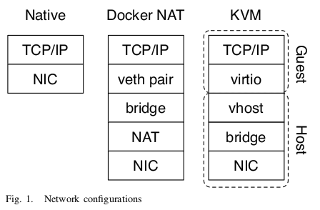

# Docker Bridge Mode

Docker bridge 是 Docker 默认的网络连接方式，所以无需额外的配置。Docker bridge 基于 Linux veth、bridge 和 iptables 实现，如图。其中，Linux veth 用于将容器连接到主机网络中，工作在 Layer 2；Linux bridge 作为一个虚拟交换机；iptables 用于构造 NAT 将流量在容器和主机之间进行转换。

容器使用 veth 将容器连接到 host OS 上，而 KVM 使用 virtio 将 guest OS 连接到 host OS 上。相比 veth 实现，virtio-based 的 packet IO 开销会更高一些，因为 virtio 需要两个 ring，avail/used ring，来处理请求而，相比 RX/RX 分别只需要一个 ring 进行 packet IO（`desc = tx_ring.deq(); do_handle_pkt(desc->pkt)`），使用 virtio 进行一次 packet IO（`dp = avail_ring.deq(); desc = dp->desc; do_handle_pkt(desc->pkt);`）会引入一次额外的访存开销。

P.S. virtio 需要引入 avail/used ring 的原因是虚拟设备可能会 out-of-order 执行请求。若只用一个 ring，则当前请求被处理之前，后面的请求都会被阻塞。

该模式下，容器中的数据包需要穿过内核协议栈两次才能抵达到外部网络上，第一次是容器中的数据包通过协议栈转化为 Layer 2 packet，然后通过 veth 传送放到主机虚拟交换机上，然后经过 iptables NAT 转化为主机网络中可传输的数据包，最后再次经过协议栈到达外部网络上。Overlay 网络中，数据包也需要两次经过协议栈，不同的是，Docker bridge 通过 NAT 实现，而 overlay 网络通过 VXLAN 实现，包括包的 encapsulation 和 decapsulation。
