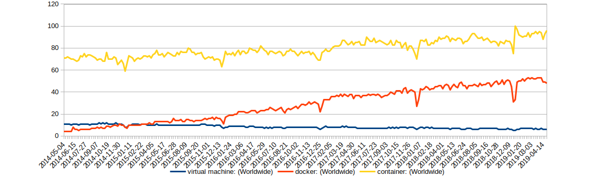

# Docker: Lightweight Linux Containers for Consistent Development and Deployment

[TOC]

## Abstract

与 Docker 容器一起承担「依赖性地狱」，这是 VM 的轻量级和灵活的表兄。本文将带你了解 Docker 如何通过将应用程序打包到基于 LXC 技术的容器中来使应用程序具有可移植性（portable）和隔离性（isolated）。

想象一下，我们能够轻松地将应用程序及其所有依赖项打包，然后在不同的开发、测试和生产环境中顺利运行。这就是开源 Docker 项目的目标。虽然它尚未正式投入生产，但最新版本（撰写本文时为0.7.x）使 Docker 更接近实现这一雄心勃勃的目标。

Docker 试图解决「依赖地狱」的问题。现代应用程序通常由现有组件组装而成，并依赖于其他服务和应用程序。例如，您的 Python 应用程序可能将 PostgreSQL 用作数据存储，使用 Redis 进行缓存，将 Apache 用作 Web 服务器。这些组件中的每一个都有自己的一组依赖项，这些依赖项可能与其他组件的依赖项冲突。通过打包每个组件及其依赖项，Docker 解决了以下问题：

- 冲突的依赖关系（conflicting dependencies）：需要在 PHP 4.3上 运行一个 Web 站点而在 PHP 5.5 上运行另一个 Web 站点？如果您在单独的 Docker 容器中运行每个版本的PHP，这不再是问题。
- 缺少依赖关系（missing dependencies）：在新环境中安装应用程序是 Docker 的一个快照，因为所有依赖项都与应用程序一起打包在容器中。
- 平台差异（platform differences）：从一个发行版转移到另一个发行版不再是一个问题。如果两个系统都运行 Docker，则同一容器将顺利执行。

## Docker: a little background

Docker 于 2013 年初开始在 dotCloud（一家以云为中心的 PaaS 公司）的开源项目中开始其生涯。最初，Docker 是该公司为了支撑其云业务在成千上万台机器上运行而开发的技术的自然延伸。Docker 是用 Go 开发的，这是一种由 Google 开发的静态类型编程语言，with syntax loosely based on C。六至九个月后，该公司聘请了一位新 CEO，加入了 Linux Foundation，更名为 Docker Inc. 并宣布将重点转移到 Docker 和 Docker 生态系统的开发上。Docker 很受欢迎，在撰写本文时，它已经在 GitHub 上被标注了 8985 次并且已经被 fork 了 1304 次。图 1 显示了 Docker 在 Google 搜索中越来越受欢迎。我预测，过去 12 个月的形状将在接下来的 12 个月内相形见绌，因为 Docker 公司提供了第一个受到容器生产部署支持的版本，整个社区都意识到了 Docker 的实用性。

## Under the hood

Docker 利用一些强大的 kernel-level 技术，并将其置于触手可及的位置。虚拟化容器的概念已存在多年，但通过提供简单的工具集和统一的 API 来管理一些内核级技术，例如 LXC（LinuX Containers）、cgroups 和 copy-on-write 文件系统，Docker 创建了一个大于其各部分之和的工具。这让其成为 DevOps、系统管理员和开发人员的潜在游戏改变者。

Docker 提供了尽可能简单地创建和使用容器的工具。容器将进程相互隔离。现在，您可以将容器视为轻量级的虚拟机。

Linux Containers 和 LXC 是 Linux 容器的用户空间控制包，构成了 Docker 的核心。LXC 使用 kernel-level namespaces 将容器与主机隔离。用户命名空间（user namespace）将容器和主机的用户数据库分开，从而确保容器的 root 用户在主机上没有 root 权限。进程名称空间（process namespace）负责仅显示和管理容器中运行的进程，而不是主机。并且，网络名称空间（network namespace）为容器提供其自己的网络设备和虚拟 IP 地址。

LXC 为 Docker 提供的另一个组件是控制组（cgroups）。命名空间负责主机和容器之间的隔离，而控制组实现资源记帐（accounting）和限制（limitation）。虽然允许 Docker 限制容器消耗的资源，例如内存、磁盘空间和 I / O，但 cgroups 还会输出大量有关这些资源的指标。这些指标允许 Docker 监视容器内各种进程的资源消耗，并确保每个进程只获得可用资源的公平份额。

P.S. 

除了上述组件之外，Docker 还使用 AuFS（Advacned Multi-Layered Unification Filesystem）作为容器的文件系统。AuFS 是一个分层文件系统，可以透明地覆盖一个或多个现有文件系统。当进程需要修改文件时，AuFS 会创建该文件的副本。AuFS 能够将多个图层合并为文件系统的单个表示。此过程称为写时复制。

> In addition to the above components, Docker has been using AuFS (Advanced Multi-Layered Unification Filesystem) as a filesystem for containers. AuFS is a layered filesystem that can transparently overlay one or more existing filesystems. When a process needs to modify a file, AuFS creates a copy of that file. AuFS is capable of merging multiple layers into a single representation of a filesystem. This process is called copy-on-write.

非常酷的是 AuFS 允许 Docker 使用某些 images 作为容器的基础。例如，您可能拥有一个 CentOS Linux 映像，它可用作许多不同容器的基础。由于 AuFS ，只需要一份 CentOS 映像副本，这样可以节省存储和内存，并加快容器的部署速度。

使用 AuFS 的另一个好处是 Docker 能够对容器图像进行版本化。每个新版本只是对以前版本的更改差异，有效地将 images 文件保持在最低限度。但是，这也意味着您始终可以对从容器的一个版本更改为另一个版本的内容进行完整的审计跟踪。

传统上，Docker 依赖于 AuFS 来提供写时复制存储机制。但是，最近添加的存储驱动程序 API 可能会减少这种依赖性。最初，有三种存储驱动程序可供使用：AuFS、VFS 和 Device-Mapper，这是与 Red Hat 合作的结果。从版本 0.7 开始，Docker 可以与所有 Linux 发行版一起使用。但是，它不适用于大多数非 Linux 操作系统，例如 Windows 和 OS X。在这些操作系统上使用 Docker 的推荐方法是使用 Vagrant 在VirtualBox上配置虚拟机。

## Containers vs. other types of virtualization

究竟什么是容器，它与 hypervisor-based 的虚拟化有何不同？简而言之，容器在操作系统级别进行虚拟化，而 bypervisor-based 的解决方案在硬件级别进行虚拟化。虽然效果相似，但差异很重要（important）且很重要（significant），这就是为什么我会花一点时间探索差异以及由此产生的差异和权衡。

### 虚拟化

容器和 VM 都是虚拟化工具。在 VM 端，hypervisor 使得孤立的硬件切片可用。通常有两种类型的管理程序：「类型 1」直接在硬件的裸机上运行，而「类型 2」运行作为主机操作系统中的附加软件层。开源 Xen 和 VMware 的 ESX 是 Type 1 hypervisor 的示例，而 Type 2 的示例包括 Oracle 的开源软件 VirtualBox 和 VMware 的 VMware Server。虽然类型 1 是比较 Docker 容器的更好的候选者，但我没有在本文的其余部分区分这两种类型。

相反，容器使操作系统的受保护部分可用 - 它们有效地虚拟化操作系统。在同一操作系统上运行的两个容器不知道它们正在共享资源，因为每个容器都有自己的抽象网络层和进程等等。

### 操作系统和资源

由于 hypervisor-based 虚拟化仅提供对硬件的访问，因此您仍需要安装操作系统。因此，有多个成熟的操作系统在运行，每个 VM 一个，可以快速吞噬服务器上的资源，如 RAM、CPU 和带宽。

容器背负着已经运行的操作系统作为其主机环境。它们可以在彼此隔离的空间中执行，也可以在主机 OS 的某些部分中执行。这有两个显着的好处。首先，资源利用效率更高。容器没有执行任何操作，它没有耗尽资源，容器可以调用其主机操作系统来满足其部分或全部依赖关系。其次，容器很便宜（cheap），因此很快就能制造和销毁。容器无需启动，而只要终止在其隔离空间中运行的进程。结果，启动和停止容器更类似于启动和停止应用程序，并且速度也一样快。

### 隔离性能和安全性

在 Docker 容器中执行的进程与在主机操作系统或其他 Docker 容器中运行的进程被隔离开。Docker 利用 LXC 为容器提供单独的命名空间，这种技术已经在 Linux 内核中存在了 5 年多，并且被认为是公平成熟的。它还使用 cgroups，它们已经在 Linux 内核中更长时间，以实现资源审计（accounting）和限制（limiting）。

Docker 守护程序本身也构成潜在的攻击向量，因为它当前以 root 权限运行。对 LXC 和 Docker 的改进应允许容器在没有 root 权限的情况下运行，并在不同的系统用户下执行 Docker 守护程序。

尽管提供的隔离类型总体上非常强大，但可以说它并不像虚拟机在 hypervisor-level 那样强大。如果内核发生故障，所有容器也会发生故障。虚拟机具有的另一个优势是，虚拟机已在许多不同的高可用性环境中得到强化和验证。在 Docker 及其支持技术方面几乎没有看到同样多的行动。特别是 Docker 每天都在发生巨大的变化，我们都知道变化是安全的敌人。

### Docker 和 VMs -- 亦敌亦友

现在我花了这么多时间来比较 Docker 和 VM，现在是时候承认这两种技术实际上可以相互补充。Docker 在已经虚拟化的环境中运行得很好。您显然不希望将每个应用程序或组件封装在单独的 VM 中，但是在 Linux VM 上，您可以轻松地在其上部署 Docker 容器。这就是为什么在非 Linux 系统（如 OS X 和 Windows）上使用 Docker 的官方支持方式是在 Vagrant 的帮助下安装 Ubuntu 虚拟机，这一点不足为奇。 

底线是虚拟化和容器表现出一些相似之处。但是，随着您在容器上花费更多时间，您会逐渐了解微妙但重要的差异。 Docker 做得很好利用集装箱化的好处来实现一个目的，即轻量级打包和应用程序部署

## Others

文章余下部分在介绍 Docker Workflow 和具体操作，部分信息已过时，所以这里就直接略去。

## Conclusion

Docker 轻量级打包和部署应用程序和依赖项的前景令人兴奋，它很快被 Linux 社区采用并正在进入生产环境。例如，Red Hat 在 12 月宣布支持即将推出的 Red Hat Enterprise Linux 7 中的 Docker。但是，Docker 仍然是一个年轻的项目，并且正在以极快的速度增长。当项目接近其 1.0 版本时，将是令人兴奋的，该版本应该是正式批准用于生产环境的第一个版本。Docker 依赖于已有的技术，其中一些已经存在了十多年，但这并没有使它变得不那么具有革命性。希望本文为您提供了足够的信息和灵感来下载 Docker 并自己进行实验。

## My summary

虚拟化的目的是为了物理机，从而提高物理机的使用效率。虚拟化最基本的要求就是资源隔离，方法包括虚拟机的硬件虚拟化和 LXC 所用的 namespaces。除此之外，还要考虑资源审计和限制，容器中使用 cgroups 实现。

目前，虚拟机和容器是两种典型的虚拟化技术，不同的是，虚拟机是硬件层面的虚拟化，而容器是操作系统层面的虚拟化。相比虚拟机，容器的好处就是轻量和快。轻量体现在其无需额外的 OS 内核。另外，容器的快体现在容器的创建、停止和摧毁时间基本等于容器中进程的启动、停止和摧毁时间，因为容器所需的各种资源，包括 namespaces 和 cgroups，引入的开销很小。

当然，容器最致命的地方就是严重依赖 OS kernel。若 OS kernel 挂了，则所有的容器都会停止。

## Refs

- [Docker: lightweight Linux containers for consistent development and deployment.](https://dl.acm.org/citation.cfm?id=2600241)