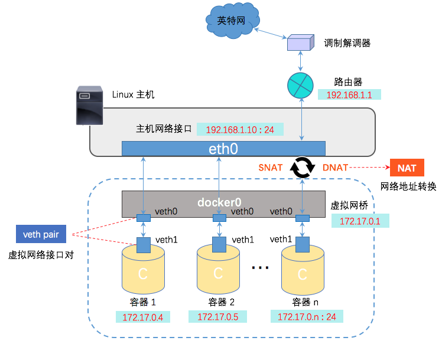

# Docker Networks

[TOC]

## Docker concepts

Docker 提供了一个统一的平台来开发、携带和运行应用程序。Docker 允许我们将应用程序和底层平台设施分开，从而提升软件的交付速度。Balala。See [Docker overview](https://docs.docker.com/engine/docker-overview/) for more details.

### Docker Engine

Docker Engine is a client-server application with these major components: dockerd, REST API and CLI.


### What can I use Docker for?

#### Fast, consistent delivery of your applications

Docker streamlines the development lifecycle by allowing developers to work in standardized environments using local containers which provide your applications and services. Containers are great for continuous integration and continuous delivery (CI/CD) workflows.

Consider the following example scenario:

- Your developers write code locally and share their work with their colleagues using Docker containers.
- They use Docker to push their applications into a test environment and execute automated and manual tests.
- When developers find bugs, they can fix them in the development environment and redeploy them to the test environment for testing and validation.
- When testing is complete, getting the fix to the customer is as simple as pushing the updated image to the production environment.

#### Responsive deployment and scaling

Docker’s container-based platform allows for highly portable workloads. Docker containers can run on a developer’s local laptop, on physical or virtual machines in a data center, on cloud providers, or in a mixture of environments.

Docker’s **portability** and **lightweight** nature also make it easy to dynamically manage workloads, scaling up or tearing down applications and services as business needs dictate, in near real time.

#### Running more workloads on the same hardware

Docker is **lightweight** and fast. It provides a viable, cost-effective alternative to hypervisor-based virtual machines, so you can use more of your compute capacity to achieve your business goals. Docker is perfect for high density environments and for small and medium deployments where you need to do more with fewer resources.

### The underlying technology

Docker 是用 Go 写的，同时基于 Linux kernel 的许多特性构建了其功能。

#### Namespaces

Docker 使用一种叫 namespaces 的技术来提供隔离的环境（isolated environment or isolation），即容器（container）。当你创建一个 container，Docker 为其创建了一系列的 namespaces，从而限定容器中的应用只能访问这些 namespaces 中的资源。

目前，Docker Engine 使用了 Linux namespaces 中的五种：

- The pid namespace: Process isolation.
- The net namespace: Manaing network interfaces.
- The ipc namespace: Managing access to IPC resources.
- The mnt namespace: Managing filesystem mount points.
- The uts namespace: Isolating kernel and version identifiers. (UTS: Unix Timesharing System).

其中，network namespaces 用于隔离和 networking 相关的资源，包括 network devices、IPv4 and IPv6 protocol stacks、IP routing tables、firewall rules、the `/proc/net` directory (which is a symbolic link to `/proc/PID/net`)、the `/sys/class/net` directory、various files under `/proc/sys/net` 和 port numbers（sockets）等等。另外，network namespaces 还隔离了 UNIX domain abstract socket namespace。

一个物理网络设备只能出现在一个 network namespace 中。如果某物理网络设备所在的 network namespace 被释放了，则该设备将被移回最初的 network namespace，而不是归还给父进程。

veth 设备用于连接两个不同的 network namespaces，如桥接处在不同 network namespace 中的物理网络设备 。当一个 namespace 被释放后，其拥有的 veth 设备将被销毁。

#### Control groups

Docker Engine 依赖的另一种技术叫 control groups (`cgroups`)。一个 `cgroup` 用于限制应用可用的资源。借助 `cgroups`，Docker Engine 可以选择性地限制 container 的硬件资源，如限定某 container 的内存使用量。

#### Union file systems

Union file systems, or UnionFS, are file systems that operate by creating layers, making them very lightweight and fast. Docker Engine uses UnionFS to provide the building blocks for containers. Docker Engine can use multiple UnionFS variants, including AUFS, btrfs, vfs, and DeviceMapper.

#### Container format

Docker Engine combines the namespaces, control groups, and UnionFS into a wrapper called a container format. The default container format is `libcontainer`. In the future, Docker may support other container formats by integrating with technologies such as BSD Jails or Solaris Zones.

## Swarm mode concetps

See [Swarm mode key concepts](https://docs.docker.com/engine/swarm/key-concepts/#/services-and-tasks) for more details.

## Learn network deployment models by example

See [Tutorial Application: The Pets APP](https://github.com/docker/labs/blob/master/networking/tutorials.md#overlayarch) for more details.

文中涉及 single/multi-host bridge driver deployment、overlay driver  deployment 和 MACVLAN bridge mode，共四种部署方式。其中，相比 bridge，MACVLAN 直接在网络接口上虚拟出若干个 L2 设备，然后 host、containers 分别绑定一个虚拟网络接口来接入网络。因为 MACVLAN 省去了 bridge 设备，所以性能更好，但是丧失了一定的 portability。


需要注意的是，docker bridge mode 和 Linux bridge 不是同一个概念。Docker bridge mode 是 Docker network 的一种，基于 NAT 和 Linux bridge 实现。所以，在 Docker 中，我们无法通过 bridge mode 让 host 和 containers 处于同一个网段，而 macvlan 可以。




## Operate Docker networking

```bash
$ docker network ls/inspect/...
# Show supported network plugins
$ docker info 
```

## Challenges of networking containers and microservices

Docker has developed a new way of delivering applications, and with that, containers have also changed some aspects of how we approach networking. The following topics are common design themes for containerized applications:

- **Portability**
  - *How do I guarantee maximum portability across diverse network environments while taking advantage of unique network characteristics?*
- **Service Discovery**
  - *How do I know where services are living as they are scaled up and down?*
- **Load Balancing**
  - *How do I share load across services as services themselves are brought up and scaled?*
- **Security**
  - *How do I segment to prevent the right containers from accessing each other?*
  - *How do I guarantee that a container with application and cluster control traffic is secure?*
- **Performance**
  - *How do I provide advanced network services while minimizing latency and maximizing bandwidth?*
- **Scalability**
  - *How do I ensure that none of these characteristics are sacrificed when scaling applications across many hosts?*

## Design of Docker's libnetwork

Libnetwork 项目将遵循 Docker 和 Linux 的理念，开发小型、高度模块化和可组合的工具，这些工具可以独立工作。Libnetwork 旨在满足容器中网络的可组合需求。

### The container networking model


Docker 的网络架构构建在一系列的 interfaces 之上，我们称这些 interfaces 的集合为 Container Networking Model (CNM)。CNM 的原则是在不同的基础设施之上为应用提供 portability。

CNM 中有一些高层的抽象，不依赖于 OS 和基础设施，所以应用无需考虑底层的软件栈。包括：

- **Sandbox** — A Sandbox contains the configuration of a container's network stack. This includes management of the container's interfaces, routing table, and DNS settings. An implementation of a Sandbox could be a Linux Network Namespace, a FreeBSD Jail, or other similar concept. A Sandbox may contain many endpoggints from multiple networks.
- **Endpoint** — An Endpoint joins a Sandbox to a Network. The Endpoint construct exists so the actual connection to the network can be abstracted away from the application. This helps maintain portability so that a service can use different types of network drivers without being concerned with how it's connected to that network.
- **Network** — The CNM does not specify a Network in terms of the OSI model. An implementation of a Network could be a Linux bridge, a VLAN, etc. A Network is a collection of endpoints that have connectivity between them. Endpoints that are not connected to a network will not have connectivity on a Network.

### CNM objects

- NetworkController - NetworkController 对象为 libnetwork 提供入口点，为用户（如 Docker Engine）公开简单的 API 以分配和管理网络。 Libnetwork 支持多个活动驱动程序（内置和远程）。NetworkController 允许用户将特定驱动程序绑定到给定网络。
- Driver - Driver 不是用户可见对象，但 Driver 提供使网络工作的实际实现。然而，NetworkController 提供了一个 API 来配置任何特定的 Driver，其中包含对 libnetwork 透明的 Driver 特定的选项/标签，但可以由 Driver 直接处理。Driver 既可以内置（例如 Bridge，Host，None和overlay），也可以远程（来自插件提供程序）以满足各种用例和部署方案。此时，Driver 拥有一个 Network，负责管理网络（包括 IPAM 等）。通过让多个 Driver 参与处理各种网络管理功能，可以在将来改进这一点。
- Network - Network 是如上定义的 CNM：Network 的实现。NetworkController 提供 API 来创建和管理 Network 对象。无论何时创建或更新网络，都会通知相应的驱动程序该事件。Libnetwork 在抽象级别处理 Network 对象，以提供属于同一网络的一组端点之间的连接，并与其余端点隔离。驱动程序执行提供所需连接和隔离的实际工作。连接可以位于同一主机内，也可以位于多主机中。因此，Network 在群集中具有全局范围。
- Endpoint - Endpoint 表示一个服务端 Endpoint。它为网络中的容器与网络中其他容器提供的其他服务提供的服务提供连接。Network 提供用于创建和管理 Endpoint 的 API。Endpoint 只能连接到一个网络。对相应的驱动程序进行 Endpoint 创建调用，该驱动程序负责为相应的 Sandbox 分配资源。由于 Endpoint 表示服务而不一定是特定容器，因此 Endpoint 也在集群中具有全局范围。
- Sandbox - Sandbox 对象表示容器的网络配置，例如 ip-address、mac-address、routes 和 DNS 条目。当用户请求在 Network 上创建 Endpoint 时，将创建 Sandbox 对象。处理 Network 的 Driver 负责分配所需的网络资源（例如 ip-address）并将名为 SandboxInfo 的信息返回给 libnetwork。 libnetwork 将使用特定于操作系统的构造（例如：netns for Linux）将网络配置填充到 Sandbox 所代表的容器中。Sandbox 可以将多个 Endpoint 连接到不同的 Network。由于 Sandbox 与给定主机中的特定容器相关联，因此它具有表示 Container 所属的主机的本地范围。

### CNM attributes

- Options - Options 提供了一种通用且灵活的机制，可以直接从用户向 Driver 传递特定于 Driver 的配置选项。Options 只是数据的键值对，其中 key 由字符串表示，value 由通用对象表示（例如 golang interface {}）。如果 key 与 net-labels 包中定义的任何已知 Label 匹配，则只能在 Options 上运行Libnetwork。Options 还包括 Labels，如下所述。 Options 通常不是最终用户可见的（在 UI 中），而 Labels 是。
- Labels - Labels 与 Options 非常相似，实际上它们只是 Options 的一个子集。Labels 通常是最终用户可见的，并使用 --labels 选项显式在 UI 中表示。它们从 UI 传递到 Driver，以便 Driver 可以使用它并执行任何特定于 Driver 的操作（例如从 Network 的特定子网中分配 IP 地址）。

### CNM lifecycle

CNM 的消费者（例如 Docker）通过 CNM Objects 及其 API 进行交互，以便对他们管理的容器进行联网。

1. Drivers 向 NetworkController 注册。内置驱动程序在 LibNetwork 内部注册，而远程驱动程序通过 Plugin 机制向 LibNetwork 注册。（插件机制 WIP）。每个 Driver 处理特定的 networkType。
2. NetworkController 对象是使用 `libnetwork.New()` API 创建的，用于管理 Networks 分配，还可以选择使用 Driver 特定的选项配置 Driver。i.e. `controller = libnetwork.New()`。
3. 通过提供 name 和 networkType，使用 `controller.NewNetwork()` API 创建 Network。networkType 参数有助于选择相应的 Driver 并将创建的 Network 绑定到该 Driver。从这一点开始，该 Driver 将处理 Network 上的任何操作。
4. `controller.NewNetwork()` API 还接受可选参数，该参数包含特定于 Driver 的 Options 和 Labels，Driver 可以将其用于其目的。i.e. `network = controller.NewNetwork(name, networkType, options, labels)`。
5. 可以调用 `network.CreateEndpoint()` 在给定 Network 中创建新的 Endpoint。此 API 还接受 Driver 可以使用的可选 Options 参数。 这些 Options 包含众所周知的 Labels 和特定于 Driver 的 Labels。Driver 将依次使用 `driver.CreateEndpoint` 调用，并且可以选择在网络中创建 Endpoint 时保留 IPv4 / IPv6 地址。Driver 将使用 driver API 中定义的 InterfaceInfo 接口分配这些地址。需要 IP / IPv6 作为服务定义以及 Endpoint 公开的端口来完成端点，因为服务端点本质上只是网络地址和应用程序容器正在侦听的端口号。i.e. `endpoint = network.CreateEndpoint(IP, port)`。
6. `endpoint.Join()` 可用于将容器附加到 Endpoint。如果该容器尚不存在，则 Join 操作将创建一个 Sandbox。Driver 可以使用 Sandbox Key 来标识连接到同一容器的多个 Endpoints。此 API 还接受 Driver 可以使用的可选 Options 参数。i.e. `sbx = controller.NewSandBox(); endpoint.Join(sbx)`。
7. 虽然它不是 LibNetwork 的直接设计问题，但强烈建议像 Docker 这样的用户在 Container 的 `Start()` 生命周期中调用 `endpoint.Join()`，该生命周期在容器运行之前调用。作为 Docker 集成的一部分，我们将对此进行处理。
8. 关于 Endpoint `join()` API 的常见问题解答之一就是，为什么我们需要一个 API 来创建一个 Endpoint，另一个来 Join Endpoint。答案是基于 Endpoint 代表一个服务，该服务可能由 Container 支持也可能不支持。 创建 Endpoint 时，它将保留其资源，以便以后任何容器都可以连接到 Endpoint 并获得一致的网络行为。
9. 当容器停止时，可以调用 `endpoint.Leave()`。Driver 可以清除在` Join()` 调用期间分配的状态。 当最后一个引用 Endpoint 离开网络时，LibNetwork 将删除 Sandbox。但只要 Endpoint 仍然存在，LibNetwork 就会保留 IP 地址，并在容器（或任何容器）再次加入时重用。这可确保容器的资源在再次停止和启动时重复使用。i.e. `endpoint.Leave(idx_of_sandbox)`。
10. `endpoint.Delete()` 用于从网络中删除端点。这导致删除端点并清理缓存的 sandbox.Info。
11. `network.Delete()` 用于删除网络。如果网络上附加了任何现有端点，LibNetwork 将不允许删除。

### Implementation details

#### Networks & Endpoints

Libnetwork 的 network 和 endpoint API 主要用于管理相应的对象并将其保存，以提供 CNM 所需的抽象级别。它将实际实现委托给驱动程序，这些驱动程序实现了 CNM 中承诺的功能。有关这些详细信息的更多信息，请参阅驱动程序部分。

#### Sandbox

Libnetwork 提供了在多个操作系统中实现 Sandbox 的框架。目前，我们已经使用 sandbox 
 包中的 namespace_linux.go 和 configure_linux.go 实现了 Sandbox for Linux。这将为每个沙箱创建一个网络命名空间，该命名空间由主机文件系统上的路径唯一标识。Netlink 调用用于将接口从全局命名空间移动到 Sandbox 命名空间。Netlink 还用于管理命名空间中的路由表。

### Using `libnetwork`

```go
import (
	"fmt"
	"log"

	"github.com/docker/docker/pkg/reexec"
	"github.com/docker/libnetwork"
	"github.com/docker/libnetwork/config"
	"github.com/docker/libnetwork/netlabel"
	"github.com/docker/libnetwork/options"
)

func main() {
	if reexec.Init() {
		return
	}

	// Select and configure the network driver
	networkType := "bridge"

	// Create a new controller instance
	driverOptions := options.Generic{}
	genericOption := make(map[string]interface{})
	genericOption[netlabel.GenericData] = driverOptions
	controller, err := libnetwork.New(config.OptionDriverConfig(networkType, genericOption))
	if err != nil {
		log.Fatalf("libnetwork.New: %s", err)
	}

	// Create a network for containers to join.
	// NewNetwork accepts Variadic optional arguments that libnetwork and Drivers can use.
	network, err := controller.NewNetwork(networkType, "network1", "")
	if err != nil {
		log.Fatalf("controller.NewNetwork: %s", err)
	}

	// For each new container: allocate IP and interfaces. The returned network
	// settings will be used for container infos (inspect and such), as well as
	// iptables rules for port publishing. This info is contained or accessible
	// from the returned endpoint.
	ep, err := network.CreateEndpoint("Endpoint1")
	if err != nil {
		log.Fatalf("network.CreateEndpoint: %s", err)
	}

	// Create the sandbox for the container.
	// NewSandbox accepts Variadic optional arguments which libnetwork can use.
	sbx, err := controller.NewSandbox("container1",
		libnetwork.OptionHostname("test"),
		libnetwork.OptionDomainname("docker.io"))
	if err != nil {
		log.Fatalf("controller.NewSandbox: %s", err)
	}

	// A sandbox can join the endpoint via the join api.
	err = ep.Join(sbx)
	if err != nil {
		log.Fatalf("ep.Join: %s", err)
	}

	// libnetwork client can check the endpoint's operational data via the Info() API
	epInfo, err := ep.DriverInfo()
	if err != nil {
		log.Fatalf("ep.DriverInfo: %s", err)
	}

	macAddress, ok := epInfo[netlabel.MacAddress]
	if !ok {
		log.Fatalf("failed to get mac address from endpoint info")
	}

	fmt.Printf("Joined endpoint %s (%s) to sandbox %s (%s)\n", ep.Name(), macAddress, sbx.ContainerID(), sbx.Key())
}
```

### Drivers

#### API

Driver 本质上是 libnetwork 的扩展，并为上面定义的所有 LibNetwork API 提供实际的实现。因此，所有 Network 和 Endpoint API 都有 1-1 对应关系，其中包括：

- driver.Config
- driver.CreateNetwork
- driver.DeleteNetwork
- driver.CreateEndpoint
- driver.DeleteEndpoint
- driver.Join
- driver.Leave

These Driver facing APIs make use of unique identifiers (`networkid`,`endpointid`,...) instead of names (as seen in user-facing APIs).

#### Driver semantics

- Driver.CreateEndpoint

This method is passed an interface `EndpointInfo`, with methods `Interface` and `AddInterface`. 如果 Interface 返回的值是非零的，则期望 Driver 利用其中的接口信息（e.g., treating the address or addresses as statically supplied），如果不能，则必须返回错误。如果值为 nil，则 Driver 应该只分配一个新的 Interface，并使用 AddInterface 来记录它们；如果不能，则返回错误。It is forbidden to use `AddInterface` if `Interface` is non-nil.

### Implementations

Libnetwork includes the following driver packages:

- null - The null driver is a `noop` implementation of the driver API, used only in cases where no networking is desired. This is to provide backward compatibility to the Docker's `--net=none` option.
- bridge - The `bridge` driver provides a Linux-specific bridging implementation based on the Linux Bridge. For more details, please [see the Bridge Driver documentation](https://github.com/docker/libnetwork/blob/master/docs/bridge.md).
- overlay - The `overlay` driver implements networking that can span multiple hosts using overlay network encapsulations such as VXLAN. For more details on its design, please see the [Overlay Driver Design](https://github.com/docker/libnetwork/blob/master/docs/overlay.md).
- remote - The `remote` package does not provide a driver, but provides a means of supporting drivers over a remote transport. This allows a driver to be written in a language of your choice. For further details, please see the [Remote Driver Design](https://github.com/docker/libnetwork/blob/master/docs/remote.md).

## Linux network fundamentals

Linux kernel 已经包含了一个成熟且高效的 TCP/IP 协议栈，包括 DNS 和 VXLAN。Docker networking 在这些基础上（low level primitives）构建了高层的 network drivers。简而言之，Docker 网络就是 Linux 网络。

现有 Linux 内核功能的这种实现确保了高性能和健壮性。最重要的是，它提供了多发行版间的可移植性，从而增强了应用程序的可移植性。

Docker 使用若干 Linux 网络模块来实现其内置的 CNM 网络驱动程序，包括 Linux bridge，network namespaces，veth pair 和 iptables。The combination of these tools implemented as network drivers provide the forwarding rules, network segmentation, and management tools for complex network policy.

### bridge

Linux 网桥是 L2 设备，它是在 Linux 内核中实现的虚拟交换机。它根据通过检查流量动态学习 MAC 地址从而进行流量转发。Linux bridge 广泛用于 Docker 网络驱动程序中。Linux 桥不应与 Docker bridge network 驱动程序混淆，后者是 Linux bridge 的高层实现。

### netns

Linux network namepsace 是内核中独立的网络协议栈，包括独立的接口（interfaces）、路由（routes）和防火墙规则（firewall rules）。 它属于容器和 Linux 安全方面之一，用于隔离容器。 在网络术语中，它们类似于 VRF，它将主机内的 network control plane 和 data plane 分离。Network namespace 确保同一主机上的两个容器无法相互通信，甚至无法与主机本身通信，除非通过 Docker 网络进行配置。通常，CNM 网络驱动程序为每个容器实现单独的命名空间。但是，容器可以共享相同的网络命名空间，甚至可以是主机网络命名空间的一部分。主机网络命名空间包含主机接口和主机路由表。此网络命名空间称为全局网络命名空间。

### veth

虚拟以太网设备或 veth 是一个 Linux 网络接口，充当两个网络命名空间之间的连接线。 veth 是一个全双工链接，每个命名空间中都有一个接口。 一个接口中的流量被引导出另一个接口。Docker 网络驱动程序利用 veths 在创建Docker网络时提供名称空间之间的显式连接。当容器连接到 Docker 网络时，veth 的一端放在容器内（通常被视为 ethX 接口），而另一端连接到 Docker 网络。

### iptables

iptables 是本机包过滤系统，自 2.4 版本以来一直是 Linux 内核的一部分。它是一个功能丰富的 L3 / L4 防火墙，通过 rule chains 为数据包提供 marking，masquerading 和 dropping 操作。内置的 Docker 网络驱动程序广泛使用 iptables 来分割网络流量，提供主机端口映射，并标记流量以实现负载平衡决策。

### tc

TODO

## Overlay driver network architecture

内置的 Docker overlay network driver 从根本上简化了多主机网络中的许多挑战。 With the overlay driver, multi-host networks are first-class citizens inside Docker without external provisioning or components. 在大规模的集群中，Overlay 使用 Swarm 分布式控制提供 centralized management，stability 和 security。

### VXLAN data plane

覆盖驱动程序使用行业标准的 VXLAN 数据平面，将容器网络与底层物理网络（底层）分离。Docker overlay network 将容器流量封装在 VXLAN 标头中，允许流量穿过物理 L2 或者 L3 网络。无论底层物理拓扑如何，overlay 使得网络分段可动态变化且易于控制。 使用标准 IETF VXLAN 标头可促进标准工具检查和分析网络流量。

自 3.7 版本以来，VXLAN 一直是 Linux 内核的一部分，而 Docker 使用内核的本机 VXLAN 功能来创建 overlay network。Docker overlay 数据路径完全在内核空间中。 这样可以减少上下文切换，减少CPU开销，并在应用程序和物理 NIC 之间实现低延迟和直接的流量路径。

IETF VXLAN（RFC 7348）是一种数据层封装格式，它通过第 3 层网络覆盖第 2 层网段。VXLAN 旨在在标准 IP 网络和共享物理网络基础架构上支持大规模多租户设计。现有的内部部署和基于云的网络可以透明地支持 VXLAN。VXLAN 定义为 MAC-in-UDP 封装，将容器第 2 层帧放置在底层 IP/UDP 头中。底层 IP / UDP 报头提供底层网络上主机之间的传输。The overlay is the stateless VXLAN tunnel that exists as point-to-multipoint connections between each host participating in a given overlay network. 由于覆盖层独立于底层拓扑，因此应用程序变得更加便携。因此，无论是在本地，在开发人员桌面上还是在公共云中，网络策略和连接都对应用程序透明。


In this diagram we see the packet flow on an overlay network. Here are the steps that take place when `c1` sends `c2`packets across their shared overlay network:

- `c1` does a DNS lookup for `c2`. Since both containers are on the same overlay network the Docker Engine local DNS server resolves `c2` to its overlay IP address `10.0.0.3`.
- An overlay network is a L2 segment so `c1` generates an L2 frame destined for the MAC address of `c2`.
- The frame is encapsulated with a VXLAN header by the `overlay` network driver. The distributed overlay control plane manages the locations and state of each VXLAN tunnel endpoint so it knows that `c2` resides on `host-B` at the physical address of `192.168.1.3`. That address becomes the destination address of the underlay IP header.
- Once encapsulated the packet is sent. The physical network is responsible of routing or bridging the VXLAN packet to the correct host.
- The packet arrives at the `eth0` interface of `host-B` and is decapsulated by the `overlay` network driver. The original L2 frame from `c1` is passed to the `c2`'s `eth0` interface and up to the listening application.

### Overlay driver internal architecture

Docker Swarm 控制平面可自动完成 overlay network 的所有配置。不需要额外配置 VXLAN 或 Linux networking。数据平面加密是可选功能，也可以在创建网络时由 overlay 驱动程序自动配置。用户或网络管理员只需定义网络（docker network create -d overlay ...）并将容器附加到该网络即可。


在覆盖网络创建期间，Docker Engine 会在每台主机上创建覆盖所需的网络基础架构。 每个覆盖创建一个 Linux 桥及其关联的 VXLAN 接口。 仅当在主机上安排连接到该网络的容器时，Docker Engine 才会智能地在主机上实例化 overlay network。 这可以防止不存在连接容器的 overlay network 蔓延。

In the following example we create an overlay network and attach a container to that network. We'll then see that Docker Swarm/UCP automatically creates the overlay network.

```
# Create an overlay named "ovnet" with the overlay driver
$ docker network create -d overlay ovnet

# Create a service from an nginx image and connect it to the "ovnet" overlay network
$ docker service create --network ovnet --name container nginx
```

When the overlay network is created, you will notice that several interfaces and bridges are created inside the host.

```
# Run the "ifconfig" command inside the nginx container
$ docker exec -it container ifconfig

# docker_gwbridge network
eth0      Link encap:Ethernet  HWaddr 02:42:AC:12:00:04
          inet addr:172.18.0.4  Bcast:0.0.0.0  Mask:255.255.0.0
          inet6 addr: fe80::42:acff:fe12:4/64 Scope:Link
          UP BROADCAST RUNNING MULTICAST  MTU:1500  Metric:1
          RX packets:8 errors:0 dropped:0 overruns:0 frame:0
          TX packets:8 errors:0 dropped:0 overruns:0 carrier:0
          collisions:0 txqueuelen:0
          RX bytes:648 (648.0 B)  TX bytes:648 (648.0 B)

# overlay network
eth1      Link encap:Ethernet  HWaddr 02:42:0A:00:00:07
          inet addr:10.0.0.7  Bcast:0.0.0.0  Mask:255.255.255.0
          inet6 addr: fe80::42:aff:fe00:7/64 Scope:Link
          UP BROADCAST RUNNING MULTICAST  MTU:1450  Metric:1
          RX packets:8 errors:0 dropped:0 overruns:0 frame:0
          TX packets:8 errors:0 dropped:0 overruns:0 carrier:0
          collisions:0 txqueuelen:0
          RX bytes:648 (648.0 B)  TX bytes:648 (648.0 B)
     
# container loopback
lo        Link encap:Local Loopback
          inet addr:127.0.0.1  Mask:255.0.0.0
          inet6 addr: ::1/128 Scope:Host
          UP LOOPBACK RUNNING  MTU:65536  Metric:1
          RX packets:48 errors:0 dropped:0 overruns:0 frame:0
          TX packets:48 errors:0 dropped:0 overruns:0 carrier:0
          collisions:0 txqueuelen:0
          RX bytes:4032 (3.9 KiB)  TX bytes:4032 (3.9 KiB)
```

Two interfaces have been created inside the container that correspond to two bridges that now exist on the host. On overlay networks, each container will have at least two interfaces that connect it to the `overlay` and the `docker_gwbridge`.

| Bridge              | Purpose                                                      |
| ------------------- | ------------------------------------------------------------ |
| **overlay**         | The ingress and egress point to the overlay network that VXLAN encapsulates and (optionally) encrypts traffic going between containers on the same overlay network. It extends the overlay across all hosts participating in this particular overlay. One will exist per overlay subnet on a host, and it will have the same name that a particular overlay network is given. |
| **docker_gwbridge** | The egress bridge for traffic leaving the cluster. Only one `docker_gwbridge` will exist per host. Container-to-Container traffic is blocked on this bridge allowing ingress/egress traffic flows only. |

Docker overlay 驱动程序自 Docker Engine 1.9 以来就已存在，并且需要外部 KV 存储来管理网络状态。Docker 1.12 将控制平面状态集成到 Docker Engine 中，因此不再需要外部存储。 1.12 还引入了一些新功能，包括加密和服务负载平衡。引入的网络功能需要支持它们的 Docker Engine 版本，并且不兼容旧版本的 Docker Engine。

## Refs

- Docker overview. https://docs.docker.com/engine/docker-overview/.
- `man namespaces`. http://man7.org/linux/man-pages/man7/namespaces.7.html.
- `man network_namespaces`. http://man7.org/linux/man-pages/man7/network_namespaces.7.html.
- Swarm mode key concepts. https://docs.docker.com/engine/swarm/key-concepts/#/services-and-tasks.
- Docker networking. https://github.com/docker/labs/tree/master/networking.
- Bridge vs macvlan. http://hicu.be/bridge-vs-macvlan.
- Docker bridge vs linux bridge. http://blog.daocloud.io/docker-bridge/.
- Docker Networking with Linux. http://www.i3s.unice.fr/~urvoy/docs/VICC/3_vicc.pdf.
- Design of Docker's libnetwork. https://github.com/docker/libnetwork/blob/master/docs/design.md.