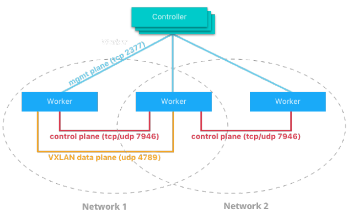
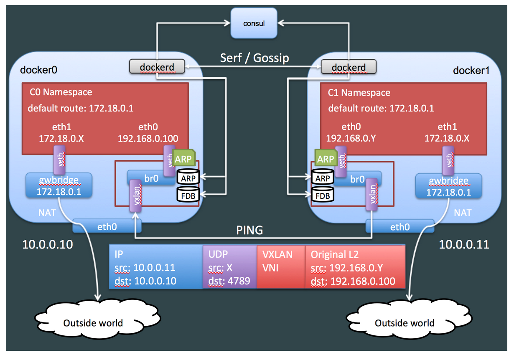
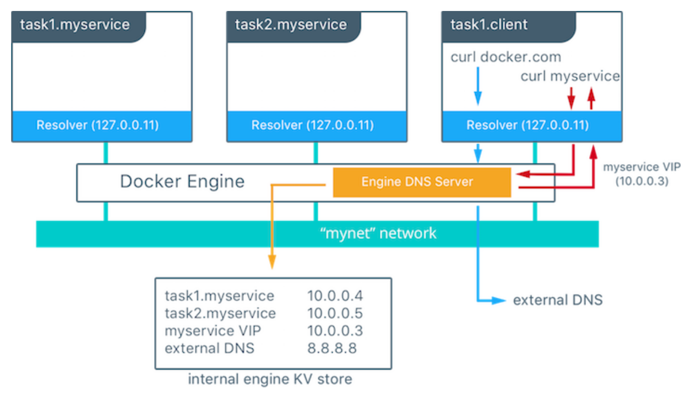

# Docker-compatible Overlay Networks

Container overlay networks 主要用于解决 Docker 容器的跨主机通信问题。Docker 在早前的时候没有考虑跨主机的容器通信，这个特性直到 Docker 1.9 才出现。在此之前，如果希望位于不同主机的容器能够通信，一般有几种方法：

- 使用端口映射：直接把容器的服务端口映射到主机上，主机直接通过映射出来的端口通信，该方式就是 Docker 的 bridge mode。
- 把容器放到主机所在的网段：修改 Docker 的 IP 分配网段和主机一致，还要修改主机的网络结构（通过 MACVLAN、SRIOV、Linux bridge 等技术让容器中的网络接口和主机接口处于同一个 L2 广播域）。
- Container overlay networks，包括 Dockery overlay network、Flannel、Weave 和 Calico。

## Docker network model (CNM)


CNM 中有一些高层的抽象，不依赖于 OS 和基础设施，所以应用无需考虑底层的软件栈。包括：

- **Sandbox** - Sandbox 包含容器网络堆栈的配置。这包括管理容器的接口，路由表和 DNS 设置。Sandbox 的实现可以是 Linux 网络命名空间、FreeBSD Jail 或其他类似概念。Sandbox 可能包含来自多个网络的许多 Endpoints。
- **Endpoint** - Endpoint 将 Sandbox 连接到一个 Network。Endpoint 的存在是有必要的，这样就可以从应用程序中抽象出与网络的实际连接。这有助于保持可移植性，以便服务可以使用不同类型的网络驱动程序，而无需关心它如何连接到该网络。
- **Network** - CNM 没有根据 OSI 模型指定 Network。Network 的实现可以是 Linux 网桥、VLAN 等。Network 是 Endpoint 的集合，它们之间具有连接。未连接到 Network 的 Endpoint 将不具有网络连接。

## Docker overlay network

### Use an overlay network for standalone containers

Overview:

- On `r0`, initialize the node as a swarm (manager).
- On `r1`, join the node to the swarm (worker).
- On `r0`, create an attachable overlay network (`test-net`).
- On `r0`, run an interactive container (`ubuntu0`) on `test-net`.
- On `r1`, run an interactive container (`ubuntu1`) on `test-net`.
- On `r0`, from within a session of ubuntu0, ping ubuntu1.

Prerequisites:

- TCP port 2377 - 集群管理端口
- TCP and UDP port 7946 - 用于节点发现
- UDP port 4789 - VXLAN



Details:

```bash
# On r0, initialize a swarm
docker swarm init
# On r1, join the swarm as instructed above
docker swarm join --token <...>
# On r0, create an attachable overlay network called `test-net`
docker network create --driver=overlay --attachable test-net
# On r0, start an -it container that connects to test-net
docker run -it --rm --name ubuntu0 --network test-net ubuntu:14.04
# On r1, list the available networks, notice that test-net does not yet exist
docker network ls
# On r1, start a -it container that connects to test-net
# \note Automatic DNS container discovery only works with unique container names.
docker run -it --rm --name ubuntu1 --network test-net ubuntu:14.04
# On r1, verify that test-net was created (and has the same network-id as test-net on r0)
docker network ls
# On r0, ping ubuntu1
ping -c 3 ubuntu1
# Clean up your networks
docker network rm test-net
```

### Internals

当我们启用 Docker 的 swarm 模式以后，主机上多出一个 docker_gwbridge 设备和一个名为 ingress 的 overlay 网络。当我们新创建一个容器并 attach 到 overlay 网络，容器会多出两个 veth，一个连上主机 netns 中的 docker_gwbridge 用于连接外部网络，一个连上 overlay 所在的 netns 中的 br0 用于连接 overlay 网络。



当我们新创建一个 overlay network `test-net` 后，Docker 会创建一个新的 br0 和 vxlan0 设备，然后封装在一个独立的 network namespace 中。

```bash
# 为了 ip netns 能够操作 Docker 创建的 netns，需要将 Docker 存放 netns 的目录链接到 /var/run/netns
$ ln -s /var/run/docker/netns /var/run/netns
# Show all netns
# \note default 是 weave 的 netns，而第一个就是我们新创建的 overlay network 的 netns
$ ip netns ls
1-ytwmpdu4mm
ingress_sbox
default
# Show all devices in the netns
# \note veth0@if175 是某容器加入该 overlay 网络后创建的 veth
$ ip netns exec 1-ytwmpdu4mm ip addr
1: lo: <LOOPBACK,UP,LOWER_UP> mtu 65536 qdisc noqueue state UNKNOWN group default qlen 1
    link/loopback 00:00:00:00:00:00 brd 00:00:00:00:00:00
    inet 127.0.0.1/8 scope host lo
       valid_lft forever preferred_lft forever
2: br0: <BROADCAST,MULTICAST,UP,LOWER_UP> mtu 1450 qdisc noqueue state UP group default 
    link/ether 86:35:0f:a7:d5:6b brd ff:ff:ff:ff:ff:ff
    inet 10.255.0.1/16 brd 10.255.255.255 scope global br0
       valid_lft forever preferred_lft forever
174: vxlan0: <BROADCAST,MULTICAST,UP,LOWER_UP> mtu 1450 qdisc noqueue master br0 state UNKNOWN group default 
    link/ether 96:b4:f0:77:6f:c2 brd ff:ff:ff:ff:ff:ff
176: veth0@if175: <BROADCAST,MULTICAST,UP,LOWER_UP> mtu 1450 qdisc noqueue master br0 state UP group default 
    link/ether 86:35:0f:a7:d5:6b brd ff:ff:ff:ff:ff:ff
```

下面看看 ubuntu0（10.0.0.2）发送的 ping 报文是怎么发送到 c2（10.0.0.3）的：

1. u0 找到路由发现目的 IP 可以直达，于是发送 ARP 报文找问目标的 MAC 地址，封包，通过 eth0 发送出去；
2. 报文传输到 veth pair 的另一端，并发送到其绑定的虚拟机交换机 br0；
3. br0 会将报文转交给 vxlan0；
4. vxlan 会查询 consul 中保存的目的主机地址，完成报文的封装并通过主机网络接口转发出去；
5. 通过中间网络和路由，报文被发送到目的主机；
6. 目的主机接受到报文后，发现是 VXLAN 报文，把它转交给 VXLAN 设备，也就是 vxlan0 处理；
7. vxlan0 解包，取出里面被封装的报文，把它交给 br0；
8. br0 发现报文是发送到连到它上面的某个容器的，将报文转交给容器。

需要注意的是，我们在执行 ping 命令时，指定的是主机的名字，如何解析成目的主机的 IP 的？

- Each Docker container (or task in Swarm mode) has a DNS resolver that forwards DNS queries to Docker Engine, which acts as a DNS server.
- Service discovery is network-scoped (per overlay)
- If the destination container or service does not belong on the same network(s) as the source container, then Docker Engine forwards the DNS query to the configured default DNS server.



## Flannel / Weave / Calico

TODO

## Refs

- An Analysis and Empirical Study of Container Networks. http://ranger.uta.edu/~jrao/papers/INFOCOM18.pdf.
- Use an overlay network for standalone containers. https://docs.docker.com/network/network-tutorial-overlay/.
- Docker 跨主机网络：overlay 简介. https://cizixs.com/2016/06/13/docker-overlay-network/.
- Battlefield: Calico, Flannel, Weave and Docker Overlay Network. http://chunqi.li/2015/11/15/Battlefield-Calico-Flannel-Weave-and-Docker-Overlay-Network/.
- Docker Networking with Linux. http://www.i3s.unice.fr/~urvoy/docs/VICC/3_vicc.pdf.