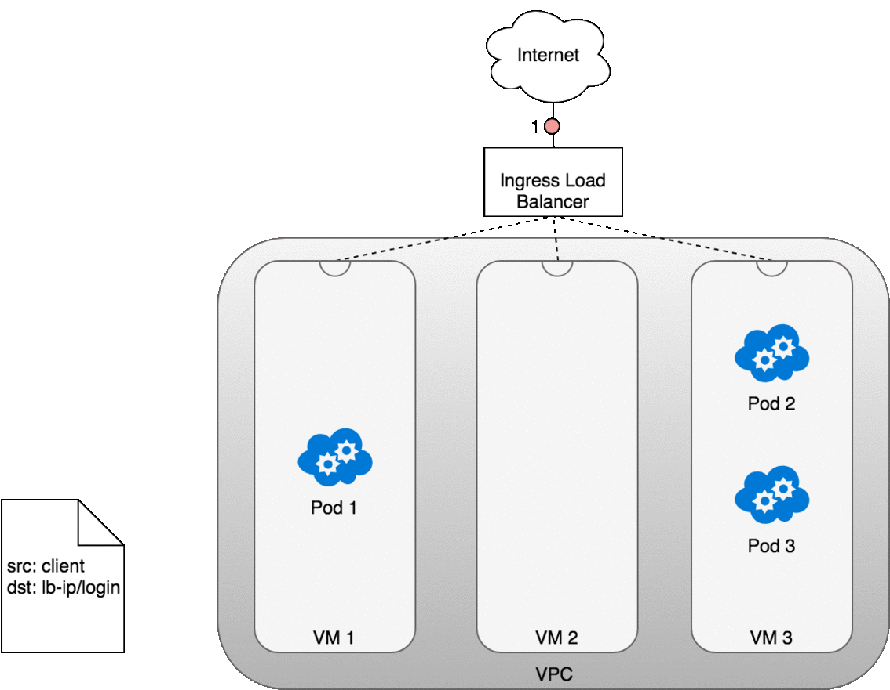

# Kubernetes Networks

[TOC]

Kubernetes是为在一组机器上运行分布式系统而构建的。分布式系统的本质使网络成为Kubernetes部署的核心和必要组件，了解Kubernetes网络模型将使您能够正确运行和监控在Kubernetes上运行的应用程序，同时有助于排除故障。

网络是一个拥有大量成熟技术的广阔空间。 对于不熟悉景观的人来说，这可能会让人感到不舒服，因为大多数人都有关于网络的先入为主的概念，并且有许多新旧概念需要理解并融合成一个连贯的整体。这些概念可能包括网络命名空间、虚拟接口、IP转发和网络地址转换等技术。本指南旨在通过讨论每个Kubernetes依赖技术以及如何使用这些技术来启用Kubernetes网络模型的描述来揭开Kubernetes网络的神秘面纱。

本指南相当长，分为几个部分。 我们首先讨论一些基本的Kubernetes术语，以确保在整个指南中正确使用术语，然后讨论Kubernetes网络模型以及它所强加的设计和实现决策。 接下来是本指南中最长和最有趣的部分：深入讨论如何使用几种不同的用例在Kubernetes中路由流量。

如果您不熟悉任何网络术语，则本指南附有网络术语表。

## Kubernetes Basics

Kubernetes是根据一些核心概念构建的，这些概念结合在一起，功能越来越强大。 本节列出了这些概念中的每一个，并提供了简要概述以帮助促进讨论。 Kubernetes的内容远远多于此处列出的内容，但本节应作为入门读物，并允许读者在后面的章节中进行介绍。 如果您已熟悉Kubernetes，请随意跳过此部分。

### Kubernetes API server

在Kubernetes中，所有内容都是由Kubernetes API服务器（kube-apiserver）提供的API调用。 API服务器是etcd数据存储的网关，可维护应用程序集群的所需状态。如果你要更新Kubernetes集群的状态，请对API服务器进行API调用，并描述所需的状态。

### Controllers

控制器是用于构建Kubernetes的核心抽象。使用API服务器声明群集的所需状态后，控制器会通过持续监视API服务器的状态并对任何更改做出反应来确保群集的当前状态与所需状态匹配。控制器使用简单的循环操作，该循环连续地检查群集的当前状态与群集的期望状态。如果存在任何差异，则控制器执行任务以使当前状态与期望状态匹配。在伪代码中：

```
while true:
  X = currentState()
  Y = desiredState()
  if X == Y:
    return  # Do nothing
  else:
    do(tasks to get to Y)

```

例如，当您使用API服务器创建新Pod时，Kubernetes调度程序（控制器）会注意到更改并决定将Pod放置在集群中的位置。然后它使用API服务器（由etcd支持）写入状态更改。然后，kubelet（控制器）会注意到新的更改并设置所需的网络功能，以使Pod在群集中可访问。这里，两个独立的控制器对两个独立的状态变化做出反应，以使集群的真实性与用户的意图相匹配。

### Pods

Pod是Kubernetes的基本单位 - 用于构建应用程序的最小可部署对象。 单个Pod表示群集中正在运行的工作负载，包括一个或多个Docker容器、任何所需的存储资源和唯一的IP地址。组成 pod 的容器会被调度到同一个容器上。

### Nodes

Nodes 是运行Kubernetes集群的计算机。这些可以是裸机、虚拟机或其他任何东西。 单词hosts通常与 nodes 互换使用。 我将尝试使用具有一致性的术语节点，但有时会根据上下文，使用「虚拟机」代替 nodes。

## The Kubernetes Networking Model

Kubernetes对Pods如何联网提出了自己的看法。特别是，Kubernetes规定了任何网络实施的以下要求：

- 所有Pod都可以与所有其他Pod通信，而无需使用网络地址转换（NAT）。
- 所有节点都可以与没有NAT的所有Pod通信。
- Pod认为自己的IP与其他人认为的IP相同。

鉴于这些限制，我们需要解决四个不同的网络问题：

- Container-to-Container网络
- Pod-to-Pod网络
- Pod-to-Service网络
- Internet-to-Service网络

本指南的其余部分将依次讨论这些问题及其解决方案。

## Container-to-Container Networking

通常，我们将虚拟机中的网络通信视为与以太网设备直接交互，如图1所示。


实际上，情况比这更微妙。 在Linux中，每个正在运行的进程在网络命名空间内进行通信，该命名空间为逻辑网络堆栈提供自己的路由，防火墙规则和网络设备。 本质上，网络命名空间为命名空间内的所有进程提供全新的网络堆栈。

作为Linux用户，可以使用ip命令创建网络命名空间。 例如，以下命令将创建一个名为ns1的新网络命名空间。

```bash
$ ip netns add ns1
```

创建命名空间时，会在 `/var/run/netns` 下创建一个挂载点，即使没有附加进程，也可以保留命名空间。您可以通过列出 `/var/run/netns` 下的所有挂载点或使用ip命令列出可用的命名空间。

```bash
$ ls /var/run/netns
ns1
$ ip netns
ns1
```

默认情况下，Linux将每个进程分配给根网络命名空间以提供对外部世界的访问，如图2所示。


就Docker构造而言，Pod被建模为共享网络命名空间的一组Docker容器。 Pod中的容器都具有通过分配给Pod的网络命名空间分配的相同IP地址和端口空间，并且可以通过localhost找到彼此，因为它们位于同一命名空间中。 我们可以为虚拟机上的每个Pod创建网络命名空间。 这是使用Docker实现的「Pod容器」，它保持网络命名空间打开，而「app containers」（用户指定的东西）通过Docker的 `-net = container:function` 连接该命名空间。 图3显示了每个Pod如何由共享命名空间中的多个Docker容器（ctr *）组成。


Pod中的应用程序还可以访问共享卷，共享卷被定义为Pod的一部分，可以安装到每个应用程序的文件系统中。

## Pod-to-Pod Networking

在Kubernetes中，每个Pod都有一个真实的IP地址，每个Pod使用该IP地址与其他Pod通信。 手头的任务是了解Kubernetes如何使用真实IP实现Pod-to-Pod通信，无论Pod是部署在同一物理节点上还是部署在集群中的不同节点上。 我们通过考虑驻留在同一台机器上的Pod来开始讨论，以避免通过内部网络跨节点进行通信的复杂性。

从Pod的角度来看，它存在于自己的以太网命名空间中，需要与同一节点上的其他网络命名空间进行通信。 值得庆幸的是，名称空间可以使用Linux虚拟以太网设备或包含两个虚拟接口的veth对连接，这两个虚拟接口可以分布在多个名称空间中。 要连接Pod命名空间，我们可以将veth对的一侧分配给根网络命名空间，将另一侧分配给Pod的网络命名空间。 每个veth对的工作方式类似于跳线，连接两侧并允许流量在它们之间流动。 可以为机器上的多个Pod复制此设置。 图4显示了将VM上的每个Pod连接到根命名空间的veth对。


此时，我们将Pod设置为每个都有一个网络命名空间，以便他们相信他们有自己的以太网设备和IP地址，并且它们连接到Node的根命名空间。 现在，我们希望Pod通过根命名空间相互通信，为此我们使用网桥。

Linux以太网桥是一种虚拟的第2层网络设备，用于统一两个或多个网段，透明地将两个网络连接在一起。 网桥通过检查源和目的地之间的转发表来检查通过它的数据包的目的地并决定是否将数据包传递到连接到网桥的其他网段。 桥接代码通过查看网络中每个以太网设备唯一的MAC地址来决定是桥接数据还是丢弃数据。

网桥实现ARP协议以发现与给定IP地址相关联的链路层MAC地址。 当在桥接器处接收到数据帧时，桥接器将帧广播到所有连接的设备（原始发送器除外），并且响应该帧的设备存储在查找表中。 具有相同IP地址的未来流量使用查找表来发现正确的MAC地址以转发数据包。


### Life of a packet: Pod-to-Pod, same Node

Given the network namespaces that isolate each Pod to their own networking stack, virtual Ethernet devices that connect each namespace to the root namespace, and a bridge that connects namespaces together, we are finally ready to send traffic between Pods on the same Node. This is illustrated in Figure 6.


在图6中，Pod 1将数据包发送到其自己的以太网设备eth0，该设备可用作Pod的默认设备。 对于Pod 1，eth0通过虚拟以太网设备连接到根命名空间veth0（1）。 网桥cbr0配置有veth0，网络段连接到它。 一旦数据包到达网桥，网桥就会解析正确的网段，使用ARP协议将数据包发送到veth1（3）。 当数据包到达虚拟设备veth1时，它将直接转发到Pod 2的命名空间和该命名空间内的eth0设备（4）。 在整个流量流中，每个Pod仅与localhost上的eth0进行通信，并且流量将路由到正确的Pod。The development experience for using the network is the default behaviour that a developer would expect.

Kubernetes的网络模型规定Pod必须可以通过节点的IP地址访问。 也就是说，Pod的IP地址始终对网络中的其他Pod可见，并且每个Pod查看自己的IP地址，就像其他Pod看到的一样。 我们现在转向在不同节点上的Pod之间流量路由的问题。

### Life of  a packet: Pod-to-Pod, across Nodes

在研究了如何在同一节点上的Pod之间路由数据包之后，我们继续在不同节点上的Pod之间路由流量。 Kubernetes网络模型要求Pod IP可通过网络访问，但不指定必须如何完成。 在实践中，这是网络特定的，但已经建立了一些模式以使这更容易。

通常，群集中的每个节点都会分配一个CIDR块，指定在该节点上运行的Pod可用的IP地址。 一旦发往CIDR块的流量到达节点，Node就有责任将流量转发到正确的Pod。 图7说明了两个节点之间的流量流，假设网络可以将CIDR块中的流量路由到正确的节点。


图7以与图6中相同的请求开始，除了这次，目标Pod（以绿色突出显示）与源Pod在不同的节点上（以蓝色突出显示）。数据包首先通过Pod 1的以太网设备发送，该设备与根命名空间中的虚拟以太网设备配对（1）。最终，数据包最终位于根命名空间的网桥（2）。 ARP将在网桥上失败，因为没有设备连接到网桥，并且数据包的MAC地址正确。失败时，网桥将数据包发送出默认路由 - 根命名空间的eth0设备。此时路由离开节点并进入网络（3）。我们现在假设网络可以基于分配给节点的CIDR块将分组路由到正确的节点（4）。数据包进入目标节点的根命名空间（VM 2上的eth0），通过网桥将其路由到正确的虚拟以太网设备（5）。最后，路由通过流经Pod 4的命名空间（6）中的虚拟以太网设备对完成。一般来说，每个节点都知道如何将数据包传递到其中运行的Pod。一旦数据包到达目标节点，数据包的流动方式与在同一节点上的Pod之间路由流量的方式相同。

我们方便地分步了如何配置网络以将Pod IP的流量路由到负责这些IP的正确节点。 这是特定于网络的，但查看具体示例将提供对所涉及问题的一些了解。 例如，通过AWS，亚马逊为Kubernetes维护一个容器网络插件，允许节点到节点网络使用容器网络接口（CNI）插件在Amazon VPC环境中运行。

容器网络接口（CNI）提供了用于将容器连接到外部网络的通用API。 作为开发人员，我们想知道Pod可以使用IP地址与网络通信，我们希望此操作的机制是透明的。 AWS开发的CNI插件尝试满足这些需求，同时通过AWS提供的现有VPC，IAM和安全组功能提供安全且可管理的环境。 解决方案是使用弹性网络接口。

在EC2中，每个实例都绑定到弹性网络接口（ENI），并且所有ENI都在VPC内连接 - ENI能够相互联系而无需额外的配置。默认情况下，每个EC2实例都使用单个ENI进行部署，但您可以自由创建多个ENI并根据需要将它们部署到EC2实例。 Kubernetes的AWS CNI插件通过为部署到节点的每个Pod创建新的ENI来充分利用这种灵活性。由于VPC中的ENI已在现有AWS基础架构内连接，因此允许每个Pod的IP地址在VPC内本地可寻址。当CNI插件部署到集群时，每个节点（EC2实例）创建多个弹性网络接口并为这些实例分配IP地址，从而为每个节点形成CIDR块。When Pods are deployed, a small binary deployed to the Kubernetes cluster as a DaemonSet receives any requests to add a Pod to the network from the Nodes local kubelet process. 此二进制文件从节点的可用ENI池中选择一个可用的IP地址，并通过连接Linux内核中的虚拟以太网设备和桥接器将其分配给Pod，如同在同一节点内联网Pod时所述。有了这个，Pod流量可以跨群集中的节点进行路由。

## Pod-to-Service Networking

我们已经展示了如何在Pod及其关联的IP地址之间路由流量。这很有效，直到我们需要处理变化。 Pod IP地址不耐用，并且会响应向上或向下扩展，应用程序崩溃或节点重新启动而出现和消失。这些事件中的每一个都可以使Pod IP地址更改而不会发出警告。Services were built into Kubernetes to address this problem.

Kubernetes服务管理一组Pod的状态，允许您跟踪一组随时间动态变化的Pod IP地址。服务充当Pod的抽象，并为一组Pod IP地址分配单个虚拟IP地址。发往服务虚拟IP的任何流量都将路由到与虚拟IP关联的Pod集。这允许与服务关联的Pod集随时更改 - 客户端只需要知道服务的虚拟IP，该IP不会更改。

创建新的Kubernetes服务时，将代表您创建新的虚拟IP（也称为群集IP）。在群集中的任何位置，寻址到虚拟IP的流量将负载平衡到与服务关联的一组备用Pod。实际上，Kubernetes会自动创建和维护分布式群集内负载均衡器，以便将流量分配到服务的相关健康Pod。让我们仔细看看它是如何工作的。

### netfilter and iptables

为了在集群中执行负载平衡，Kubernetes依赖于Linux内置的网络框架 -  netfilter。 Netfilter是Linux提供的框架，允许以自定义处理程序的形式实现各种与网络相关的操作。 Netfilter为包过滤，网络地址转换和端口转换提供各种功能和操作，它们提供通过网络引导数据包所需的功能，以及提供禁止数据包到达计算机网络内敏感位置的功能。

iptables是一个用户空间程序，提供了一个基于表的系统，用于定义使用netfilter框架操作和转换数据包的规则。在Kubernetes中，iptables规则由kube-proxy控制器配置，该控制器监视Kubernetes API服务器的更改。当对服务或Pod的更改更新服务的虚拟IP地址或Pod的IP地址时，将更新iptables规则以将针对服务的流量正确路由到后备Pod。 iptables规则监视发往服务的虚拟IP的流量，并且在匹配时，从可用Pod集合中选择随机Pod IP地址，iptables规则将数据包的目标IP地址从服务的虚拟IP更改为IP选定的Pod。当Pods启动或关闭时，会更新iptables规则集以反映群集的更改状态。换句话说，iptables已在机器上完成负载平衡，将指向服务IP的流量转移到实际的pod的IP。

在返回路径上，IP地址来自目标Pod。在这种情况下，iptables再次重写IP头以将Pod IP替换为服务的IP，以便Pod认为它一直与服务的IP通信。

### IPVS

Kubernetes的最新版本（1.11）包括用于集群内负载平衡的第二个选项：IPVS。 IPVS（IP虚拟服务器）也构建在netfilter之上，并实现传输层负载平衡作为Linux内核的一部分。 IPVS包含在LVS（Linux虚拟服务器）中，它在主机上运行，并在真实服务器集群前充当负载均衡器。 IPVS可以将对基于TCP和UDP的服务的请求定向到真实服务器，并使真实服务器的服务在单个IP地址上显示为虚拟服务。这使得IPVS非常适合Kubernetes服务。

声明Kubernetes服务时，您可以指定是否要使用iptables或IPVS完成群集内负载平衡。 IPVS专门用于负载平衡，并使用更高效的数据结构（哈希表），与iptables相比，允许几乎无限的规模。在创建与IPVS平衡的服务负载时，会发生以下三种情况：在节点上创建虚拟IPVS接口，将服务的IP地址绑定到虚拟IPVS接口，并为每个服务IP地址创建IPVS服务器。

将来，期望IPVS成为集群内负载平衡的默认方法。此更改仅影响集群内负载平衡，在本指南的其余部分中，您可以安全地将iptables替换为IPVS，以实现集群内负载平衡，而不会影响其余讨论。现在让我们通过集群内负载均衡服务来查看数据包的生命周期。

### Life of a packet: Pod to Service


在Pod和服务之间路由数据包时，旅程将以与以前相同的方式开始。数据包首先通过连接到Pod网络命名空间的eth0接口离开Pod（1）。然后，它通过虚拟以太网设备传输到网桥（2）。在网桥上运行的ARP协议不知道服务，因此它通过默认路由 -  eth0（3）传输数据包。在这里，发生了不同的事情在eth0接受之前，数据包通过iptables过滤。收到数据包后，iptables使用kube-proxy安装在Node上的规则来响应Service或Pod事件，将数据包的目的地从服务IP重写为特定的Pod IP（4）。该数据包现在注定要到达Pod 4而不是服务的虚拟IP。 iptables利用Linux内核的conntrack实用程序来记住所做的Pod选择，以便将来的流量路由到同一个Pod（禁止任何扩展事件）。从本质上讲，iptables直接在Node上进行了集群内负载均衡。然后流量使用我们已经检查过的Pod-to-Pod路由流到Pod（5）。

### Life of a packet: Service to Pod


收到此数据包的Pod将响应，将源IP识别为自己的IP，将目标IP识别为最初发送数据包的Pod（1）。 进入节点后，数据包流经iptables，它使用conntrack记住它之前做出的选择，并将数据包的源重写为服务的IP而不是Pod的IP（2）。 从这里开始，数据包通过网桥流向与Pod的命名空间（3）配对的虚拟以太网设备，并流向我们之前看到的Pod的以太网设备（4）。

### Using DNS

Kubernetes可以选择使用DNS来避免将服务的群集IP地址硬编码到您的应用程序中。 Kubernetes DNS作为在群集上安排的常规Kubernetes服务运行。 它配置在每个节点上运行的kubelet，以便容器使用DNS服务的IP来解析DNS名称。 群集中定义的每个服务（包括DNS服务器本身）都会分配一个DNS名称。 DNS记录根据您的需要将DNS名称解析为服务的群集IP或POD的IP。 SRV记录用于指定用于运行服务的特定命名端口。

A DNS Pod consists of three separate containers:

- `kubedns`: watches the Kubernetes master for changes in Services and Endpoints, and maintains in-memory lookup structures to serve DNS requests.
- `dnsmasq`: adds DNS caching to improve performance.
- `sidecar`: provides a single health check endpoint to perform healthchecks for `dnsmasq` and `kubedns`.

DNS Pod本身作为Kubernetes服务公开，其静态集群IP在启动时传递给每个正在运行的容器，以便每个容器都可以解析DNS条目。 DNS条目通过kubedns系统解析，该系统维护内存中的DNS表示。 etcd是集群状态的后端存储系统，kubedns使用一个库将etcd键值存储转换为DNS，以便在必要时重建内存中DNS查找结构的状态。

CoreDNS与kubedns的工作方式类似，但是使用插件架构构建，使其更加灵活。 从Kubernetes 1.11开始，CoreDNS是Kubernetes的默认DNS实现。

## Internet-to-Service Networking

到目前为止，我们已经了解了如何在Kubernetes集群中路由流量。 这一切都很好，但不幸的是，从外部世界隔离您的应用程序将无法满足任何销售目标 - 在某些时候，您将希望将您的服务暴露给外部流量。 这需要强调两个相关的问题：（1）从Kubernetes服务获取流量到Internet，以及（2）从Internet到Kubernetes服务获取流量。 本节依次讨论这些问题。

### Egress-Routing traffic to the Internet

从节点到公共Internet的路由流量是特定于网络的，实际上取决于网络配置为如何发布流量。为了使本节更具体，我将使用AWS VPC讨论任何具体细节。

在AWS中，Kubernetes集群在VPC内运行，其中每个节点都分配了一个可从Kubernetes集群内访问的私有IP地址。要使群集外部的流量可访问，请将Internet网关连接到VPC。 Internet网关有两个目的：在VPC路由表中提供可以路由到Internet的流量的目标，以及为已分配公共IP地址的任何实例执行网络地址转换（NAT）。 NAT转换负责将群集专用的节点内部IP地址更改为公共Internet中可用的外部IP地址。

通过Internet网关，VM可以自由地将流量路由到Internet。不幸的是，有一个小问题。 Pod具有自己的IP地址，该IP地址与承载Pod的节点的IP地址不同，并且Internet网关上的NAT转换仅适用于VM IP地址，因为它不知道正在运行哪些Pod哪些VM  - 网关不是容器感知的。让我们看看Kubernetes如何使用iptables解决这个问题（再次）。

#### Life of a packet: Node to Internet

在下图中，数据包源自Pod的命名空间（1），并通过连接到根命名空间（2）的veth对传播。一旦进入根命名空间，数据包就会从网桥移动到默认设备，因为数据包上的IP与连接到网桥的任何网段都不匹配。在到达根命名空间的以太网设备（3）之前，iptables会破坏数据包（3）。在这种情况下，数据包的源IP地址是Pod，如果我们将源保持为Pod，则Internet网关将拒绝它，因为网关NAT仅了解连接到VM的IP地址。解决方案是让iptables执行源NAT  - 更改数据包源 - 以便数据包看起来来自VM而不是Pod。有了正确的源IP，数据包现在可以离开VM（4）并到达Internet网关（5）。 Internet网关将执行另一个NAT，将源IP从VM内部IP重写为外部IP。最后，数据包将到达公共互联网（6）。在回来的路上，数据包遵循相同的路径，任何源IP修改都被撤消，以便系统的每一层都接收它理解的IP地址：节点或VM级别的VM内部，以及Pod中的Pod IP命名空间。


### Ingress-Routing Internet traffic to Kubernetes

Ingress  - 让流量进入您的群集 - 是一个令人惊讶的难以解决的问题。 同样，这特定于您运行的网络，但一般来说，Ingress分为两个解决方案，可以在网络堆栈的不同部分工作：（1）Service LoadBalancer和（2）Ingress控制器。

#### Layer 4 Ingress: LoadBalancer

创建Kubernetes服务时，您可以选择指定LoadBalancer。 LoadBalancer的实现由云控制器提供，该控制器知道如何为您的服务创建负载均衡器。 创建服务后，它将公布负载均衡器的IP地址。 作为最终用户，您可以开始将流量定向到负载均衡器以开始与您的服务进行通信。

借助AWS，负载均衡器可以识别其目标组中的节点，并将平衡群集中所有节点的流量。 一旦流量到达节点，之前在整个群集中为您的服务安装的iptables规则将确保流量到达您感兴趣的服务的Pod。

#### Life of a packet: LoadBalancer to Service

让我们来看看它在实践中是如何运作的。部署服务后，您正在使用的云提供商将为您创建一个新的负载均衡器（1）。由于负载均衡器不能识别容器，因此一旦流量到达负载均衡器，它就会分布在构成群集的整个VM中（2）。每个VM上的iptables规则将来自负载均衡器的传入流量定向到正确的Pod（3） - 这些是在服务创建期间和前面讨论过的相同的IP表规则。从Pod到客户端的响应将返回Pod的IP，但客户端需要具有负载均衡器的IP地址。正如我们之前看到的，iptables和conntrack用于在返回路径上正确地重写IP。

下图显示了承载Pod的三个VM前面的网络负载平衡器。传入流量（1）针对您的服务的负载均衡器。一旦负载均衡器收到数据包（2），它就会随机选择一个VM。在这种情况下，我们选择了没有Pod运行的VM：VM 2（3）。这里，VM上运行的iptables规则将使用kube-proxy使用安装在集群中的内部负载平衡规则将数据包定向到正确的Pod。 iptables执行正确的NAT并将数据包转发到正确的Pod（4）。


#### Layer 7 Ingress: Ingress Controller

第7层网络Ingress在网络堆栈的HTTP / HTTPS协议范围内运行，并建立在服务之上。启用Ingress的第一步是使用Kubernetes中的NodePort服务类型在服务上打开一个端口。如果将服务类型字段设置为NodePort，则Kubernetes主服务器将从您指定的范围中分配端口，并且每个节点将代理该服务器中的端口（每个节点上的相同端口号）。也就是说，任何指向节点端口的流量都将使用iptables规则转发到服务。此服务到Pod路由遵循我们在将流量从服务路由到Pod时已经讨论过的相同内部群集负载平衡模式。

要将Node的端口暴露给Internet，请使用Ingress对象。 Ingress是一种更高级别的HTTP负载均衡器，可将HTTP请求映射到Kubernetes服务。 Ingress方法将根据Kubernetes云提供程序控制器的实现方式而有所不同。 HTTP负载平衡器（如第4层网络负载平衡器）仅了解节点IP（不是Pod IP），因此流量路由同样利用kube-proxy在每个节点上安装的iptables规则提供的内部负载平衡。

在AWS环境中，ALB Ingress Controller使用Amazon的第7层应用程序负载均衡器提供Kubernetes Ingress。下图详细说明了此控制器创建的AWS组件。它还演示了Ingress流量从ALB到Kubernetes群集的路由。


在创建时，（1）Ingress Controller监视来自Kubernetes API服务器的Ingress事件。 当它找到满足其要求的Ingress资源时，它开始创建AWS资源。 AWS为Ingress资源使用应用程序负载均衡器（ALB）（2）。 负载平衡器与目标组一起使用，目标组用于将请求路由到一个或多个已注册的节点。 （3）在AWS中为Ingress资源描述的每个唯一Kubernetes服务创建目标组。 （4）监听器是一个ALB进程，它使用您配置的协议和端口检查连接请求。 监听器由Ingress控制器为Ingress资源注释中详述的每个端口创建。 最后，为Ingress资源中指定的每个路径创建目标组规则。 这可确保将特定路径的流量路由到正确的Kubernetes服务（5）。

#### Life of a packet: Ingress to Service

流经Ingress的数据包的生命周期与LoadBalancer非常相似。关键的区别在于Ingress知道URL的路径（允许并且可以根据路径将流量路由到服务），并且Ingress和Node之间的初始连接是通过节点上为每个服务公开的端口。

让我们来看看它在实践中是如何运作的。部署服务后，您正在使用的云提供商将为您创建一个新的Ingress负载均衡器（1）。由于负载均衡器不能识别容器，因此一旦流量到达负载均衡器，它就会通过所通告的服务端口分布到构成群集的VM中（2）。每个VM上的iptables规则会将来自负载均衡器的传入流量引导到正确的Pod（3） - 正如我们之前看到的那样。从Pod到客户端的响应将返回Pod的IP，但客户端需要具有负载均衡器的IP地址。正如我们之前看到的，iptables和conntrack用于在返回路径上正确地重写IP。




第7层负载均衡器的一个好处是它们具有HTTP感知能力，因此它们了解URL和路径。 这允许您按URL路径细分服务流量。 它们通常还在HTTP请求的X-Forwarded-For标头中提供原始客户端的IP地址。

## Wrapping Up

本指南为理解Kubernetes网络模型及其如何实现常见网络任务提供了基础。 网络领域既广泛又深入，这里不可能涵盖所有内容。 本指南应为您提供一个起点，让您深入了解您感兴趣的主题，并希望了解更多相关信息。 每当您感到难过时，利用Kubernetes文档和Kubernetes社区来帮助您找到自己的方式。

## Glossary

Kubernetes relies on several existing technologies to build a functioning cluster. Fully exploring each of these technologies is beyond the scope of this guide, but this section describes each of those technologies in enough detail to follow along with the discussion. You can feel free to skim this section, skip it completely, or refer to it as needed if you ever get confused or need a refresher.

### Layer 2 Networking

Layer 2 is the data link layer providing Node-to-Node data transfer. It defines the protocol to establish and terminate a connection between two physically connected devices. It also defines the protocol for flow control between them.

### Layer 4 Networking

The transport layer controls the reliability of a given link through flow control. In TCP/IP, this layer refers to the TCP protocol for exchanging data over an unreliable network.

### Layer 7 Networking

The application layer is the layer closest to the end user, which means both the application layer and the user interact directly with the software application. This layer interacts with software applications that implement a communicating component. Typically, Layer 7 Networking refers to HTTP.

### NAT — Network Address Translation

NAT or *network address translation* is an IP-level remapping of one address space into another. The mapping happens by modifying network address information in the IP header of packets while they are in transit across a traffic routing device.

A basic NAT is a simple mapping from one IP address to another. More commonly, NAT is used to map multiple private IP address into one publicly exposed IP address. Typically, a local network uses a private IP address space and a router on that network is given a private address in that space. The router is then connected to the Internet with a public IP address. As traffic is passed from the local network to the Internet, the source address for each packet is translated from the private address to the public address, making it seem as though the request is coming directly from the router. The router maintains connection tracking to forward replies to the correct private IP on the local network.

NAT provides an additional benefit of allowing large private networks to connect to the Internet using a single public IP address, thereby conserving the number of publicly used IP addresses.

#### SNAT — Source Network Address Translation

SNAT simply refers to a NAT procedure that modifies the source address of an IP packet. This is the typical behaviour for the NAT described above.

#### DNAT — Destination Network Address Translation

DNAT refers to a NAT procedure that modifies the destination address of an IP packet. DNAT is used to publish a service resting in a private network to a publicly addressable IP address.

### Network Namespace

In networking, each machine (real or virtual) has an Ethernet device (that we will refer to as `eth0`). All traffic flowing in and out of the machine is associated with that device. In truth, Linux associates each Ethernet device with a *network namespace* — a logical copy of the entire network stack, with its own routes, firewall rules, and network devices. Initially, all the processes share the same default network namespace from the init process, called the root namespace. By default, a process inherits its network namespace from its parent and so, if you don’t make any changes, all network traffic flows through the Ethernet device specified for the root network namespace.

### veth — Virtual Ethernet Device Pairs

Computer systems typically consist of one or more networking devices — eth0, eth1, etc — that are associated with a physical network adapter which is responsible for placing packets onto the physical wire. Veth devices are virtual network devices that are always created in interconnected pairs. They can act as tunnels between network namespaces to create a bridge to a physical network device in another namespace, but can also be used as standalone network devices. You can think of a veth device as a virtual patch cable between devices — what goes in one end will come out the other.

### bridge — Network Bridge

A network bridge is a device that creates a single aggregate network from multiple communication networks or network segments. Bridging connects two separate networks as if they were a single network. Bridging uses an internal data structure to record the location that each packet is sent to as a performance optimization.

### CIDR — Classless Inter-Domain Routing

CIDR is a method for allocating IP addresses and performing IP routing. With CIDR, IP addresses consist of two groups: the network prefix (which identifies the whole network or subnet), and the host identifier (which specifies a particular interface of a host on that network or subnet). CIDR represents IP addresses using CIDR notation, in which an address or routing prefix is written with a suffix indicating the number of bits of the prefix, such as 192.0.2.0/24 for IPv4. An IP address is part of a CIDR block, and is said to belong to the CIDR block if the initial n bits of the address and the CIDR prefix are the same.

### CNI — Container Network Interface

CNI (Container Network Interface) is a Cloud Native Computing Foundation project consisting of a specification and libraries for writing plugins to configure network interfaces in Linux containers. CNI concerns itself only with network connectivity of containers and removing allocated resources when the container is deleted.

### VIP — Virtual IP Address

A virtual IP address, or VIP, is a software-defined IP address that doesn’t correspond to an actual physical network interface.

### netfilter — The Packet Filtering Framework for Linux

netfilter is the packet filtering framework in Linux. The software implementing this framework is responsible for packet filtering, network address translation (NAT), and other packet mangling.

netfilter, ip_tables, connection tracking (ip_conntrack, nf_conntrack) and the NAT subsystem together build the major parts of the framework.

### iptables — Packet Mangling Tool

iptables is a program that allows a Linux system administrator to configure the netfilter and the chains and rules it stores. Each rule within an IP table consists of a number of classifiers (iptables matches) and one connected action (iptables target).

### conntrack — Connection Tracking

conntrack is a tool built on top of the Netfilter framework to handle connection tracking. Connection tracking allows the kernel to keep track of all logical network connections or sessions, and direct packets for each connection or session to the correct sender or receiver. NAT relies on this information to translate all related packets in the same way, and iptables can use this information to act as a stateful firewall.

### IPVS — IP Virtual Server

IPVS implements transport-layer load balancing as part of the Linux kernel.

IPVS is a tool similar to iptables. It is based on the Linux kernel’s netfilter hook function, but uses a hash table as the underlying data structure. That means, when compared to iptables, IPVS redirects traffic much faster, has much better performance when syncing proxy rules, and provides more load balancing algorithms.

### DNS — The Domain Name System

The Domain Name System (DNS) is a decentralized naming system for associating system names with IP addresses. It translates domain names to numerical IP addresses for locating computer services.

## My Review

文章给出了 k8s 网络的全貌。其中有几个概念说得不是很清楚，包括：

- k8s为什么要引入pod的概念？
- k8s为什么要引入service的概念？
- IPVS工作原理？
- LoadBalancer-to-Service中，iptables如何将流量导向正确的VM？
- IngressController工作原理？

本文并没有出现容器overlay网络的身影，但是overlay网络用于解决容器的跨主机通信问题。在Pod-to-Pod Networking一节中，容器的跨主机通信方案依赖于具体实现，其中的一个选项就是overlay网络，集成的方式即实现一个CNI plugin，最后在容器创建时被调用。

## Refs

- A Guide to the  Kubernetes Networking Model. https://sookocheff.com/post/kubernetes/understanding-kubernetes-networking-model/.