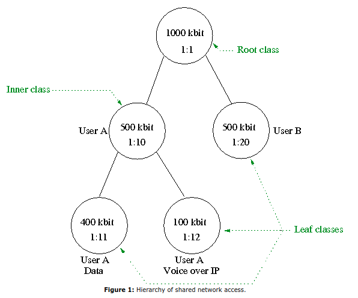
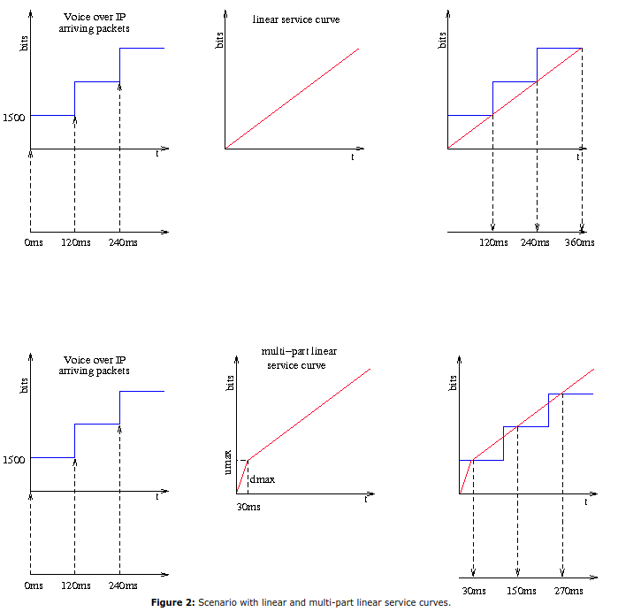
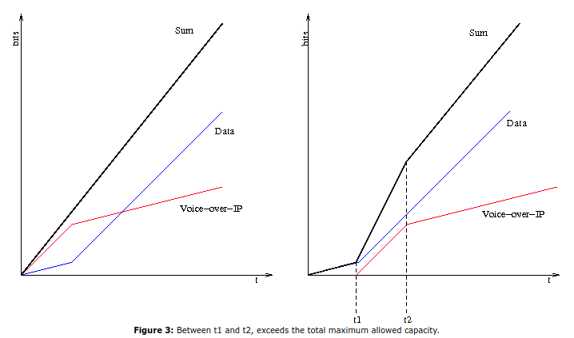

# HFSC Scheduling with Linux

对于复杂的 traffic shaping 场景，分层算法是必要的。当前版本的Linux支持算法HTB和HFSC。虽然HTB基本上将令牌桶过滤器（TBF）重新排列为分层结构，从而保留了TBF的主要特征，但HFSC允许带宽的比例分配以及延迟的控制和分配。这允许在带宽密集型数据服务和交互式服务共享单个网络链路的情况下更好和更有效地使用网络链接。

当多个实体或不同服务共享网络访问服务时，则需要某种合理的资源管理。确保单个服务和用户的最小带宽（链路共享）是一种可能的解决方案。对于涉及IP语音或流媒体服务的场景，纯带宽分配和防止高延迟都变得很重要。

在一种情况下，两个用户共享一个具有1000 kbit容量的Internet连接; 每个用户在任何给定时刻都应该控制至少500 kbit的容量。 其中一个用户（A方）使用最大100 kbit的带宽用于网络电话，其余的传输容量用于一般数据传输。 图1显示了相应的层次结构。



假设要发送的所有数据包都符合1500字节的固定大小，并且所有类都以最大速率发送。基于1000 kbit链路容量，发送数据包需要12ms（8 * 1500字节/ 1000000 bit / s = 12ms）。IP语音应用程序以100kbit发送，相当于每秒8个数据包。为了满足此类的保证100kbit速率，qdisc必须每隔120ms从该类发送一个数据包，这意味着每个数据包的最大[排队]延迟为132ms（？？？）。此示例说明了带宽和延迟之间的关系。

HFSC算法能够处理这些资源，带宽和延迟。为此，该算法使用服务曲线模型来分配资源。服务曲线S(t)表示在时间t以比特为单位实现的工作（服务）。 曲线的斜率对应于传输速率。



The concept of the interaction with latency resides in the structure of the service curves of the individual classes. 通过选择两部分服务曲线，每个部分是线性的，IP语音类的传输延迟可以减少到30毫秒。服务曲线的第一部分具有持续30ms的400kbit斜率，其中第二部分具有100kbit的斜率。延迟减少约78毫秒的这种增益是以牺牲其他类别为代价的。但是，在任何时候，曲线的总和都不得超过总链路容量的服务曲线。在我们的示例中，IP语音类的延迟减少是以A方未指定的数据类为代价的，其服务曲线必须调整以便不超过全局限制。结果，该类的最大传输延迟从30ms增加到总共52.5ms。For bulk data transport, such as FTP, for example, delay simply plays a secondary role in contrast to that of throughput, which isn't impaired by conforming to the service curve.

HFSC算法区分实时和链路共享标准。可以为叶类分配实时和链接共享曲线，其中内部类只能具有链接共享曲线。 实时标准只能应用于叶类，因为只有这些类实际上包含数据包。因此，这种面向实时的标准负责执行有保证的服务。 链接共享标准仅涉及与邻近类别的关系。它负责公平分配服务而非绝对保证。为了能够在所有情况下满足保证的延迟时间，必须将这分为两个标准。这也意味着一个类可以基于其实时保证发送分组，即使短暂地违反了层次结构中较高级别的类的链路共享曲线，结果也是如此。



Let's say our example data class from party A is already active and sending at its maximum packet rate, 400 kbit. Now, if at any point in time, the Voice over IP class becomes active, it is allowed to send with a higher rate on account of its real-time guarantee (Figure 3). Thus, the service for class A, totals to above 500 kbit, meaning that the link-sharing parameter for this class has been violated in the short term. In order to be able to carry out the link-sharing guarantees over the long term, class A will be "punished" for this brief excess.

Each of the classes in the hierarchy is assigned a "virtual time", which corresponds to service actually attained. As soon as it is possible to send a packet, each level of the hierarchy is searched, starting at the root, for the class exhibiting the least attained virtual time. The leaf class found with this method then sends a packet and the virtual time of that class, along with each of its parent classes all the way up to the root, will be increased accordingly. If a class sends based on its real-time parameter, its virtual time will also be increased.

## HFSC usage on Linux

```
tc qdisc add dev $dev root handle $ID: hfsc [default $classID ]
```

In the second step, the class hierarchy is constructed with consecutive class additions. 

````
tc add class dev $dev parent $parentID classid $ID hfsc [ [ rt  SC ] [ ls  SC ] | [ sc  SC ] ][ ul SC ]
````

The particular attributes of each class are configured via the service curves which are described as follows: 

````
SC := [ umax $bytes dmax $ms ] rate $BPS
````

Classes at the lowest level of the hierarchy can be assigned a real-time curve (`rt`) as well as a link-sharing curve (`ls`), where inner classes can only have a link-sharing curve. By using the `ul`service curve, an upper limit on service actually rendered to each class can be defined. Instead of specifying two identical `rt` and `ls` curves, a single `sc` curve can be specified. A service curve is described by its transmission rate, which correlates with the slope of the curve. If the curve consists of two parts, it can be specified with `dmax` the maximum delay at a certain transmission rate `umax`.

## Example

```bash
# Example from Figure 1.
tc qdisc add dev eth0 root handle 1: hfsc
tc class add dev eth0 parent 1: classid 1:1 hfsc sc rate 1000kbit ul rate 1000kbit
tc class add dev eth0 parent 1:1 classid 1:10 hfsc sc rate 500kbit ul rate 1000kbit
tc class add dev eth0 parent 1:1 classid 1:20 hfsc sc rate 500kbit ul rate 1000kbit
tc class add dev eth0 parent 1:10 classid 1:11 hfsc sc umax 1500b dmax 53ms rate 400kbit ul rate 1000kbit
tc class add dev eth0 parent 1:10 classid 1:12 hfsc sc umax 1500b dmax 30ms rate 100kbit ul rate 1000kbit
```

## Refs

- HFSC Scheduling with Linux. <http://linux-ip.net/articles/hfsc.en/>.