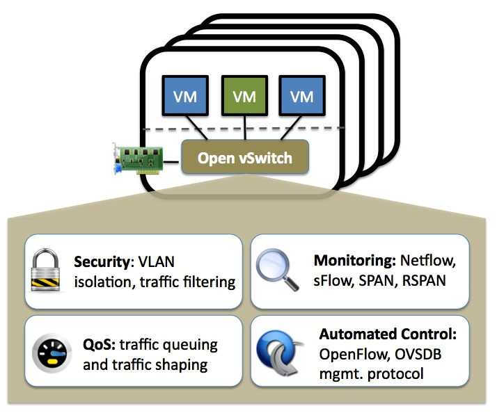

# Open vSwitch

[TOC]

## What is Open vSwitch?

## Why Open vSwitch?

Hypervisors 需要能够在 VM 之间以及与外部网络之间桥接流量。在基于 Linux 的虚拟机管理程序中，这通常意味着使用内置的 L2 交换机（Linux 网桥），这种交换机快速可靠，那么为什么需要 Open vSwitch？

答案是 Open vSwitch 的目标是多服务器虚拟化部署，这是之前工具堆栈不太适合的环境。这些环境通常以高度动态的 endpoints，逻辑抽象的维护以及（有时）与专用交换硬件的集成或卸载为特征。以下特性和设计注意事项有助于 Open vSwitch 满足上述要求。

## The mobility of state

与网络实体（例如虚拟机）相关联的所有网络状态应该易于识别并且可以在不同主机之间迁移。 这可以包括传统的“软状态”（例如L2学习表中的条目），L3转发状态，策略路由状态，ACL，QoS策略，监视配置（例如NetFlow，IPFIX，sFlow）等。

Open vSwitch支持在实例之间配置和迁移慢速（配置）和快速网络状态。 例如，如果VM在终端主机之间迁移，则不仅可以迁移关联配置（SPAN规则，ACL，QoS），还可以迁移任何实时网络状态（包括例如可能难以重建的现有状态）。Further, Open vSwitch state is typed and backed by a real data-model allowing for the development of structured automation systems.

## Responding to network dynamics

虚拟环境通常以高变化率为特征。 虚拟机来来往往，虚拟机及时前后移动，改变逻辑网络环境，等等。

Open vSwitch支持许多功能，允许网络控制系统在环境变化时做出响应和适应。 这包括简单的会计和可见性支持，如NetFlow，IPFIX和sFlow。 但也许更有用，Open vSwitch支持支持远程触发器的网络状态数据库（OVSDB）。 因此，一段编排软件可以“观察”网络的各个方面，并在它们发生变化时进行响应。 例如，今天大量使用它来响应和跟踪VM迁移。

Open vSwitch还支持OpenFlow作为导出远程访问以控制流量的方法。 这有许多用途，包括通过检查发现或链路状态流量（例如LLDP，CDP，OSPF等）进行全球网络发现。

## Maintenance of logical tags

分布式虚拟交换机（例如VMware vDS和Cisco的Nexus 1000V）通常通过在网络数据包中附加或操作标记来维护网络中的逻辑上下文。这可以用于唯一地标识VM（以抵抗硬件欺骗的方式），或者用于保持仅在逻辑域中相关的一些其他上下文。构建分布式虚拟交换机的大部分问题是高效且正确地管理这些标签。

Open vSwitch包含多种用于指定和维护标记规则的方法，所有这些方法都可供业务流程的远程进程访问。此外，在许多情况下，这些标记规则以优化的形式存储，因此它们不必与重量级网络设备耦合。例如，这允许配置，更改和迁移数千个标记或地址重新映射规则。

与此类似，Open vSwitch支持GRE实现，可以处理数千个同时发生的GRE隧道，并支持隧道创建，配置和拆除的远程配置。例如，这可以用于连接不同数据中心中的私有VM网络。

## Hardware integration

Open vSwitch的转发路径（内核数据路径）旨在将数据包处理“卸载”到硬件芯片组，无论是安装在传统硬件交换机机箱中还是安装在终端主机NIC中。 这允许Open vSwitch控制路径能够控制纯软件实现或硬件开关。

目前正在努力将Open vSwitch移植到硬件芯片组。 其中包括多个商用硅芯片组（Broadcom和Marvell），以及许多特定于供应商的平台。 文档中的“移植”部分讨论了如何制作这样的端口。

硬件集成的优势不仅在于虚拟化环境中的性能。 如果物理交换机还公开Open vSwitch控制抽象，则可以使用相同的自动网络控制机制来管理裸机和虚拟主机环境。

## Summary

在许多方面，Open vSwitch的目标设计空间与之前的虚拟机管理程序网络堆栈不同，侧重于在大规模基于Linux的虚拟化环境中对自动和动态网络控制的需求。

Open vSwitch的目标是使内核中的代码尽可能小（如性能所需），并在适用时重用现有的子系统（例如Open vSwitch使用现有的QoS堆栈）。 从Linux 3.3开始，Open vSwitch作为内核的一部分包含在内，用户空间实用程序的打包在大多数流行的发行版中都可用。

## Refs

- Introduce to OVS. <https://github.com/openvswitch/ovs/tree/master/Documentation/intro>.