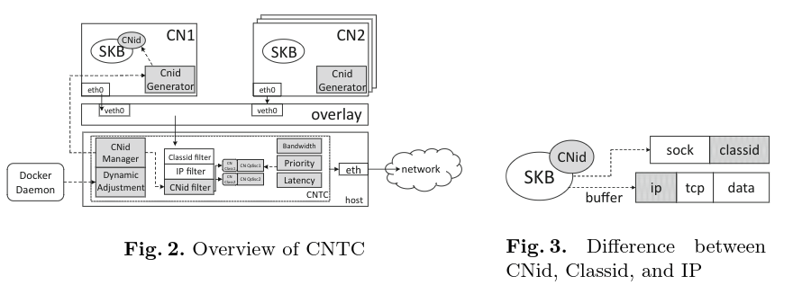
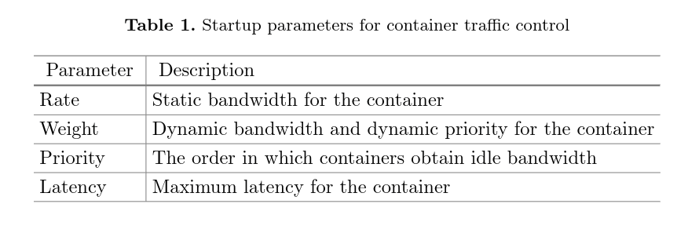
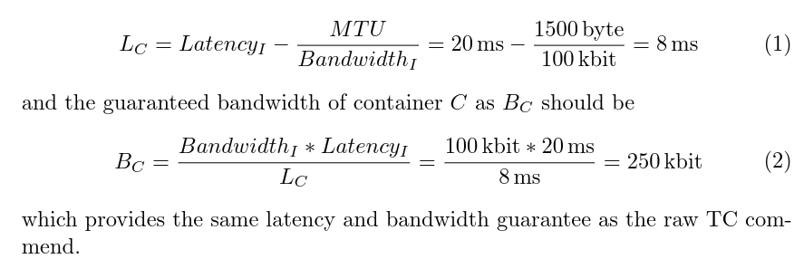
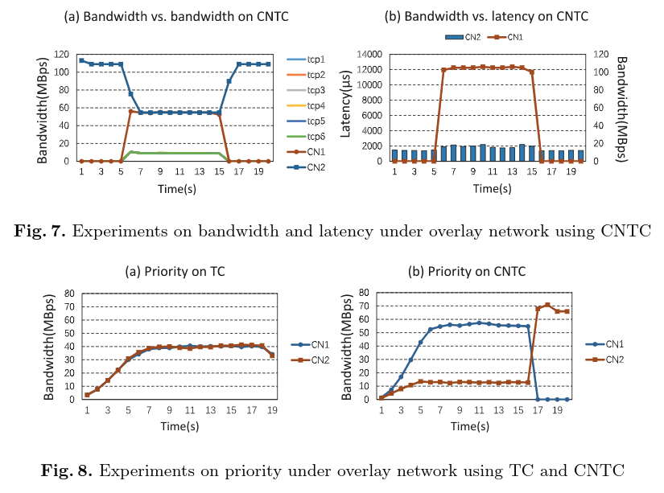
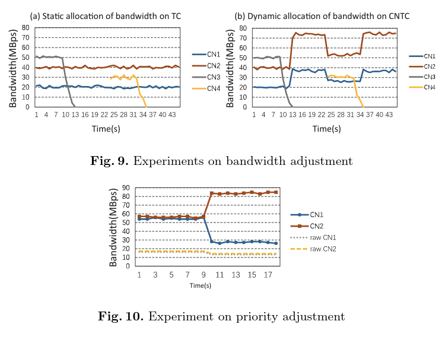
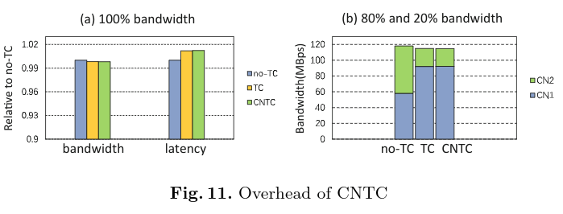

# CNTC: A Container Aware Network Traffic Control Framework

## Abstract

- As a lightweight virtualization technology, containers are attracting much attention and widely deployed in the cloud data centers.
- Cloud needs resource isolation.
- Docker uses CGroup to provide CPU, memory, and disk resource isolation.
- But ignore the performance of networked hosts.
- **Although several researches discuss the possibility of leveraging Linux Traffic Control (TC) module to guarantee network bandwidth, they fail to capture the diversity and dynamics of container network resource demands and therefore cannot be applied to container-level network traffic control.**
- This paper proposes a Container Network Traffic Control (CNTC) framework which **can provide strong isolation and container-level management for network resource with joint consideration of container characteristics and QoS.**

Keywords: Container Network, Traffic Control, Network Isolation

## Background and motivation

- **When multiple containers run on one host machine and share the OS kernel with each other, resource competition can never be avoided and seriously hinders the system performance.**
- Docker uses CGroup to enable CPU, memory, and disk resource allocation for containers, but doesn't have a good support for network resource.
- 容器间通信一般使用 overlay 网络实现，其数据包到达主机上时，TC 所需要的信息（IP filter 和 classid filter）就不见了。IP filter 需要 virtual IP，但是该 IP 被封装在主机的 UDP 中。同时，classid 是 netns 私有的，所以容器（netns）的 classid 在主机（netns）中不可见。
- TC 命令参数不直观，很难用。Raw TC operation and configuration are relatively complicated and require a full understanding of the traffic control details.
- TC only focus on static network traffic control. That is, once a TC command is carried out, its organization and resource configuration cannot be changed.

## Design

Goals:

- One size fits all.
- Easy to use.
- Dynamic adjustment.



### CNid and CNid filter

To achieve a valid TC framework under different network modes for containers, we propose a new module as CNid and CNid filter to enable container-level packet tracing and resource allocation.

- How can we identify the source and destination container of each network packet after overlay encapsulation? @CNid/CNid manager/CNid generator.
- How to keep the identification of packets across network namespaces? Classid and IP are only part of SKB (a structure keeping all control information of network packet) reference which will be lost when across network namespace . By integrating CNid into the SKB structure, our CNid will not be released and re-created even when across network namespaces.

### Simple APIs

TC is complicated, which has many traffic control algorithms falling into two categories:

1. Classless algorithms, which are used for constant types of data streams.
2. Classful algorithms, whose role is to use different restrictions on multiple types of data streams.

We believe that classful algorithms are more suitable for the container which produce and process various types of data streams.





直接使用 TC 的参数很不直观，所以 CNTC 引入更直观的参数（见表）来限定容器网络资源的使用情况。当然，这些参数最后还是要转换成 TC 参数，转换公式如上图（参考算法 HFSC）。举个例子：

```
$ docker run --rate 100kbit --latency 20ms ...
# In backend
$ tc -m1 250kbit -d 8ms -m2 100kbit ...
```

### Dynamic adjustment

还有问题需要结果，就是在容器创建和销毁过程中进行资源分配和动态调整每一个容器可用的带宽。So we propose the Dynamic Adjustment module to overcome the following two challenges: (1) How to adjust the TC organization? (2) How to adjust network resource?

- Firstly, to adjust TC organization, Dynamic Adjustment needs to communicate with the Docker Daemon for monitoring the status of containers. Whena container is activated, it requests an available CNid from the Manager andcreates a new CN class and CN Qdisc.
- Secondly, Dynamic Adjustment should adjust the resources obtained by containers to achieve a higher utilization con-sidering two factors: bandwidth and priority.

## Evaluation





## Overhead



## My summary

CNTC 基于 TC 实现了 container aware 的 network resource 隔离。新添加的模块包括前端 CNid Generator，后端 CNid Manager 和 Dynamic Adjustment，涉及改动的地方利用 SKB 中属性保存 CNid，TC 中添加 CNid filter 功能。

当然，文章中还有几个概念不是很明白：

- Simple API 中 HFSC 算法原理？
- TC 使用和原理？
- Dynamic adjustment 中 rate/weight-style bandwidth allocation 原理？