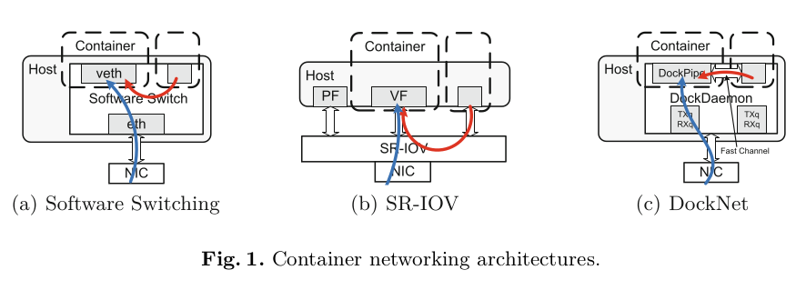
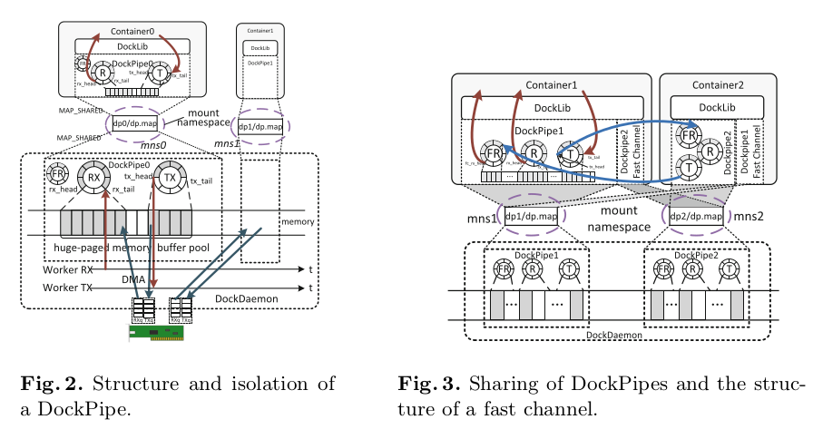
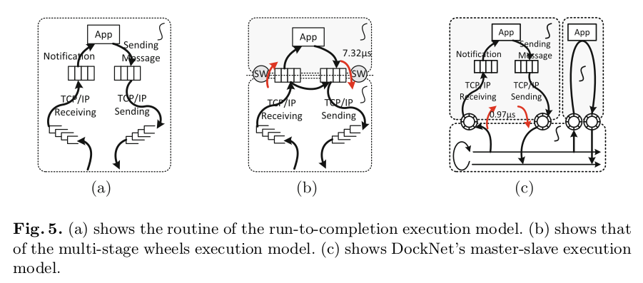
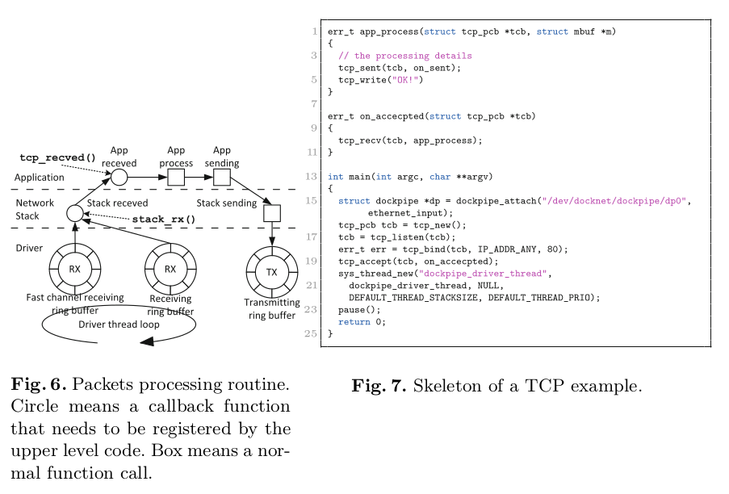
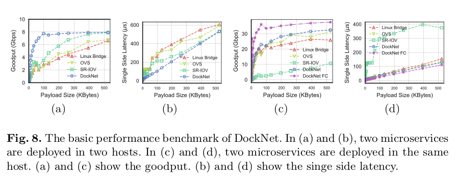
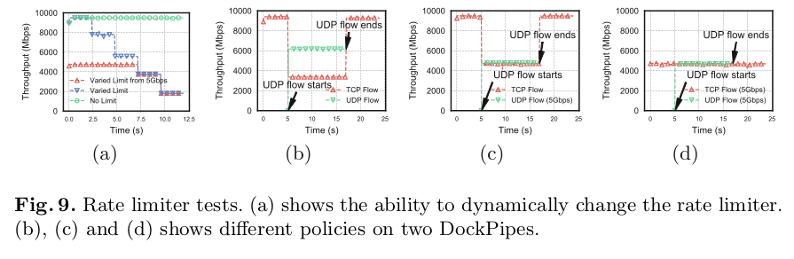
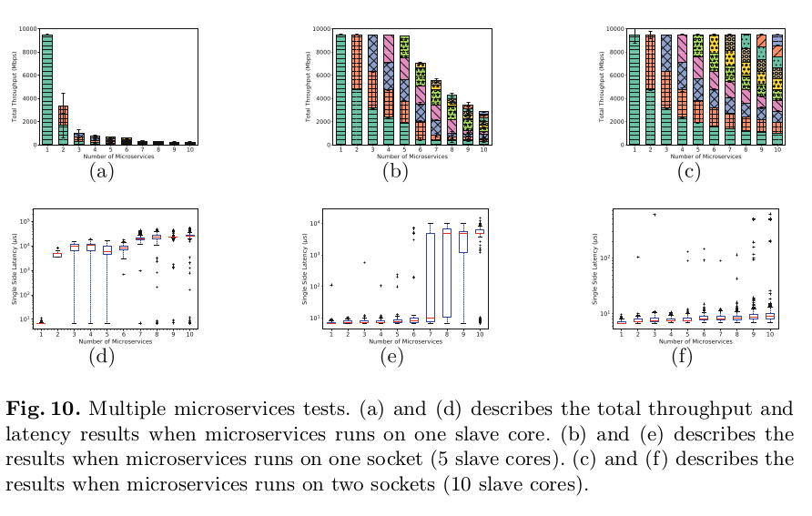
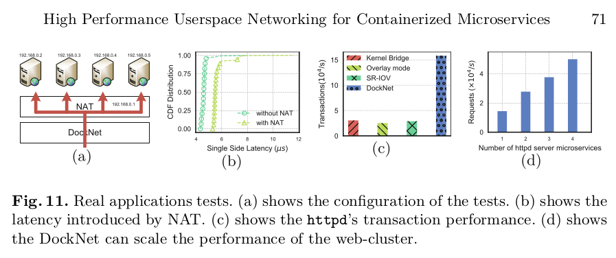

# High Performance Userspace Networking for Containerized Microservices

DockNet 通过 DPDK 和 IwIP 构建了高性能的容器网络方案。通过采用前后端分离的思想隐藏了硬件细节，同时支持灵活的控制和管理。但是，容器中的应用需要使用专用的接口才能获得加速效果。

## Abstract

容器化的微服务常常用于构建那些服务简单、轻量和松散耦合的系统。随着 monolithic 应用解藕成多个微服务时，内部函数调用变成了微服务间的通信，从而增加了网络压力。但是，构建在内核之上的容器网络性能不够好。本文，我们提出 DockNet，一个为容器化微服务设计的高性能用户态网络方案。DockNet（1）引入 DPDK 和定制化的 IwIP 以分别构建高性能的数据平面和 TCP / IP 协议栈。（2）通过引入主从线程模型，解耦执行和管理。（3）采用 namespace 机制来限制微服务对数据平面的访问，从而实现安全隔离；同时采用基于计时器的方法实现速率限制，从而实现性能隔离。（4）在同主机上的同 microservices 之间引入 fast channels 来进一步提升网络的性能。在我们的各种实验中，与现有网络解决方案相比，DockNet 在性能上分别内核 bridge、OVS 和 SR-IOV 4.2×，4.3×，5.5×。

## Motivation

- Microservices increase the network pressure. Unfortunately, network in the container in inefficient since kernel is usually a bottleneck for these kernel-based networks.

## Requirements and basic solutions

- High-performance - Although userspace network stacks can offer high-performance, they cannot be directly used by containerized microservices. A userspace TCP/IP stack is also needed. 
  - DPDK for packet I/O.
  - Customized IwIP for TCP/IP stack.
- Easy management - Userspace network stacks bypass the kernel, we must implement management functionalities in the userspace network stack.
  - **Master-slave threading model.**
  - The master thread is responsible for control and managment. 
  - The slave threads (i.e.,the container threads) are only responsible for processing packets.
- Isolation - Security and performance guarantee.
  - Uses the hardware-based flow director mechanism to virtualize a physical network interface card (NIC) into multiple lightweight network interfaces, which effectively supports multiple containers.
  - For isolation, we adopt namespace mechanism to control the access of containers to data planes. 
  - We also employ timer-based rate limiters to achieve performance isolation.
- Fast intra-host communication.
  - Constructs fast channels between partner microservices to improve network performance further.

## Background

### Existing approaches

- Software switching: Linux bridge, OVS => insufficient
- SR-IOV => scarifying portability

### Kernel inefficiency

Previous studies have exposed three main performance limitations of the kernel: inefficient packet processing, general resource sharing, overheads of context switching. 

1. Per-packet memory (de)allocation and heavy data structures (e.g., sk buff) limit the efficiency.
2. Resources are shared in many folds: a multi-thread application shares only one listening sockets, sockets share file descriptors with the regular files.
3. Frequent system calls result in increasing the overheads of context switching. 

To overcome these limitations introduced by the kernel, many userspace approaches have been proposed.

1. High performance packet I/O frameworks including DPDK, PSIO, PF_RING and netmap.
2. Userspace networking stack including mTCP and IX's data plane.

## System design and implementation

### 

## Evaluation

