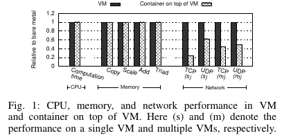
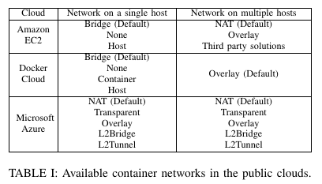
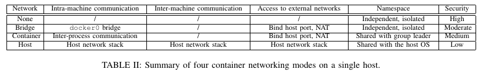
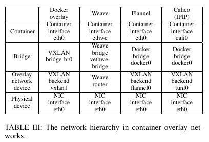
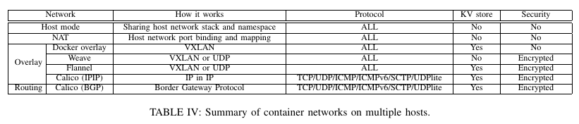
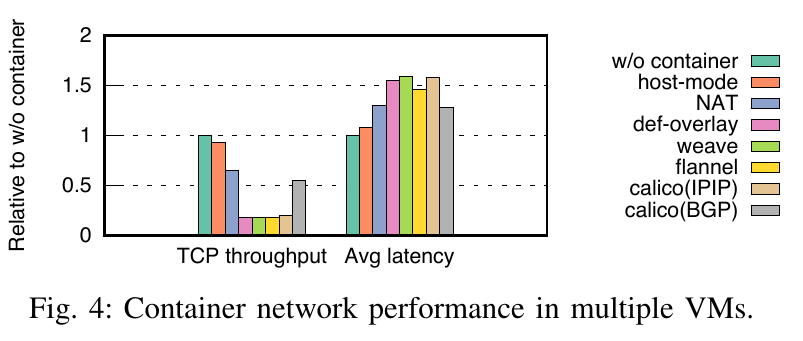

# An Analysis and Empirical Study of Container Networking

这篇文章很值得一读，适合了解容器网络。另外，文章给出各种容器网络的性能对比和分析。需要注意的是，本文的实验环境是在 VM 进行的。

## Motivation

目前有很多容器网络（container networking）方案，但是缺少深入的分析和比较，包括公有云环境下，各有哪些优势（advantages）？限制（limitations）？性能（performance）怎么样？

## Contribution

1. 首先，量化对比各种容器网络，属性包括使用场景（applicable scenarios）、安全隔离级别（levels of security isolation）和开销（overhead）。
2. 然后，量化分析各种容器网络，包括吞吐（throughput）、可拓展性（scalability）和启动开销（startup cost）。

## Result

Overlay network（docker-def-overlay/weave/flannel/calico）在灵活性（flexibility）和安全性（security）上很好，但是性能很差。灵活性好是因为整个协议实现由单独的后端软件实现，易于管理。安全性好是因为容器网络支持每个容器使用独立的 IP 进行通信。性能差是因为引入了较多的开销，包括overlay包到underlay包的转换（encap/decap，可能会拆包，因为 MTU 有限，包转换时会追加 hdr 导致拆包）、routing（根据容器的 private ID 和 tenant ID 查表得相应的 underlay network IP）和多次协议栈重入（至少两次，overlay network 一次，underlay network 一次）。

## One more thing

1. 文章使用 osu_benchmarks 的 alltoall 测试多容器通信的延迟，可以借鉴。