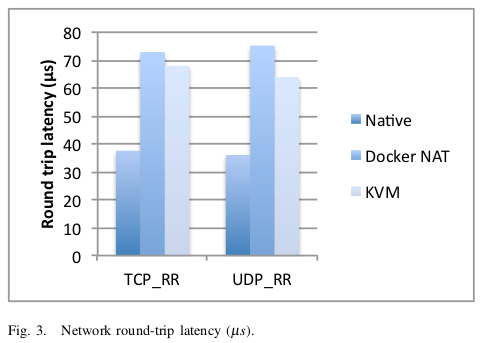

# An Updated Performance Comparison of Virtual Machines and Linux Containers

[TOC]

这篇文章很值得一读，引用中也提到了许多开创性的工作，e.g. KVM、Container。文章较详细的介绍了 VM 和 Container 技术，并给出性能对比和分析，其中的实验方法和过程很值得学习。下面给出我感兴趣部分的翻译或总结。

文章主要关注的硬件资源包括 CPU、内存、存储和网络资源。文章的实验表明，Docker 和 KVM 在 CPU 和 memory 这块基本没引入额外的开销。当然，虚拟机因为引入了额外的页表映射，所以在内存相关的测试中性能相比主机性能更差一些（30% 以内）。但是，容器和虚拟机在网络 I/O 和 block I/O 两方面都有一些性能问题。网络 I/O 这一块，容器主要因为用到了 NAT，所以多出较多的开销。对于 block I/O，容器因为使用了 layered file system 引入了额外的开销，但是可以通过 attach volumns 来减少 block I/O 开销。

作者提到，容器可以直接使用 host network mode 来避免 NAT 引入的开销，但是这样就丧失了 network namespace 带来的好处。

## Abstract

云计算广泛使用虚拟机（VM），因为它们允许工作负载彼此隔离，并且可以在一定程度上控制资源使用。 但是，虚拟化中涉及的额外抽象级别会降低工作负载性能，这会将性能/性能降低到客户端。 基于容器的虚拟化的新进展简化了应用程序的部署，同时继续允许控制分配给不同应用程序的资源。
    
在本文中，我们将探讨传统虚拟机部署的性能，并将其与 Linux 容器的使用进行对比。我们使用一套工作负载来压测 CPU，内存，存储和网络资源。我们使用 KVM 作为代表性管理程序，使用 Docker 作为容器管理器。我们的结果表明，在几乎所有情况下，容器都会产生与 VM 相同或更好的性能。VM和容器都需要调整以支持 I / O 密集型应用程序。 我们还讨论了我们的性能结果对未来云架构的影响。

## Introduction

Pass!

## Contributions

- 我们使用最新的硬件和软件，跨越与云相关的有趣基准测试和工作负载，提供本机、容器和虚拟机环境的最新比较。
- 我们确定当前虚拟化选项对 HPC 和服务器工作负载的主要性能影响。
- 我们详细说明了一些影响虚拟化性能的非显而易见的实际问题。
- 我们表明，即使在整个服务器的规模上，容器也是可行的，而且性能影响最小。

## Background

- Motivation and requirements for cloud virtualization
- KVM
- Linux containers

## Evalutation

其中性能测试包括：

- CPU - PXZ (MB/s)
- HPC - Linpack (GFLOPS)
- Memory bandwidth - Stream: Add / Copy / Scale / Triad (GB/s)
- Random Memory Access - RandomAccess (GUPS)
- Network bandwidth - nuttcp
- Network latency - netperf
- Block I/O - fio

另外，文章还测试了 Redis 和 MySQL，分别用于测试 network-bound 和 block I/O-bound 的负载。

### Network bandwidth - `nuttcp`

我们使用 nuttcp 工具测量被测系统之间的网络带宽，以及使用两个通过 10 Gbps Mellanox ConnectX-2 EN NIC 直连的相同机器。我们对 10 Gbps 网络应用标准网络调整，例如启用 TCP 窗口缩放和增加套接字缓冲区大小。如图 1 所示，Docker 将主机上的所有容器附加到桥接并通过 NAT 将网桥连接到网络。在我们的 KVM 配置中，我们使用 virtio 和 vhost 来最小化虚拟化开销。

我们使用 nuttcp 来测量单个 TCP 连接上标准 1500 字节 MTU 的单向批量数据传输的 goodput。在客户端到服务器的情况下，被测系统（SUT）充当 transmitter；在服务器到客户端的情况下，SUT 充当 receiver。因为 TCP 具有不同的发送和接收代码路径，所以有必要测量两个方向。所有三种配置在发送和接收方向均达到 9.3 Gbps，由于数据包报头非常接近理论上的 9.41 Gbps 限制。由于分段卸载（LSO / GSO），即使由不同形式的虚拟化创建额外的层，批量数据传输也非常有效。此测试的瓶颈是 NIC，其他资源大多闲置。在这种受 I / O 限制的场景中，我们通过测量传输和接收数据所需的 CPU 周期量来确定开销。图 2 显示了使用 perf stat -a 测量的此测试的系统范围 CPU 利用率。 Docker 使用桥接和 NAT 显着增加了传输路径长度；vhost-net 在传输方面相当高效，但在接收端具有很高的开销。不使用 NAT 的容器与本机 Linux 具有相同的性能。在真正的网络密集型工作负载中，我们预计此类 CPU 开销会降低整体性能。

从历史上看，由于通过用户空间发送每个数据包的迂回 I / O 路径，Xen 和 KVM 一直在努力提供线速网络。这导致了对复杂网络加速技术（如轮询驱动程序或虚拟机管理程序旁路）的大量研究。我们的结果表明，允许 VM 直接与主机内核通信的 vhost 以直接的方式解决了网络吞吐量问题。随着更多的 NIC，我们希望这台服务器可以在不使用任何奇特技术的情况下驱动超过 40 Gbps 的网络流量。

### Network latency - `netperf`

我们使用 netperf RR 基准来测量往返网络延迟，使用与上一节中的 nuttcp 测试类似的配置。在这种情况下，被测系统运行 netperf 服务器（netserver），另一台机器运行 netperf 客户端。客户端发送一个 100 字节的请求，服务器发送一个 200 字节的响应，客户端在发送另一个请求之前等待响应。因此，一次只有一笔交易在进行中。

图 3 显示了基准测试的 TCP 和 UDP 变体的测量事务延迟。Docker 使用的 NAT，在此测试中使延迟加倍。与非虚拟化网络堆栈相比，KVM 为每个事务增加了 30μs 的开销，增加了 80％。TCP 和 UDP 具有非常相似的延迟，因为在两种情况下，事务都包含每个方向上的单个数据包。与吞吐量测试不同，在这种情况下，无法摊销虚拟化开销。

### Redis

基于内存的键值存储通常在云中用于缓存、存储会话信息，以及维护热的非结构化数据集的便捷方式。Redis 的操作往往是简单的，并且需要客户端和服务器之间的网络往返。此模型使应用程序通常对网络延迟敏感。鉴于大量并发客户端，每个客户端都向很多服务器发送非常小的网络数据包，因此这一挑战更加复杂。结果，服务器在网络堆栈中花费了相当多的时间。

为了我们的评估，我们选择了 Redis，因为它具有高性能
丰富的 API 以及 PaaS 提供商（e.g. Amazon Elasticache、Google Compute Engine）的广泛使用。我们从 GitHub 存储库获得 Redis 2.8.13，并在我们的 Ubuntu 13.10 平台中构建它。然后，在每种部署模式中使用生成的二进制文件：native、Docker 和 KVM。为了提高性能，并且假设 Redis 是单线程应用程序，我们将容器或 VM 关联到靠近网络的核心。该测试由许多向服务器发出请求的客户端组成。使用 50％ 读数和 50％ 写入的混合。每个客户端都维护与服务器的持久 TCP 连接，并且可以通过该连接发起最多 10 个并发请求。因此，进行中的请求总数是客户端数量的 10 倍。所有的 key 值为 10 个字符，生成的 values 平均为 50 个字节。该数据集形状代表 [Steinberg](https://redislabs.com/blog/i-have-500-million-keys-but-whats-in-my-redis-db/) 等人描述的 Redis 在生产环境下的情况。对于每次运行，都会先清除数据集，然后发出确定的操作序列，从而逐步创建 1.5 亿个 keys。Redis 服务器的内存消耗在执行期间达到 11 GB。

图 8 显示了相对于不同部署模型的客户端连接数的吞吐量（QPS）。图 9 显示了每个实验的相应平均延迟（以 μs 为单位）。在本机部署中，网络子系统足以处理负载。因此，当我们扩展客户端连接的数量时，限制 Redis 服务器吞吐量的主要因素是 CPU 利用率。需要注意的是，Redis 是一个基于事件的单线程应用程序。在我们的平台中，这种情况很快发生在 110 QPS 的请求。添加更多客户端会导致请求排队并导致平均延迟增加。

Redis 服务器给网络和内存子系统带来了很大的压力。将 Docker 与主机网络堆栈一起使用时，我们可以看到吞吐量和延迟几乎与本机情况相同。使用 Docker 并启用 NAT 时，故事情况大不相同，如图 1 所示。在这种情况下，引入的延迟随着网络上接收的数据包数量的增加而增加。 虽然它与具有 4 个并发连接的本机（51μs 或 1.05x 本机连接）相当，但是一旦连接数增加（在 100 个连接时超过 1.11x），它就会快速增长。 此外，NAT 会消耗 CPU 周期，从而阻止 Redis 部署达到具有本机网络堆栈的部署所见的峰值性能。

同样，在 KVM 中运行时，Redis 似乎是 network-bound 的。KVM 为每个事务增加了大约 83μs 的延迟。我们看到 VM 在低并发性时具有较低的吞吐量，但随着并发性的增加渐近地接近本机性能。超过 100 个连接，两个部署的吞吐量几乎相同。这可以用 little's law 解释：因为在 KVM 下网络延迟较高，Redis 需要更多的并发才能充分利用系统。这可能是一个问题，具体取决于云方案中最终用户所期望的并发级别。

### Discussion

我们在这些结果中看到了几个一般趋势。正如我们所期望的那样，容器和虚拟机几乎不会对 CPU 和内存使用造成任何开销。它们只影响 I / O 和 OS 交互。这种开销以每个 I / O 操作的额外周期的形式出现，因此小 I / O 比大 I / O 受到的影响要大得多。这种开销会增加 I / O 延迟并减少可用于有用工作的 CPU 周期，从而限制吞吐量。遗憾的是，实际应用程序通常无法通过 batch 将小 I / O 转化为大型 I / O。

Docker 增加了一些功能，如 layered images 和 NAT，使其比 LXC-style 的原始容器更容易使用，但这些功能引入了额外的性能开销。因此，使用默认设置的 Docker 可能不会比 KVM 快。文件系统或磁盘密集型应用程序应使用 volumn 绕过 AUFS。使用 -net=host 可以轻松消除 NAT 开销，但这会消除 network namespace 的好处。最终，我们认为 Kubernetes 项目提出的每个容器一个 IP 地址的模型可以提供灵活性和性能。

虽然 KVM 可以提供非常好的性能，但它的可配置性是一个弱点。良好的 CPU 性能需要仔细配置大页面、CPU 模型、vCPU 绑定和缓存拓扑：这些功能记录很少，需要配置试错。我们建议读者避免直接使用 qemu-kvm，而是使用 libvirt，因为它简化了 KVM 配置。即使在最新版本的 Ubuntu 上，我们也无法让 vhost-scsi 工作，因此仍有改进的余地。这种复杂性是任何有抱负的云运营商（无论是公共还是私有）进入的障碍。

## Related work

Pass!

## Conclusions and future work

虚拟机和容器都是成熟的技术，受益于十年的增量硬件和软件优化。通常，在我们测试的每种情况下，Docker 都等于或超过 KVM 性能。我们的结果表明，KVM 和 Docker 都为 CPU 和内存性能带来了可忽略不计的开销（极端情况除外）。对于 I / O 密集型工作负载，应谨慎使用这两种形式的虚拟化。

我们发现 KVM 性能自创建以来已大大改善。过去被认为非常具有挑战性的工作负载，如线速 10 Gbps 网络，现在只需使用 2013 年代硬件和软件在单核上即可实现。即使使用最快的可用形式的半虚拟化，KVM 仍然会为每个 I / O 操作增加一些开销。这种开销范围从执行小 I / O 时的显着性到在大 I / O 上分摊时可忽略不计。因此，KVM 不太适合对延迟敏感或具有高 I / O 速率的工作负载。这些开销会严重影响我们测试的服务器应用程序。

虽然容器本身几乎没有开销，但 Docker 并非没有性能问题。Docker volumes 的性能明显优于 AUFS 中存储的文件。Docker 的 NAT 还为 high packet rates 的工作负载引入了开销。这些特征代表了 ease of management 和 performance 之间的权衡，应根据具体情况加以考虑。

从某种意义上说，对于容器来说，比较只会变得更糟，因为它们的开销几乎为零，而且随着时间的推移，VM 会变得更快。如果要广泛采用容器，它们必须提供稳态性能以外的优点。我们相信，在不久的将来，便利性、更快部署、弹性和性能的结合可能会让它变得引人注目。

我们的结果可以为如何构建云基础架构提供一些指导。传统智慧（to the extent such a thing exists in the young cloud ecosystem）表示 IaaS 是使用 VM 实现的，而 PaaS 是使用容器实现的。我们认为没有技术原因可以解决这种情况，特别是在基于容器的 IaaS 可以提供更好的性能或更容易部署的情况下。容器还可以消除 IaaS 和「裸机」非虚拟化服务器之间的区别，因为它们提供了具有裸机性能和 VM 的可控性和隔离性。而不是为虚拟化和非虚拟化服务器维护不同的映像，相同的 Docker 映像可以有效地部署在从核心的一小部分到整个机器的任何东西上。

我们还质疑在 VM 中部署容器的做法，因为与直接在非虚拟化 Linux 上部署容器相比，这会增加 VM 带来的性能开销，同时没有任何好处。如果必须使用 VM，则在容器内运行它可以创建额外的安全层，因为可以利用 QEMU 的攻击者仍然在容器内。

虽然今天的典型服务器是 NUMA，但我们认为尝试在云中利用 NUMA 可能比它的价值更大。将每个工作负载限制为单个 CPU socket 极大地简化了性能分析和调优。鉴于云应用程序通常旨在向外扩展，并且每个插槽的核心数量随着时间的推移而增加，因此扩展的单位应该是 CPU socket 而不是服务器。这也是针对裸机的情况，因为每个 CPU socket 运行一个容器的服务器实际上可能比通过在 CPU socket 间分散工作负载更快，因为 CPU socket 间的通信流量减少了。

在本文中，我们创建了使用整个服务器的单个 VM 或容器。在云中，将服务器划分为更小的单元更为常见。这导致了一些值得研究的其他主题：在同一服务器上运行多个工作负载时的性能隔离、容器和 VM 的实时大小调整、scale-up 和 scale-out 之间的权衡，以及实时迁移和重新启动之间的权衡。