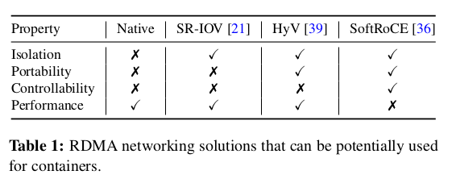
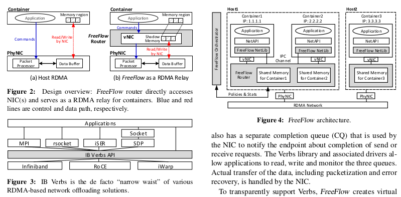
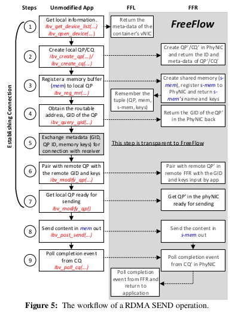
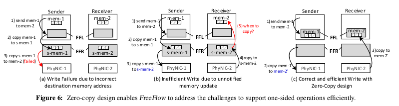
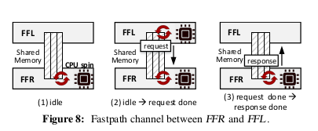

# FreeFlow: Software-based Virtual RDMA Networking for Containerized Clouds

[TOC]

## Motivation

FreeFlow 主要解决的问题是容器云中我们还没有一个符合需求且在容器中可用的 RDMA 虚拟化方案。容器化云需要容器在网络中具有三个属性：

- Isolation。每个容器都应具有其专用的网络命名空间（包括端口空间、路由表、接口等），以消除与同一主机上的其他容器的冲突。
- Portability。容器应该使用虚拟网络与其他容器进行通信，并且无论将容器放置或迁移到哪个主机，其虚拟 IP 保持不变。
- Controllability。Orchestrator 可以轻易的实施控制面策略（例如，admission control、routing）和数据面策略（例如，QoS、metering）。在（多租户）云环境中尤其需要此属性。

这些属性是云自由放置和迁移容器以及控制容器资源使用量所必需的。为此，在基于 TCP / IP 的操作中，通过软件（虚拟）交换机完全虚拟化网络。但是，很难完全虚拟化基于 RDMA 的网络。RDMA 通过将网络处理卸载到硬件 NIC，绕过内核软件堆栈，从而实现了高性能网络通信。在共享云环境中，我们很难通过修改硬件中的控制平面状态（例如，routing），同时由于 RNIC 和 RAM 之间直接通过 PCIe 进行通信，因此也难以控制数据路径。

目前，还没有成熟的容器 RDMA 虚拟化解决方案。上表总结了可能扩展到支持容器的一些重要选项，尽管它们未能达到关键要求或必须以相当大的性能成本实现。

FreeFlow 为容器提供了一套 RDMA overlay network 方案，该方案将容器中 RDMA 性能保持为主机 RDMA 同样的性能，又满足公有云环境下对容器的一些基本需求。FreeFlow 不需要任何专门的硬件或基于硬件的 I / O 虚拟化。软件虚拟交换机可以完全访问容器之间通信的控制路径（例如，地址、路由）和数据路径（例如，数据流量）。这种设计理念类似于用于容器化云中的 TCP / IP 网络的现有软件虚拟交换机，例如 Open vSwitch（OvS）。当然，由于 RDMA 的特性，FreeFlow 的实际设计与 OvS 有很大不同。

FreeFlow 的设计解决了两个关键挑战。首先，我们希望 FreeFlow 对应用程序完全透明。这很有挑战性，因为 RDMA 需要 NIC 来操作内存缓冲区和文件描述符，而容器内的应用程序由于网络虚拟化而不直接与 NIC 交互。我们应对这一挑战的关键洞察力是容器本质上是进程，他们可以使用 FreeFlow 轻松共享内存和文件描述符等资源。如果 FreeFlow 和容器共享相同的内存和文件描述符，则底层物理 RDMA NIC 上的任何操作都将自动在容器内生效。 further problem is that sharing resources transparently to applications is not straightforward, given that applications do not cooperatively create resources that are shareable.  我们设计了将资源从不可共享转换为可共享的方法，对应用程序代码没有修改或只有很少的修改。其次，FreeFlow 必须提供与裸机 RDMA 相当的吞吐量和延迟。我们分别将吞吐量和延迟的性能瓶颈确定为内存复制和进程间通信。我们利用零拷贝设计实现吞吐量，并利用 CPU 旋转共享内存进程间通道来实现延迟。我们还优化 FreeFlow 以限制 CPU 开销。

## Overall Design

##Transparent Support for RDMA Operations

### Connection Establishment

通过 FFL 截取请求并转发给 FFR 创建相应的资源。当用户调用 ibv_reg_mr 注册其提供的 mem 时，FFR 会创建一块额外的共享内存 s-mem 并注册，然后记下四元组（QP, mem, s-mem, keys），最后返回的也是 s-mem 在 RNIC 中注册返回的信息。

### Two-sided Operations

没有启用零拷贝时，数据的传输过程：发送侧 mem 到 s-mem，再到接收侧 s-mem，最后到 mem。

### One-sided Operations

**在单边操作中，客户端不仅需要服务器的 GID，还需要远端内存缓冲区的地址和访问内存的 keys。该信息在图 5 中的步骤 5 中交换，并且在步骤 8 中可用于 FreeFlow（其中可以调用 WRITE 或 READ）。**与双面操作相比，透明地支持单边操作更具挑战性。在 FreeFlow 中支持单边操作有两个问题。

首先，目标存储器地址 mem 位于远程容器的虚拟地址空间中。但是，本地 FFR 不知道另一方的相应 s-mem。例如，在图 6（a）中，当发送方尝试将 mem-1 中的数据写入远程存储器 mem-2 时，它在阶段 3）失败，因为接受侧上的 FFR 无法访问目标存储器地址 mem-2 侧。**为了解决这个问题，FreeFlow 在 FFO 中为所有 FFR 构建了一个中心键值存储，以学习应用程序虚拟内存空间中 mem 指针与 FFR 虚拟内存空间中相应 s-mem 指针之间的映射。更新此表会增加图 5 中第 3 步（当应用程序将内存注册到其虚拟 NIC 时）的延迟。但是，数据平面性能不会受到影响，因为 FFR 可以在本地缓存映射。**

其次，即使我们知道远程端的内存映射，WRITE 和 READ 可以修改远程内存，但是我们无法通知远程端的 CPU，因此 FFR 不知道何时复制到应用程序的内存或从应用程序的内存复制。例如，在图 6（b）中，发送方找到 s-mem-2 的正确地址并将数据发送给它。但是，在 s-mem-2 中有数据后，接收方的 FFR 没有通知知道何时将 s-mem-2 复制到 mem-2。解决此问题的一种方法是不断同步 s-mem-2 和 mem-2。这会消耗大量的CPU和内存总线带宽。

为了解决这个问题，我们在 FreeFlow 中设计了一个基于零拷贝的机制来有效地支持单边操作。高级别的想法是使 mem 和 s-mem 具有相同的物理内存，因此 FFR 不需要进行任何复制，并且数据将自然地呈现给应用程序。图 6（c）说明了这种设计。通过删除内存副本，我们还可以提高 FreeFlow 的性能。

这里的关键是使应用程序直接分配和使用共享内存与 FFR 进行数据传输。 为此，FreeFlow 提供了两个选项：

- Allocating shared buffers with new APIs.
- Remapping applications' virtual memory address to shared memory. 当然，该方法要求用户注册的内存按 4KB 对齐。

### Event-based Operations

从 CQ（完成队列）获得通知有两种选择。第一种选择是让应用程序定期轮询 CQ 以检查是否有任何已完成的操作。第二个选项是基于事件的，这意味着应用程序创建一个事件通道并将 CQ 添加到通道中。通道包含一个文件描述符，可以在操作完成时触发事件。在 FreeFlow 中，由于原始文件描述符是从物理网卡创建的，因此 FFR 需要将文件描述符传递给 FFL，否则后者无法检测与文件描述符关联的任何事件。我们利用 FFL 和 FFR 本质上是共享相同 OS 内核的两个进程的事实，并利用相同的方法在进程之间传递文件描述符，以将事件通道从 FFR 传递到 FFL。

## Communication Channel between FFL and FFR

### Verbs Forwarding via File Descriptor

### Fastpath between FFL and FFR

## Implementation

我们通过修改 libibverbs（v1.2.1），libmlx4（v1.2.1）和librdmacm（v1.1.0）来实现 FFL。我们添加了大约 4000 行 C 代码来实现 FreeFlow 的逻辑。我们已经从大约 2000 行 C++ 代码中实现了 FFR。 对于 FFO，我们使用 ZooKeeper 来存储用户定义的信息；例如，用于单侧操作的 IP 分配，访问控制，资源共享策略和存储器映射信息。由于空间限制，我们接下来只展示三个代表性的实施细节。

**控制和数据平面策略：**由于 FreeFlow 可以控制容器请求的控制和数据平面操作，因此它可以支持常见的控制和数据平面策略，包括 bandwidth enforcement、flow prioritization 和 resource usage enforcement。作为控制平面策略的一个例子，在我们的原型中，FreeFlow 对每个容器可以创建的 QP 数量强制执行配额，因为大量的 QP 是 RDMA NIC 性能下降的主要原因。此控制平面策略可防止容器创建太多可能影响同一主机上其他容器的 QP。

此外，作为数据平面策略的一个示例，FreeFlow 可以在很少的开销下实现 per-flow 速率限制。我们在 FFR 中实现了一个简单的令牌桶数据结构。当应用程序创建新 QP 时，我们检查存储在 FFO 中的策略，并将令牌桶与预设速率限制关联到 QP。在每个应用程序的发送请求时，路由器检查 QP 是否有足够的令牌发送请求的消息大小。如果是，则立即将发送请求转发到真实 NIC。否则，FFR 将通知 FFL 并将其延迟，直到有足够的令牌。请注意，它只是实施 QoS 策略的一个示例。FreeFlow 提供灵活的 API，用于在 FFR 中实现复杂的 QoS 算法，同时由于空间限制我们省略了细节。

**Fastpath 中的内存管理：**在 Fastpath 实现中，我们使用汇编代码显式强制将 FFL 和 FFR 写入的请求和响应的缓存行立即刷新到主内存中。这是必要的，否则，CPU 会将新写入的行保留一段时间以等待更多写入行，从而减慢 Fastpath 上的消息交换速度。

**支持并行性：**由于应用程序可以创建多个 QP 并使用多个线程并行传输数据，因此 FFL 和 FFR 之间的每个 Unix 域套接字都需要锁定。为了提高性能，我们在 FFL 和 FFR 之间创建了多个 Unix 域套接字。我们通过将更多这些套接字专用于数据平面操作和事件通知以及仅创建、设置和删除操作的少数套接字来避免“线路阻塞”。在 FFR 上，我们为每个传入的 Unix 域套接字连接使用专用线程。我们还为每个容器创建专用数据结构，并为每个已注册的内存缓冲区创建专用共享内存区域，以保持数据路径无锁。

## My Review

FreeFlow 为了支持 RDMA 单边通信，每次注册内存时，需要在当前的虚拟网络进行一次 broadcast。当然，FreeFlow 的方案是引入了一个中心化的 KV store，FFO，来保存相关的映射信息。这样，只需要向 FFO 单向更新信息。同时，FFR 通过向 FFO 查询以获取远端缓冲区的 addr 和 keys。

另外，FreeFlow 支持的零拷贝有一定的限制，要么应用注册的内存 4KB 对齐，要么使用专用的 API 分配内存。

