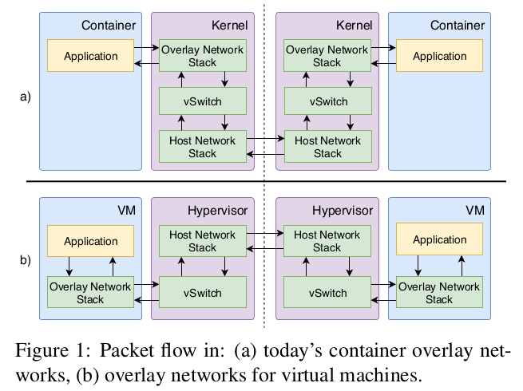
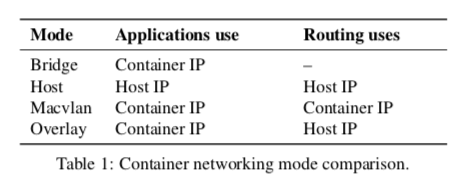
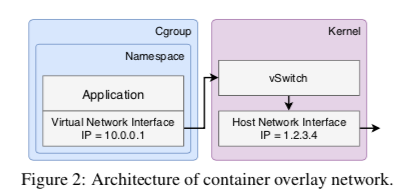
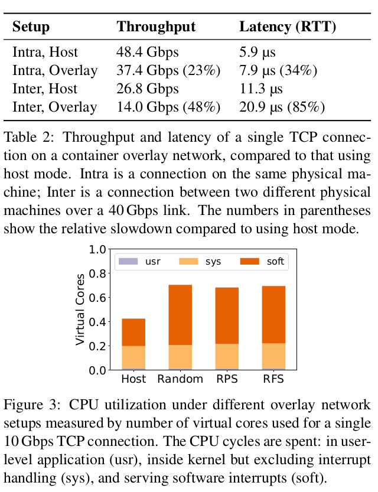
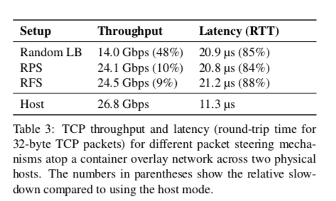
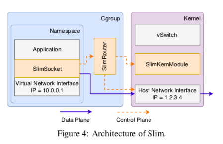
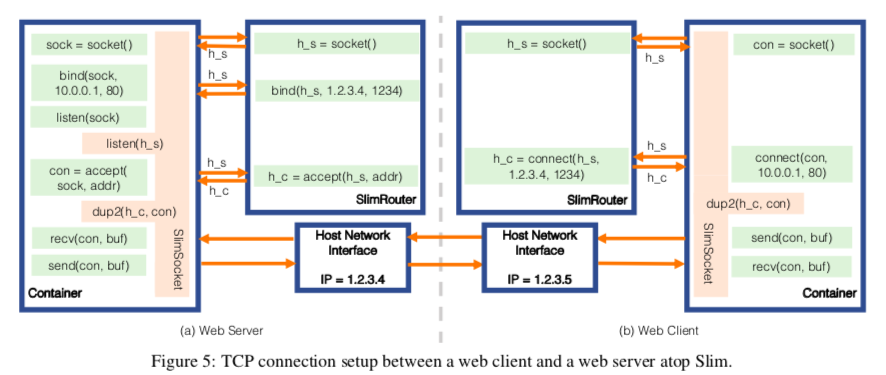

# Slim: OS Kernel Support for a Low-Overhead Container Overlay Network

[TOC]

## Motivation

容器的跨主机通信方案，容器 overlay 网络，大量依赖于内存组件。这意味着每个数据包必须两次遍历网络堆栈，并且还必须在发送方和接收方都进行虚拟交换。以发送数据包为例，由容器应用程序发送的分组首先遍历虚拟网络接口上的覆盖网络堆栈。该分组遍历虚拟交换机以进行分组变换（例如，添加主机网络报头）。最后，数据包遍历主机网络堆栈，并在主机网络接口上发送出去。在接收服务器上，以相反的顺序重复这些层。

本文的工作就是让上层的包只在 kernel 协议栈中经过一次。实现这样的容器覆盖网络具有挑战性，因为：（1）网络虚拟化必须与当今未经修改的容器化应用程序兼容；（2）我们需要支持当前由数据平面上的容器覆盖网络实施的相同网络策略；（3）我们需要实施与当今容器覆盖网络相同的安全模型。

本文做出以下贡献：

- 使用多个数据平面优化对现有容器覆盖网络进行基准测试。我们将每包处理成本（例如，数据包转换，网络堆栈的额外遍历）识别为当今容器覆盖网络的主要瓶颈。
- 设计和实现 Slim，这是一种操纵连接级元数据以实现网络虚拟化的解决方案。Slim 与当今的容器化应用程序和标准 OS 内核兼容。Slim 支持各种网络策略，并保证与当今容器覆盖网络相同的安全模型。
- 展示 Slim 对各种流行的容器化应用程序的好处，包括内存中的键值存储、Web 服务器、数据库服务器和流处理框架。

## Background 

### Container Overlay Network

容器通常有四种通信选项：桥接模式，主机模式，macvlan 模式和覆盖模式。表 1 显示了不同模式在容器化应用程序使用的 IP 地址和主机网络中的路由方面的比较。桥接模式专门用于在同一主机上通信的容器。使用桥接模式，每个容器都有一个独立的 IP 地址，OS 内核在不同的容器之间路由流量。

我们如何在不同主机上的容器之间启用通信？使用主机模式，容器直接使用其主机网络接口的 IP 地址。主机模式的网络性能接近于直接使用主机 OS 网络堆栈的任何进程的性能。但是，主机模式会产生许多管理和部署挑战。首先，容器不能配置自己的 IP 地址；他们必须使用主机网络接口的 IP 地址。这使移植变得复杂：必须重写分布式应用程序以发现和使用主机 IP 地址，并且如果容器可以迁移（例如，在检查点之后），则应用程序必须能够适应其 IP 地址的动态变化。更糟糕的是，因为同一主机上的所有容器共享相同的主机 IP 地址，所以只有一个容器可以绑定到给定端口（例如，端口 80），导致在同一主机上运行的不同应用程序之间的复杂协调。实际上，由于这些问题，容器 orchestators（如 Kubernetes）不允许使用主机模式。

Macvlan 模式或类似的硬件机制（例如，SR-IOV）允许容器具有与其主机不同的 IP 地址。Macvlan 或 SR-IOV 允许物理网卡模拟多个 NIC，每个 NIC 具有不同的 MAC 地址和 IP 地址。 Macvlan 通过使容器 IP 可在主机网络上路由，将主机网络扩展到容器中。但是，这种方法从根本上使数据中心网络路由复杂化。假设 IP 地址为 IP 1.2.3.[1-10] 的分布式应用程序。[1-10] 并不位于同一个机架上，或者开始位于同一位置，但随后会迁移一些容器。然后，主机 IP 地址将不是连续的，例如，一个可能在主机 5.6.7.8 上，而另一个可能在主机 9.10.11.12 上。 Macvlan 要求云提供商改变其核心网络路由，以重定向目的地 IP 1.2.3.[1-10] 至 5.6.7.8 和 9.10.11.12 的流量，可能需要为数百万的容器中提供单独的路由表。另一个限制是容器必须选择与任何其他容器（或主机）的 IP 地址不重叠的 IP 地址。由于这些复杂性，如今，大多数云提供商都阻止了 macvlan 模式。

为避免干扰主机网络上的路由，流行的选择是使用 overlay。这是虚拟机的模拟，但对于一组容器 - 每个应用程序都有自己的网络命名空间，对其他容器或主机网络所做的选择没有影响或可见性。每个容器创建一个虚拟网络接口（分配由应用程序选择的 IP 地址）。虚拟网络接口通过 OS 内核内的虚拟交换机（例如，Open vSwitch）连接到外部世界。当在主机网络上路由时，overley packets 使用主机网络报头封装。这使得容器覆盖网络具有其自己的 IP 地址空间和与主机网络不相交的网络配置；每个都可以完全独立管理。目前有许多容器覆盖网络解决方案可用 - 例如Weave [50]，Flannel [14]和Docker Overlay [8] - 所有这些解决方案共享类似的内部架构。

图 2 显示了使用数据包转换实现网络虚拟化的容器覆盖网络的高级系统图。它显示了一个操作系统内核和一个使用命名空间和 cgroup 构建的容器。命名空间隔离可防止容器化应用程序访问主机网络接口。Cgroup允许对容器内的应用程序可以消耗的资源（例如，CPU，内存和网络）的总量进行细粒度控制。

容器覆盖网络的关键组件是内核中的虚拟交换机（图 2）。虚拟交换机具有两个主要功能：（1）网络桥接，允许同一主机上的容器进行通信，以及（2）网络隧道，以使覆盖流量能够穿过物理网络。虚拟交换机通常使用 Open vSwitch 内核模块配置，VXLAN 作为隧道协议。为了实施各种网络策略（例如，访问控制、速率限制和服务质量），网络运营商或容器 orchestrator 向虚拟网络接口或虚拟交换机发布策略更新。例如，防火墙规则通常通过iptables实现，并且还可以在 Open vSwitch 内核模块内配置速率限制和服务质量（QoS）。这些规则通常根据应用程序的虚拟IP地址指定，而不是根据容器分配位置可能更改的主机IP地址。

在覆盖网络中运行一组容器的主机必须跨主机维护一致的全局网络视图（例如，虚拟到物理 IP 映射）。它们通常使用外部容错分布式数据存储或 gossiping protocol 来实现此目的。

### Overhead in Container Overlay Networks

#### Journey of an Overlay Network Packet

#### Quantifying Overhead

我们详细分析了一个流行的容器覆盖网络实现Weave [50]的开销。我们的测试平台由两台配备 Intel Xeon E5-2680（12 个物理内核，2.5 GHz）的机器组成。这些机器使用超线程，因此每个都有 24 个虚拟核心。每台机器运行 Linux 4.4 版本，并具有 40 Gbps Intel XL710 NIC。这两台机器通过 40 Gbps 链路直接连接。物理 NIC 配置为使用接 Receive Side Scaling（RSS）。在我们的所有实验中，我们都不会更改物理网卡的配置。

我们使用 Weave 的快速数据平面模式创建了一个覆盖网络（类似于图2中的架构）。我们使用 iperf3 [18] 创建单个 TCP 连接，并研究容器覆盖网络顶部的 TCP 吞吐量。我们使用 NPtcp [37]来测量数据包级延迟。为了进行比较，我们还使用主机模式容器网络执行相同的测试。在我们的所有实验中，我们将 CPU 保持在最大时钟频率（使用 Intel P-State 驱动程序[45]）。容器覆盖网络的开销很大。我们在四种不同的设置下比较 TCP 流量吞吐量和数据包级延迟。表 2 显示了 10 秒间隔内的平均 TCP 流量吞吐量以及 10 次测试的 32 字节 TCP 数据包的往返延迟。对于同一主机上的两个容器，TCP 吞吐量减少了 23％，延迟增加了 34％。对于跨物理机的容器，TCP 吞吐量减少了近一半（48％），延迟增加了 85％。

为了理解主要瓶颈的来源，我们使用标准的 Linux 内核 CPU 分析工具 mpstat 来测量 CPU 利用率。我们专门检查两个不同物理机器上的覆盖网络。我们将 TCP 连接的速度设置为 10 Gbps，然后使用 mpstat 来确定 CPU 周期的花费。图 3 显示了整体 CPU 利用率和故障情况。与使用直接主机连接相比，在默认模式（随机IRQ负载平衡）中，覆盖网络将 CPU 利用率（相对）提高了66％。 RPS（Receive Packet Steering）和 RFS（Receive Flow Steering）是我们对 Weave 进行的两项优化。

覆盖网络的主要 CPU 开销来自服务软件中断；在默认覆盖设置中，它对应于 0.50 个虚拟核心。额外 CPU 利用率在软件中断处理类别中的原因是数据包转换和额外网络堆栈的遍历不直接与系统调用相关联。这些任务被卸载到每个核心的专用 softirq 线程。为了进行比较，使用主机模式，只有 0.23 个虚拟内核用于服务软件中断。This difference in CPU utilization captures the extra CPU cycles wasted on traversing the network stack one extra time and packet transformation. 请注意，由于虚拟交换机和额外的网络堆栈遍历，我们不会分离 CPU 利用率。我们的解决方案 Slim 同时从容器覆盖网络数据平面中删除这两个组件，因此了解这两个组件消耗的 CPU 利用率是多少。

在§2.3中，我们表明现有技术（例如，分组控制）可以解决容器覆盖网络的一些性能问题。但是，仍然存在重大开销。

### Fine-Tuning Data-plane

有几种已知技术可以减少数据平面开销。Packet steering 为每个网络接口创建多个队列，每个 CPU 一个，并使用一致性散列将数据包映射到不同的队列。这样，同一网络连接中的数据包仅在单个核心上进行处理。因此，不同的核不必访问相同的队列，从而消除了由于多核同步（例如，高速缓存行冲突，锁定）而导致的开销。表 3 显示了使用数据包控制的容器覆盖网络上的吞吐量和延迟的变化。

数据包控制可将 TCP 吞吐量提高到使用主机 TCP 连接的91％以内，但不会降低数据包级延迟。我们为覆盖网络中的内部虚拟网络接口试验了两种分组控制选项，Receive Packet Steering（RPS）和 Receive Flow Steering（RFS）。 RPS 确保同一流中的数据包始终位于同一核心。 RFS 是 RPS 的增强版，可确保软件中断处理与应用程序在同一内核上进行。虽然 packet steering 可以提高吞吐量，但它不会减少延迟或显着影响 CPU开销（图3）。数据包仍然必须经历相同的数据包转换并遍历网络堆栈两次。我们的设计 Slim 直接关注于在容器覆盖网络中消除每个数据包的处理开销。

## Overview

## Slim

### Connection-based Network Virtualization

- Support for blocking I/O
- Service discovery
- Support for non-blocking I/O

### Support Flexible Network Policies

**控制平面策略。**Slim 支持对覆盖数据包标头字段的标准访问控制，例如源/目标 IP 地址和端口。访问控制还可以过滤特定类型的流量（例如，SSH，FTP）或来自特定 IP 前缀的流量。

在策略是静态的正常情况下， Slim 在创建连接时强制实施访问控制。SlimRouter 维护 container orchestrator 或 network operator 控制策略的副本。当通过 accept 或 connect 创建连接时，SlimRouter 会检查创建的连接是否违反任何现有的访问控制策略。如果是这样，SlimRouter 通过返回 -1 来连接或忽略 accept 中的连接来拒绝连接。

Access control policies can change dynamically, and any connection in violation of the updated access control policy must be aborted.  SlimRouter 保持每个连接状态，包括源和目标 IP 地址，端口以及相应的主机名称空间文件描述符。访问时控制策略更改，SlimRouter 遍历所有当前连接以查找更新的策略中禁止的连接。SlimRouter通过从容器中删除相应的文件描述符来中止这些连接。从正在运行的进程中删除文件描述符不是 Linux 等商用操作系统中的现有功能。我们在SlimKernModule中构建了这个功能。

**数据平面策略。**Slim 支持两种类型的数据平面策略：速率限制（rate limiting）和服务质量（QoS）。速率限制限制了容器可以使用的资源量。QoS 确保某些应用程序的性能优于其他应用程序。

Slim 重用 OS 内核的现有功能来支持数据平面策略。现代操作系统内核支持单个连接或一组连接的速率限制和 QoS。Slim 只是设置正确的标识符，让操作系统内核识别生成流量的容器。

在 Slim 中，速率限制在每个连接和每个容器级别都是强制执行的。使用 Linux 的流量控制程序 tc，以与今天的覆盖网络类似的方式设置每个连接速率限制。对于每容器速率限制，Slim 首先配置 net cls cgroups 以包括 SlimRouter 进程。net cls cgroup 使用唯一标识符标记来自容器或相应 SlimRouter 的流量。然后，SlimRouter 使用主机网络接口上的 tc 设置具有此标识符的流量的速率限制。通过这种方式，SlimRouter 的网络使用也受到速率限制的限制。正确计算网络使用率是每个容器需要单独的 SlimRouter 的基本原因。

服务质量（QoS）设置也使用 tc。SlimRouter 使用套接字选项来设置服务类型（ToS）字段（通过 setsockopt）。以这种方式，物理网络上的交换机/路由器被通知容器的流量的优先级。

**与现有 IT 工具的兼容性。**通常，需要修改 IT 工具以与 SlimRouter 交互以便与 Slim 一起工作。IT 工具通常使用一些 user-kernel 接口（例如，iptables）来注入防火墙和速率限制规则。使用 Slim 时，他们应该将这些规则注入 SlimRouter。因为 Slim 基本上是基于连接的虚拟化方法，所以我们的方法的局限性在于它不能支持基于 packet 的网络策略（例如，如果 packet 的 hash 与 signature 匹配则丢弃 overlay packet）。 如果需要基于 packet 的策略，则应使用标准 Linux overlay。如果基于静态连接的访问控制是唯一需要的网络策略，则无需修改现有 IT 工具。如果 IT 工具阻止标准容器覆盖网络上的连接，它还会阻止 Slim 上该连接的服务发现元数据，从而阻止在 Slim 上创建主机连接。

### Addressing Security Concerns

Slim 包含一个可选的内核模块 SlimKernModule，以确保 Slim 保持与当今容器覆盖网络相同的安全模型。该问题涉及想要绕过 SlimSocket 的潜在恶意容器。Slim 将主机命名空间文件描述符暴露给容器，因此需要 OS 内核内部的额外机制来跟踪和管理访问。

SlimKernModule 基于文件描述符实现了轻量级和通用功能系统。SlimKernModule 以类似于污点跟踪工具的方式跟踪标记的文件描述符，并过滤这些文件描述符上的不安全系统调用。我们设想这个内核模块也可以被其他系统用来跟踪和控制文件描述符。例如，如果文件服务器触发警报，则可能希望撤消对可疑进程的访问。Slim 无法使用现有的内核功能，例如seccomp，因为 seccomp 无法跟踪标记的文件描述符。

SlimKernModule 监视主机命名空间文件描述符在容器内的传播方式。它允许 SlimRouter 或其他特权进程标记文件描述符。然后，它会对可能复制或删除标记文件描述符的系统调用进行交互，例如 dup，fork和 close，跟踪它们的传播。如果容器将文件描述符传递给容器内的其他进程，则还会复制该标记。

标记文件描述符在容器内具有有限的权限。SlimKernModule 不允许使用这些文件描述符调用某些不安全的系统调用。例如，在 Slim 的情况下，标记的文件描述符不能与以下系统调用一起使用：connect，bind，getsockname，getpeername，setsockopt 等。这可以防止容器学习其主机 IP 地址或增加其流量优先级。它还可以防止容器直接创建主机网络连接。对于非恶意容器，SlimSocket 和 SlimRouter 模拟这些禁止的系统调用的功能。

SlimKernModule 根据请求撤消标记的文件描述符。为此，它需要进程标识符（pid）和文件描述符索引。SlimRouter 使用此功能来实现动态访问控制。当访问控制列表针对现有连接进行更改时，SlimRouter 将通过 SlimKernModule 删除文件描述符。SlimKernModule 撤消文件描述符的所有副本。

安全与非安全模式。是否在安全模式下使用 Slim（使用SlimKernModule）取决于用例。当容器和物理基础设施受同一实体控制时，例如云提供商自己使用，非安全模式就足够了。当容器可能对其他实体的物理基础结构或容器有恶意时，需要安全模式。安全模式的连接建立时间稍长（约25％）。

## Implementation

我们对 Slim 的实现基于 Linux 和 Docker。我们的原型包括§4中描述的所有功能。SlimSocket、SlimRouter 和 SlimKernModule 分别在 1184 行 C、1196 行 C++（不包括 OpenSSL）和 1438 行 C 中实现。我们的原型依赖于标准覆盖网络 Weave，用于服务发现和处理需要数据平面处理的数据包（例如，ICMP，UDP）。

SlimSocket 使用 LD_PRELOAD 动态链接到应用程序二进制文件。SlimSocket 和 SlimRouter 之间的通信是通过 Unix 域套接字进行的。在非安全模式下，文件描述符通过 sendmsg 在 SlimRouter 和 SlimSocket 之间传递。对于安全模式，文件描述符与 SlimKernModule 的跨进程文件描述符复制方法一起传递。

SlimRouter 允许网络运营商将访问控制表达为基于源/目标 IP 地址前缀和端口的条目列表。Slim 拒绝列表中匹配的任何连接。SlimRouter 使用htb qdisc 来实现速率限制，并使用 tc 实现 QoS 的 prio qdisc。SlimRouter 和 SlimKernModule 通过 SlimKernModule 创建的 procfs 中的虚拟文件进行通信。

SlimKernModule 将对此文件的写入视为请求。访问虚拟文件需要主机 root 权限。SlimKernModule通过替换系统调用表中的函数指针来插入系统调用。 SlimKernModule将标记的文件描述符存储在哈希表和不安全的系统调用列表中。 SlimKernModule拒绝对标记文件描述符进行不安全的系统调用。SlimKernModule还插入了诸如 dup、dup2 和 close 之类的系统调用，以确保适当地传播文件描述符标记。对于进程 fork（例如，fork、vfork 和 Linux 内核中的 clone），SlimKernModule 使用 sched 进程 fork 作为 call back 函数来插入它们。Slim 不会改变进程 fork 的行为。fork 进程仍然具有动态链接的 SlimSocket。

## My Review

文章通过将主机中 TCP 链接映射到容器中来将容器中的 TCP 链接加速到和主机同等的性能。但是，我们需要引入一些模块来使能该方案。因为需要将主机 netns 中的 fd pass 给容器，需要引入 SlimKernelModule 来保持容器的隔离性。另外，文章还需要在 SlimRouter 中实现 rate limiter 和 QoS。

文章一个不好的地方就是只支持 connection-level 的 access control，并不支持 packet-level 的 access control。