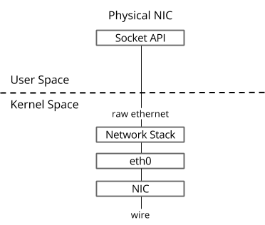
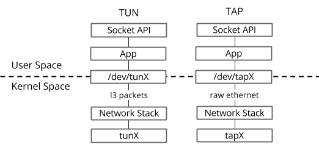
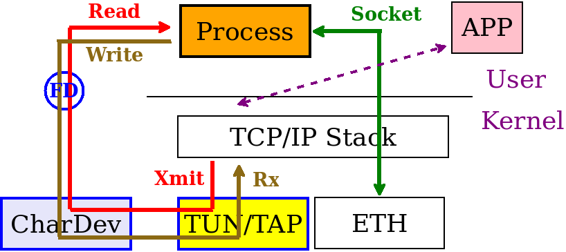
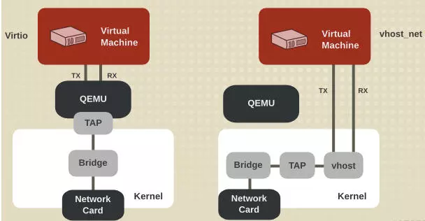
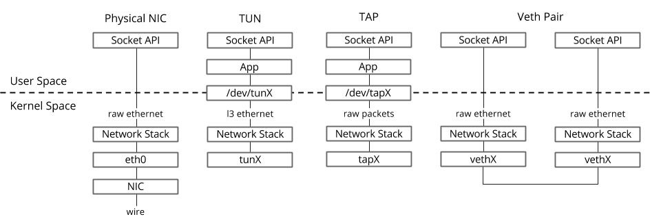

# TUN/TAP vs VETH

[TOC]

计算机系统通常由一个（或一组）网络设备组成，即eth0，eth1等。这些网络设备与物理网络适配器相关联，物理网络适配器负责将数据包放到线路上，如下图。

However, in the world of virtual networking, a degree of internal plumbing is required to patch, tunnel and forward packets within the system. This "internal plumbing" is built using virtual networking devices, such as - TUN, TAP and Veth Pairs.

## TUN/TAP

> TUN/TAP provides packet reception and transmission for user space programs. It can be seen as a simple Point-to-Point or Ethernet device, which, instead of receiving packets from physical media, receives them from user space program and instead of sending packets via physical media writes them to the userspace program.

或者换句话说，TUN / TAP驱动程序在Linux主机上构建虚拟网络接口。 该接口的功能与任何其他接口类似，即您可以为其分配IP，分析流量，路由流量等。当流量发送到接口时，流量将发送到您的用户空间程序而不是真实网络。

There are 2 driver modes for TUN/TAP, yep you guessed it - TUN and TAP.

- TUN（隧道）设备在第3层运行，这意味着您将从文件描述符接收的数据（数据包）将基于IP。 写回设备的数据也必须采用IP数据包的形式。
- TAP（网络分路器）的运行方式与TUN非常相似，但它不仅能够向/从文件描述符写入和接收第3层数据包，而是可以使用原始以太网数据包进行操作。 您通常会看到KVM / Qemu虚拟化使用该设备，其中TAP设备在创建期间分配给虚拟客户机界面。

一个更直观的图，

### TAP 用于创建 VM 虚拟网卡

Each VM has a single interface that appears as a Linux device (e.g., `tap0`) on the physical host. 有两种方式为 VM 提供虚拟网卡，全虚拟化则实现在 QEMU 中，半虚拟化则实现在内核态的 vhost 中，两者都需要在主机上创建一个 TAP 并 RW。相比 QEMU 全虚拟化方法，半虚拟化中 vhost-net 直接实现在内核中，减少了上下文切换，性能更好。

## VETH pairs

**Veth设备构建为成对的连接虚拟以太网接口，可以被认为是虚拟跳线。** 数据从一端进入，然后从另一端出来。这使得veth对非常适合将不同的虚拟网络组件连接在一起，例如Linux桥接器，OVS桥接器和LXC容器。

您将看到veth对的一个常见用例是OpenStack Neutron。 其中veth对用于将多个Linux网桥连接在一起，这是您目前无法使用基于tap的设备进行的操作。

## Summary

## Refs

- TUN/TAP and veth. <https://www.fir3net.com/Networking/Terms-and-Concepts/virtual-networking-devices-tun-tap-and-veth-pairs-explained.html>.
- Universal TUN/TAP device driver. <https://www.kernel.org/doc/Documentation/networking/tuntap.txt>.
- vhost：一种 virtio 高性能的后端驱动程序. <https://www.cnblogs.com/bakari/p/8341133.html>.