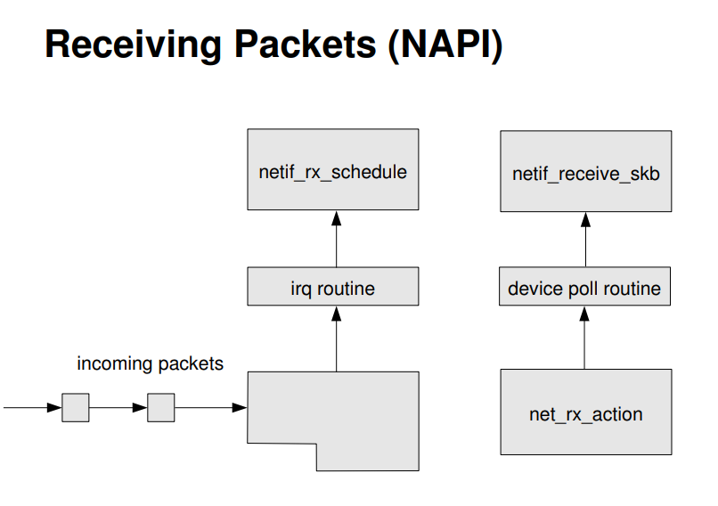

# VirtIO Protocols and Its Implementation

## virtio 1.0

Virtio 是一种半虚拟化的设备抽象接口规范。在 guest OS 中实现的前端驱动程序一般直接叫 virtio，在 host OS 实现的后端驱动程序叫 vhost。其中，其中虚拟队列（virtqueue）是连接客户机操作系统中 virtio 设备前端驱动和宿主机后端驱动的实际数据链路，如下图所示。


virtqueue 主要包括三个数据结构：vring_desc / vring_avail / vring_used。其中，vring_desc 为 vring 描述符数组，所有的空闲描述符连接成单向链表。vring_avail 是一个指向描述符的环型表，是由前端提供（写入），给后端使用（读取）的。vring_used 也是一个指向描述符的环型表，和 vring_avail 相反，它是由后端提供（写入），给前端使用（读取）的。

现考虑前端向后端提交一个 block IO 请求，则该请求流动如下：


- Figure 3： 因为本次 block IO 请求需要传递三个缓冲，则首先需要在描述符表中分配三个描述符并分别指向这三个缓冲区；
- Figure 4：本次 block IO 请求所用描述符会链在一起，并将 head 记录在 vring_avail 中，然后通知后端程序处理；
- Figure 5：后端程序处理完请求后将所用描述符的 head 放到 vring_used 中，然后通知前端进一步处理。

这里，有一些问题还没有理清楚：

- 为什么要将描述符列表和 ring 分开？为什么不在描述符列表中直接实现 ring 结构？
  - virtio 容许 device 乱序执行 requests，所以采用分开的描述符表和环表。


- vring_avail 和 vring_used 中只维护了 idx 来标记 ring 中下一个可用的表项。那么，已知前端在 vring_avail 中添加了若干个请求，则后端怎么知道从 vring_avail 的哪里开始读取这些请求？
  - See slide PV I/O for KVM and beyond for details.

Refs:

- virtio: Towards a De-Facto Standard For Virtual I/O Devices. https://dl.acm.org/citation.cfm?id=1400108.
- virtio: An I/O virtualization framework for Linux. https://www.cs.cmu.edu/~412/lectures/Virtio_2015-10-14.pdf.
- Paravirtualized I/O for KVM and beyond. https://vmsplice.net/~stefan/virtio-devconf-2014.pdf.
- virtio 0.95. https://github.com/rustyrussell/virtio-spec.
- virtio 1.0. https://github.com/oasis-tcs/virtio-spec.

## virtio 1.1

TODO

Refs:

- What's new in virtio 1.1. https://www.dpdk.org/wp-content/uploads/sites/35/2018/09/virtio-1.1_v4.pdf.
- virtio 1.1 drafts. https://github.com/oasis-tcs/virtio-docs.

## Overview of DPDK virtio framework

源码目录：`drivers/net/vritio/` 。

- 底层 PCI-e 设备层，主要包括一些读取 PCI-e 中的配置等工具函数
  - virtio_pci.[h|c]
- 中间 virtio 虚拟队列层，包括 vring、vring_desc 数据结构和相关操作实现
  - virtqueue.[h|c]
  - virtio_ring.h
- 上层网络设备层实现
  - virtio_ethdev.[h|c]，负责设备设置
  - virtio_rxtx.[h|c]，负责数据报的接收和发送

### VIRTIO-USER

DPDK 的 virtio-user 是基于 DPDK virtio 的高性能容器网络方案，适合用于学习 DPDK virtio 框架。


Refs:

- How to run DPDK with virtio-user in Docker container. https://github.com/lagopus/lagopus/blob/master/docs/how-to-use-virtio-user.md.
- VIRTIO-USER: A New Versatile Channel for Kernel-Bypass Networks. KBNets '17. https://dl.acm.org/citation.cfm?id=3098586.
- 「深入浅出 DPDK」Ch 11.

## CPU & PCIe & NIC


网卡 DMA 控制器通过环型队列与 CPU 进行交互。硬件控制所有 Head 和 Tail 之间的描述符。Head 等于 Tail 时队列为空，Head 等于 next(tail) 时表示队列已满。

无论进行收包还是发包，网卡驱动软件需要完成最基本的操作包括，1）填充缓冲区地址到描述符；2）移动尾指针；3）判断描述符中的完成状态。对于收方向，还有重申请重填写所需的缓冲区的操作。对于发方向，还有释放已发送数据缓冲区的操作。


下从 PCIe 带宽调优的角度讲述可以用到的方法：

- 减少 MMIO 访问的频度，主要是减少 CPU 对 tail register 的修改。接受（RX）包时，尾寄存器（tail register）的更新发生在新缓冲区分配以及描述符重填之后。只要将每包分配并重填描述符的行为修改为滞后的批量分配并重填描述符，接受侧的尾寄存器更新次数将大大减少。DPDK 在判断控制率小于一定值后才触发重填来完成这个操作。发送（TX）包时，就不能采用类似的方法。因为只有及时更新尾寄存器，才会通知网卡进行发包。但仍可以采用批量发包接口的方式，填充一批等待发送的描述符后，统一更新尾寄存器。
- 提高 PCIe 传输的效率，主要是 DMA 合并访问描述符来提升带宽的利用率。每个描述符的大小是固定的，为 16 字节。可以将 4 个操作合并成整个 cache line 大小来作为 PCIe 的事物请求（PCIe 净荷为 64 字节），从而提升带宽的利用率。另外，在发送方向，发送完成后回写状态到描述符。避免每次发送完成就写回，使用批量写回方式（例如，网卡中的 RS bit），可以用一次 PCIe 的事物来完成批量（如 32 个为一组）的完成确认。
- 尽量避免 cache line 的部分写，即 DMA 写数据所用缓冲区为 cache line 对齐时性能最佳。

Refs:

- 在「深入浅出 DPDK」Ch6. PCIe 与包处理 I/O.
- Understanding PCIe performance for end host networking. SIGCOMM '18.

## 网卡收包流程


一般来说，OS（Linux）收包的流程如下：

1. 链路上的帧数据会首先进入到NIC上的RX FIFO中；
2. NIC控制器通过RDH获取RX的RD；
3. NIC通过DMA将包数据写入到RD指向的skb_buf中，最后更新RDH；
4. NIC向CPU发出中断；
5. CPU根据中断号运行相应的中断处理程序；
6. 中断处理程序先mask rx event，这样再来数据包就不会产生rx中断，再将当前的NIC设备添加到NAPI的待论询队列（poll_list）中并激活收包软中断；
7. 软中断处理程序结合软中断和轮询的方式依次接受poll_list中网络设备上的报文（生成PF_PACKET类型的数据包），若处理完就unmask rx event，这样再来的数据包就会产生中断，同时移除该网络设备。




至此，NIC驱动处理程序执行完毕，最后相应的驱动程序接口会返回数据包指针。例如，TCP/IP协议栈调用nic_rx接受数据包，最后该API返回一些包指针。这里有一个问题，驱动怎么知道将数据递交给哪一个进程呢？这里需要维护一个包数据和用户进程之间的映射，如UDP协议中五元组和sockfd之间的映射。这样驱动通过调用协议栈routine解析数据包解析得五元组，然后查表得约定好的缓冲区并将包放入指定的地方，最后用户程序通过sockfd查表得约定的地方并取回数据。

控制路径上，一个数据包从链路上流入到用户程序（不考虑TCP/IP协议栈）中经过了若干个上下文：NIC controller、硬中断处理程序、软中断处理程序、用户进程。数据路径上，数据包经过的存储区包括：NIC上的RX FIFO、内存中的sk_buf、用户缓冲区。如图。

Refs:

- 网卡收包流程. https://cloud.tencent.com/developer/article/1030881.
- NAPI机制. http://cxd2014.github.io/2017/10/15/linux-napi/.
- Linux内核网络部分控制流. https://blog.csdn.net/longerzone/article/details/8672117.
- Control flow of the Linux networking kernel. https://wiki.linuxfoundation.org/networking/kernel_flow#receive-flow.
- Netpoll API. http://people.redhat.com/~jmoyer/netpoll-linux_kongress-2005.pdf.
- Linux网络——数据包的接受过程. https://segmentfault.com/a/1190000008836467.

## Pass VFs to container

```bash
# Set # of VFs
$ echo 8 > /sys/bus/pci/devices/0000:01:00.0/sriov_numvfs
$ ip link show
# Create a docker container without network
$ docker run -it --net=none <image> bash
# Create netns associated with the container:
#	- Find PID
#	- Create netns for that
$ pid=$(docker inspect -f '{{.State.Pid}}' <container_id>)
$ mkdir /var/run/netns
$ ln -s /proc/$pid/ns/net /var/run/netns/$pid
# Assign a VF to netns and use the ethernet interface for VF
$ vf=<interface>
$ ip link set $vf netns $pid
# Set IP address that specifies IP address you need to set
$ ip netns exec $pid ip addr add $ipaddr dev $vf
$ ip netns exec $pid ip link set $vf up
```

Refs:

- Building High-Performance NFV Solutions Using Containers. https://events.static.linuxfound.org/sites/events/files/slides/Jun_Nakajima_NFV_Container_final.pdf.


## vDPA (vHost Data Path Acc.), a approach of Direct I/O

Ambiguous concepts:

- Live-migration
- Stock VMs
- Control between driver and hardware: ring & interrupt & doorbell
- IOMMU & SR-IOV
- CSR, BAR conf/map
- QEMU VMCS (Virtual Machine Control Structure), PIR (Posted-Interrupt Request), EPTP
- PIO / EPT violation
- ...

Key concepts to understand vDPA: virtio CP & IOMMU & vfio
