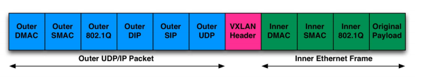
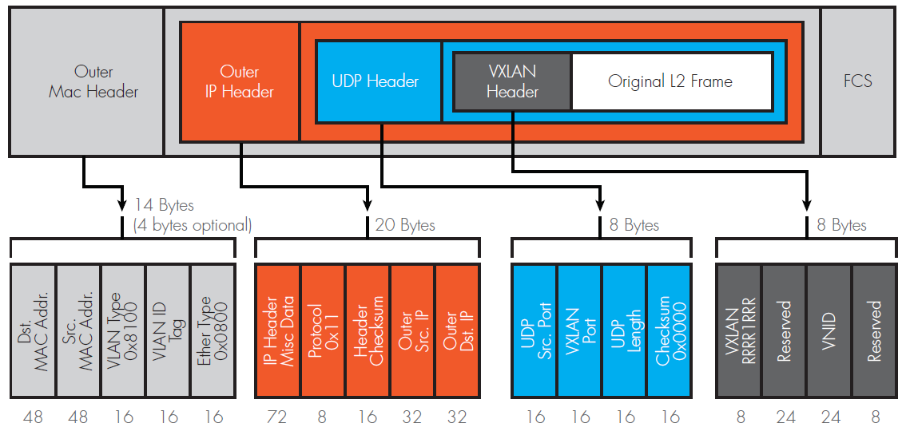
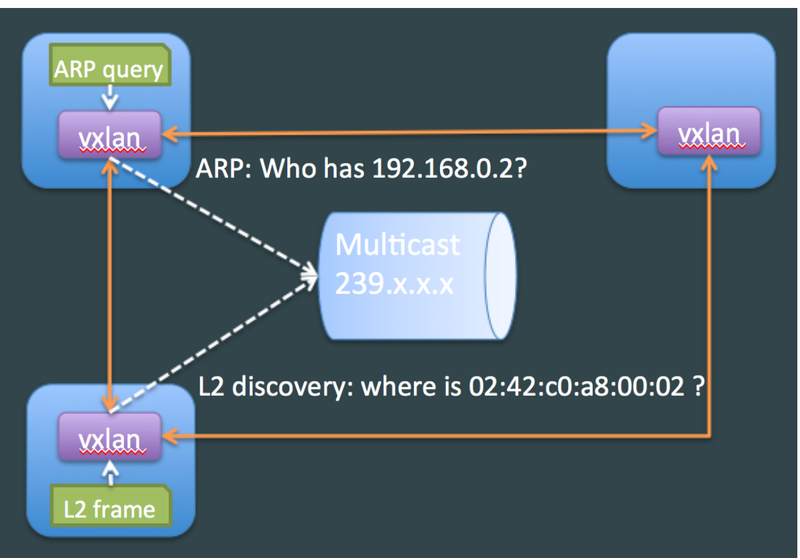
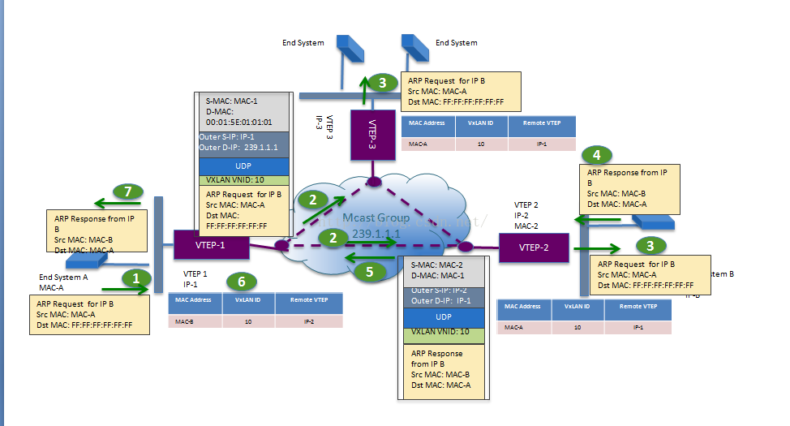
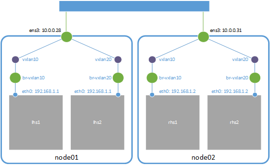

# VXLAN protocol and its impl. in Linux

## Motivation (partial)

- 数据中心（尤其是公有云服务）需要提供多租户功能。一般，不同租户之间需要分配独立的 L2 广播域。如何保证这个功能的拓展性和正确性？P.S. 传统的 VLAN 技术只能支持 4096 个网络上限，不能满足需求。
- 云计算服务对业务灵活性要求较高，虚拟机可能会大规模迁移，并保证网络一直可用。如何保持 L2 网络的灵活性？

## VXLAN protocol

> VXLAN is a  framework for overlaying actualized layer 2 networks over layer 3 networks.

### VXLAN 模型和概念

VXLAN 属于隧道网络，这类隧道网络的一个特点是对原有的网络架构影响小，原来的网络不需要做任何改动，在原来网络基础上架设一层新的网络。如图，VXLAN 引入的概念包括 VNI、VTEP 和 VXLAN Tunnel。


- VNI - VXLAN Network Identifier
  - 24 bit number (16M+ unique identifiers)
  - Part of the VXLAN header
  - Similar to VLAN ID
  - Limits broadcast domain
- VTEP - VXLAN Tunnel End Point
  - Originator and/or terminator of VXLAN tunnel for a specific VNI
  - Outer DIP/Outer SIP
- VTEP Tunnel

### VXLAN 报文





从这个报文中可以看到三个部分：

1. 最外层的 UDP 协议报文用来在底层网络上传输，也就是 VTEP 之间互相通信的基础。
2. 中间是 VXLAN 头部，VTEP 接受到报文之后，去除前面的 UDP 协议部分，根据这部分来处理 VXLAN 的逻辑，主要更具 VNI 发送到最终的虚拟机。
3. 最里面是原始的报文，也就是虚拟机看到的报文内容。

可以看出 VXLAN 协议比原始报文多出 50 字节的内容，这会降低网络链路传输有效数据的比例。VXLAN 头部最终要的是 VNID（VNI）字段，其他的保留字段主要是为了未来的拓展。

### VXLAN 网络通信过程

> - When sending a packet,
>   - ARP table is checked for IP/MAC/Interface mapping
>   - L2 FDB is checked to determine IP of destination on VTEP for destination on MAC on source VTEP
>   - Source VTEP then encapsulates frame with correct destination VTEP and destination decapsulates
> - Actually, we need a mechanism to lookup behind which VTEP is a container MAC. However, we can leverage IP muticast in VXLAN,
>   - IP Multicast group per overlay (per VXLAN)
>   - Unicast  is also possible when after first communication. 
>
> 

综合以上内容，我们可以给出 VXLAN 报文的发送过程：虚拟机的报文通过 VTEP 添加上 VXLAN 头部和外部的报文层，然后发送出去，对方 VTEP 收到之后拆除 VXLAN 头部，然后根据 VNI 把原始报文发送到目的虚拟机。

上面的过程是双方已经知道所有通信信息的过程，但是在第一次通信之前还有很多问题需要解决：

1. 哪些 VTEP 需要添加到一个相同的 VNI 组？
2. 发送方虚拟机如何知道对方的 MAC 地址？
3. VTEP 怎么知道目的虚拟机在哪一台宿主机上？

这三个问题可以归结为同一个问题：VXLAN 网络怎么感知彼此的存在并选择正确的路径传输报文？因为 VTEP 形成的组是虚构的概念，所以只要某些 VTEP 能够正确的传递报文，他们就是在同一个组内，问题 1 clear。

现考虑问题 2 和 3。一个完整的 VXLAN 报文涉及的信息包括：

- Inner IP 头部：通信的虚拟机双方要么直接使用 IP 地址，要么通过 DNS 等方式已经获取了对方的 IP 地址，因此网络层地址已经知道。
- Inner MAC 头部：同一网络（同属于一个 L2 广播域）的虚拟机需要通信，还需要知道**对方虚拟机的 MAC 地址**，VXLAN 需要一个机制来实现传统网络 ARP 的功能。
- VXLAN 头部：只需要知道 VNI，这一般是直接配置在 VTEP 上的，要么是提前规划写死，要么是根据内部报文自动生成的，也不需要担心。
- Outer UDP 头部：最重要的是源地址和目的地址的端口。其中，源地址端口是系统生成并管理的，目的端口则是写死的，比如 IANA 规定的 4789 端口，Linux 则选择 8472。这部分也并不需要担心。
- Outer IP 头部：IP 头部关心的是 VTEP 双方的 IP 地址，源地址可以很简单确定，目的地址是**虚拟机所在宿主机 VTEP 的 IP 地址**，这个也需要由某种方式来确定。
- Outer MAC 头部：如果 VTEP 的 IP 地址确定了，MAC 地址可以通过经典的 ARP 方式来获取，毕竟 VTEP 网络在同一个三层，经典网络架构那一套就能直接用了（查路由表得 next hop 的 IP，然后通过 ARP 得 next hop 的 MAC 地址）。

总结一下，一个 VXLAN 报文需要确定两个地址信息：目的虚拟机的 MAC 地址和目的 VTEP 的 IP 地址，如果 VNI 也是动态感知的，那么虚拟机在通信之前需要确认一个三元组 `tuple3_peer(inner_macaddr, vni, vtep_ip)`。根据实现的不同，一般分为两种模式：多播和控制中心。多播的概念是同个 VXLAN 网络的 VTEP 加入同一个多播网络，如果需要知道以上信息，就是组内发送多播来查询；控制中心的概念是在某个集中式的地方保存了所有虚拟机的上述信息，自动化告知 VTEP 它需要的信息。

#### 多播

简单的说，每个多播组对应一个多播 IP 地址，往这个多播 IP 地址发送的报文会发给多播组的所有主机。为什么要使用多播？因为 VXLAN 底层网络是三层的，广播地址无法穿越三层网络，要给 VXLAN 网络所有 VTEP 发送报文只能通过多播。

下图是在多播模式下，vxlan 的报文工作流程，位于左下方的主机 A 要通过 vxlan 网络发送报文给右下方的主机 B。

VTEP 建立的时候会通过配置加入到多播组（具体做法取决于实现），图中的多播组 IP 地址是 `239.1.1.1`。需要注意的是，多播地址不属于任何一个主机，所以加入到特定多播组的 VTEP interface 并不会绑定该 IP。

1. 主机 A 只知道对方的 IP 地址，不知道 MAC 地址，因此会发送 ARP 报文进行查询，内部的 ARP 报文很普通，目标地址为全 1 的广播地址。
2. VTEP-1 收到 ARP 报文，发现虚拟机目的 MAC 为广播地址，封装上 VXLAN 协议头部之后（外层 IP 为多播组 IP，MAC 地址为多播组的 MAC 地址），发送给多播组 `239.1.1.1`，支持多播的底层网络设备（交换机和路由器）会把报文发送给组内所有的成员。
3. VTEP 接收到 VXLAN 封装的 ARP 请求，去掉 VXLAN 头部，并通过报文学习到 peer 的 `tuple3_peer(inner_macaddr, vni, vtep_ip)` 并保存起来，把原来的 ARP 报文广播给所有主机。
4. 主机接收到 ARP 请求报文，如果 ARP 报文请求的是自己的 MAC 地址，就返回 ARP 应答
5. VTEP-2 此时已经知道发送方的虚拟机信息和 VTEP 信息，把 ARP 应答添加上 VXLAN 头部（外部 IP 地址为 VTEP-1 的 IP 地址，VNI 是原来报文的 VNI）之后通过单播发送出去。
6. VTEP-1 接收到报文，并学习到报文中的三元组，记录下来。然后 VTEP 进行解包，知道内部的 IP 和 MAC 地址，并转发给目的虚拟机。
7. 虚拟机拿到 ARP 应答报文，就知道了到目的虚拟机的 MAC 地址。

在这个过程中，只有一次多播，因为 VTEP 有自动学习的能力，后续的报文都是通过单播直接发送的。可以看到，多播报文非常浪费，每次的多播其实只有一个报文是有效的，如果某个多播组的 VTEP 数量很多，这个浪费是非常大的。但是多播组也有它的实现起来比较简单，不需要中心化的控制，只有底层网络支持多播，只有配置好多播组就能自动发现了。

单播报文的发送过程就是上述应答报文的逻辑，应该也非常容易理解了。还有一种通信方式，那就是不同 VNI 网络之间的通信，这个需要用到 VXLAN 网关（可以是物理网络设备，也可以是软件），它接收到一个 VXLAN 网络报文之后解压，根据特定的逻辑添加上另外一个 VXLAN 头部转发出去。

因为并不是所有的网络设备都支持多播，再加上多播方式带来的报文浪费，在实际生产中这种方式很少用到。

#### 分布式控制中心

从多播的流程可以看出来，其实 VTEP 发送报文最关键的就是知道对方虚拟机的 MAC 地址和虚拟机所在主机的 VTEP IP 地址。如果能够事先知道这两个信息，直接告诉 VTEP，那么就不需要多播了。

在虚拟机和容器的场景中，当虚拟机或者容器启动还没有进行网络通讯时，我们就可以知道它的 IP 和 MAC（可能是用某种方式获取，也有可能是事先控制这两个地址），分布式控制中心保存了这些信息。除此之外，控制中心还保存了每个 VXLAN 网络有哪些 VTEP 和它们的 IP。有了这些信息，VTEP 就能发送报文时直接查询并添加头部，不需要再通过多播查找。

一般情况下，在每个 VTEP 所在的节点都会有一个 agent，它会和控制中心通信，获取 VTEP 需要的信息以某种方式告诉 VTEP。具体的做法取决于具体的实现，每种实现可能会更新不同的信息给 VTEP，比如 HER（Head End Replication）只是把多播组替换成多个单播报文，也就是把多播组所有的 VTEP IP 地址告诉 VTEP，这样查询的时候不是发送多播，而是给组内每个 VTEP 发送一个单播报文；有些实现只是告诉 VTEP 目的虚拟机的 MAC 地址信息；有些实现告诉 MAC 地址对应的 VTEP IP 地址。

此外，什么时候告诉 VTEP 这些信息也是有区别的。一般有两种方式：常见的是一旦知道了虚拟机的三元组信息就告诉 VTEP（即使某个 VTEP 用不到这个信息，因为它管理的虚拟机不会和这个地址通信），一般这时候第一次通信还没有发生；另外一种方式是在第一次通信时，当 VTEP 需要这些信息的时候以某种方式通知 agent，然后 agent 这时候才告诉 VTEP 信息。

分布式控制的 VXLAN 是一种典型的 SDN 架构，也是目前使用最广泛的方式。因为它的实现多样，而且每种实现都有些许差距，这里不便来具体的例子来说明，只要明白了上面的原理，不管是什么样的实现，都能很快上手。

### VXLAN 网络带来的新问题

VXLAN 协议给虚拟网络带来了 flexibility 和 scalability，让云计算网络能够像计算、存储资源那样按需扩展和灵活分布。当然，VXLAN 也引入了新的问题，包括新的复杂性和额外的开销。

- Extra overhead including reduced bandwidth utilization (54 bytes longer header) and more CPU cycles
  - 每一个 VXLAN 报文都有额外的 50 字节开销，如果加上 VLAN 字段，开销要到 54 字节。这对于小报文的传输是非常昂贵的操作，e.g. 如果某个报文应用才几个字节，原来的网络头部加上 VXLAN 报文头部都能有 100 字节的控制信息。
  - 额外的报文也带来了额外的计算量。
- 相比经典的网络模型，VXLAN 在部署、监控和运维上更加复杂。

## Implementation of VXLAN in Linux

### VXLAN support in Linux

Well supported in most modern Linux Distros (Linux Kernel 3.10+). Linux uses UDP port 8472 instead of IANA issued 4789 and configure using `ip link`.

### Demo a VXLAN-based overlay network in Linux



```bash
# First we create a vxlan device and then attach to a bridge
$ sudo ip link add vxlan10 type vxlan id 10 group 239.1.1.1 dev ib0
$ sudo ip link add br-vxlan10 type bridge
$ sudo ip link set vxlan10 master br-vxlan10
$ sudo ip link set vxlan10 up
$ sudo ip link set br-vxlan10 up
# Allow fowarding between vxlan device and bridge
$ sudo iptables -P FORWARD ACCEPT

# Create a pair of veths that are used to link container and host's network namespace
$ sudo ip link add vxlan10-veth1 type veth peer name vxlan10-veth0
$ sudo ip link set dev vxlan10-veth0 up
$ sudo ip link set vxlan10-veth0 master br-vxlan10

# Make docker run permenatly in background
$ sudo docker run -d --rm --privileged \
$	--network=none --name=guest0 ubuntu:14.04 tail -f /dev/null
# or
$ sudo docker run -d -t --rm --privileged --network=none --name=guest0 ubuntu:14.04
# alias docker-pid="sudo docker inspect --format '{{.State.Pid}}'"
$ sudo ip link set vxlan10-veth1 netns $(docker-pid guest0) 
$ sudo ip netns exec $(docker-pid guest0) ip addr add 192.168.233.140 dev vxlan10-veth1 
$ sudo ip netns exec $(docker-pid guest0) ip link set vxlan10-veth1 up

# Repeat above commands in another host then make a test
$ sudo docker exec guest0 ping -c3 192.168.233.141

# Quit and do post clearing
$ sudo docker stop guest0
$ sudo ip link del br-vxlan10
$ sudo ip link del vxlan10
```

### 手动维护 FDB 表

VXLAN interface 创建后会初始化 FDB 中一些表项，

```bash
$ bridge fdb | grep vxlan10
00:00:00:00:00:00 dev vxlan10 dst 239.1.1.1 via ib0 self permanent
```

VXLAN 通过参考 FDB 中的规则将 local 的请求转发给同组的所有 VTEPs。第一次通信结束后，该表会缓存 `tuple3_peer(inner_macaddr, vni, vtep_ip)`，而以后的通信都采用单播，

```bash
$ bridge fdb | grep vxlan10
00:00:00:00:00:00 dev vxlan10 dst 239.1.1.1 via enp0s8 self permanent
d6:d9:cd:0a:a4:28 dev vxlan10 dst 192.168.10.141 self
```

**为什么在 overlay network 中需要引入多播？**因为对 overlay network 来说，它的网络范围是分布在多个主机上的，因此传统 ARP 报文的广播无法直接使用。要想做到 overlay network 的广播，必须把报文发送到所有 VTEP 在的节点上，这才引入多播。

能不能不使用多播？方法是手动维护 VTEP 引用的 FDB。我们可以通过手动配置 VXLAN FDB 表项来维护 VTEP 多播组。结合一些自动化工具，定时更新 FDB 表项，就能动态地维护 VTEP 的拓扑结构。

```bash
$ bridge fdb append 00:00:00:00:00:00 dev vxlan10 dst 192.168.10.141
$ bridge fdb append 00:00:00:00:00:00 dev vxlan10 dst 192.168.10.142
```

这个方案解决了在某些 underlay 网络中不能使用多播的问题，但是并没有解决多播的另一个：每次要查找 MAC 地址都会在组内所有的 VTEP 内广播，产生大量无用的报文。**能不能减少网络上的报文量？**

如果提前知道目的虚拟机 MAC 地址和它所在主机 IP 地址，也可以通过更新 FDB 表项来减少广播的报文数量。

```bash
$ bridge fdb append 52:5e:55:58:9a:ab dev vxlan10 dst 192.168.10.141
$ bridge fdb append d6:d9:cd:0a:a4:28 dev vxlan10 dst 192.168.10.142
```

如果知道了对方的 MAC 地址，VTEP 搜索 FDB 表项就知道应该发送到哪个对应的 VTEP。需要注意的是，这个情况还是需要默认的表项（那些全零的表象），在不知道容器 IP 和 MAC 对应关系的时候通过默认方式发送 ARP 报文去查询对方的 MAC 地址。

需要注意的是，和上一个方法相比，这个方法并没有任何效率上的改进，只是把自动学习 FDB 表项换成了手动维护（当然实际情况一般是自动化程序来维护），第一次发送 ARP 请求还是会在 VTEP 组内广播。当然，这个方法给了我们很重要的提示：如果知道 VXLAN 网络的信息，VTEP 需要的信息都可以自动维护，而不需要学习。

### 手动维护 ARP 表

了维护 fdb 表，arp 表也是可以维护的。如果能通过某个方式知道容器的 IP 和 MAC 地址对应关系，只要更新到每个节点，就能实现网络的连通。

但是这里有个问题，我们需要维护的是每个容器里面的 ARP 表项，因为最终通信的双方是容器。到每个容器里面（所有的 network namespace）去更新对应的 ARP 表，是件工作量很大的事情，而且容器的创建和删除还是动态的，。Linux 提供了一个解决方案，VTEP 可以作为 ARP 代理，回复 ARP 请求，也就是说只要 VTEP interface 知道对应的 `tuple2_peer(vip, vmacaddr)` 关系，在接收到容器发来的 ARP 请求时可以直接作出应答。这样的话，我们只需要更新 VTEP interface 上 ARP 表项就行了。

### 动态更新 ARP 和 FDB 表项

尽管前一种方法通过动态更新 FDB 和 ARP 表避免多余的网络报文，但是还有一个的问题：为了能够让所有的容器正常工作，所有可能会通信的容器都必须提前添加到 ARP 和 FDB 表项中。但并不是网络上所有的容器都会互相通信，所以**添加的有些表项（尤其是 ARP 表项）是用不到的**。

Linux 提供了另外一种方法，内核能够动态地通知节点要和哪个容器通信，应用程序可以订阅这些事件，如果内核发现需要的 ARP 或者 FDB 表项不存在，会发送事件给订阅的应用程序，这样应用程序从中心化的控制拿到这些信息来更新表项，做到更精确的控制。细节参考 [Linux 实现 VXLAN 网络](https://cizixs.com/2017/09/28/linux-vxlan/)。

## Refs

- How to create overlay networks using Linux Bridges and VXLANs. https://ilearnedhowto.wordpress.com/2017/02/16/how-to-create-overlay-networks-using-linux-bridges-and-vxlans/.
- VXLAN: Extending Networking to Fit the Cloud. https://www.usenix.org/publications/login/october-2012-volume-37-number-5/vxlan-extending-networking-fit-cloud.
- VXLAN 协议原理简介. https://cizixs.com/2017/09/25/vxlan-protocol-introduction/.
- Linux 实现 VXLAN 网络. https://cizixs.com/2017/09/28/linux-vxlan/.
- Virtual eXtensible Local Area Networking documetation. https://www.kernel.org/doc/Documentation/networking/vxlan.txt.
- RFC 7348: VXLAN. https://tools.ietf.org/html/rfc7348.
