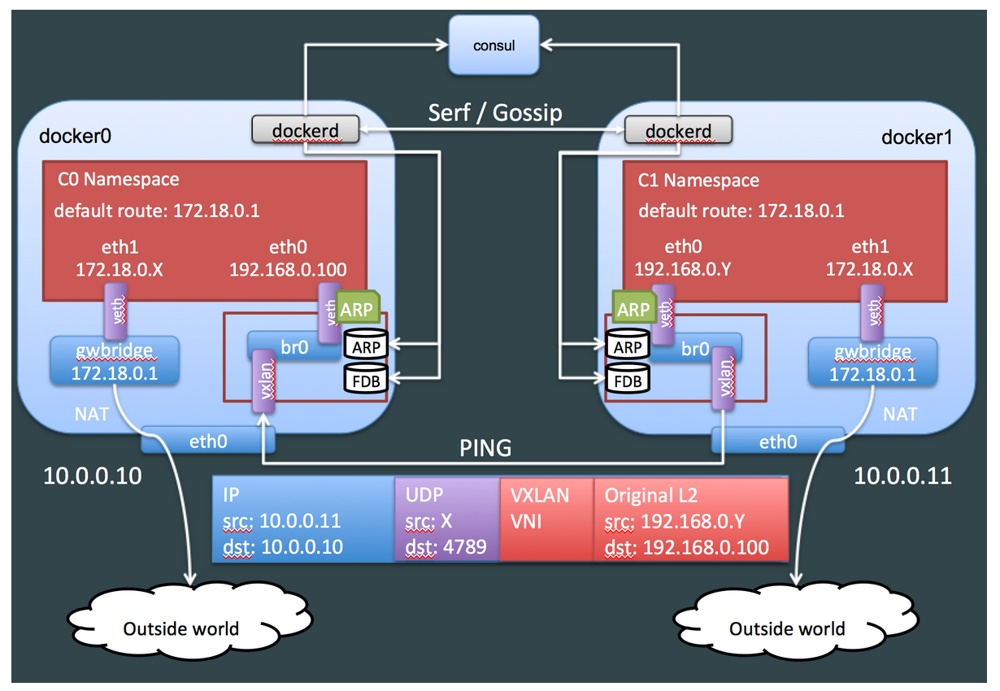

# VXLAN

## Demo a VXLAN-based overlay network in Linux 

```bash
# First we create a vxlan device and then attach to a bridge
$ sudo ip link add vxlan10 type vxlan id 10 group 239.1.1.1 dev ib0
$ sudo ip link add br-vxlan10 type bridge
$ sudo ip link set vxlan10 master br-vxlan10
$ sudo ip link set vxlan10 up
$ sudo ip link set br-vxlan10 up
# Allow fowarding between vxlan device and bridge
$ sudo iptables -P FORWARD ACCEPT

# Create a pair of veths that are used to link container and host's network namespace
$ sudo ip link add vxlan10-veth1 type veth peer name vxlan10-veth0
$ sudo ip link set dev vxlan10-veth0 up
$ sudo ip link set vxlan10-veth0 master br-vxlan10

# Make docker run permenatly in background
$ sudo docker run -d --rm --privileged \
$	--network=none --name=guest0 ubuntu:14.04 tail -f /dev/null
# or
$ sudo docker run -d -t --rm --privileged --network=none --name=guest0 ubuntu:14.04
# alias docker-pid="sudo docker inspect --format '{{.State.Pid}}'"
$ sudo ip link set vxlan10-veth1 netns $(docker-pid guest0) 
$ sudo ip netns exec $(docker-pid guest0) ip addr add 192.168.233.140 dev vxlan10-veth1 
$ sudo ip netns exec $(docker-pid guest0) ip link set vxlan10-veth1 up

# Repeat above commands in another host then make a test
$ sudo docker exec guest0 ping -c3 192.168.233.141

# Quit and do post clearing
$ sudo docker stop guest0
$ sudo ip link del br-vxlan10
$ sudo ip link del vxlan10
```

## VXLAN internals


- VNI - VXLAN Network Identifier
  - 24 bit number (16M+ unique identifiers)
  - Part of the VXLAN header
  - Similar to VLAN ID
  - Limits broadcast domain
- VTEP - VXLAN Tunnel End Point
  - Originator and/or terminator of VXLAN tunnel for a specific VNI
  - Outer DIP/Outer SIP
- When sending a packet,
  - ARP table is checked for IP/MAC/Interface mapping
  - L2 FDB is checked to determine IP of destination on VTEP for destination on MAC on source VTEP
  - Source VTEP then encapsulates frame with correct destination VTEP and destination decapsulates
- Actually, we need a mechanism to lookup behind which VTEP is a container MAC. However, we can leverage IP muticast in VXLAN,
  - IP Multicast group per overlay (per VXLAN)
  - Unicast  also possible


在 Docker 中，因为创建 containers 时知道 MAC addresses，会向所有的 VTEP 设备广播 MAC/VTEP mapping，所以该操作一定程度上可以避免组播。否则，任意两个 vhost 第一次通信时，都会在 VXLAN 产生组播以学习 ARP mapping。



## VXLAN support in Linux

Well supported in most modern Linux Distros (Linux Kernel 3.10+). Linux uses UDP port 8472 instead of IANA issued 4789 and configure using `ip link`.

## Refs

- How to create overlay networks using Linux Bridges and VXLANs. https://ilearnedhowto.wordpress.com/2017/02/16/how-to-create-overlay-networks-using-linux-bridges-and-vxlans/.
- VXLAN: Extending Networking to Fit the Cloud. https://www.usenix.org/publications/login/october-2012-volume-37-number-5/vxlan-extending-networking-fit-cloud.
- VXLAN 协议原理简介. https://cizixs.com/2017/09/28/linux-vxlan/.
- Virtual eXtensible Local Area Networking documetation. https://www.kernel.org/doc/Documentation/networking/vxlan.txt.
